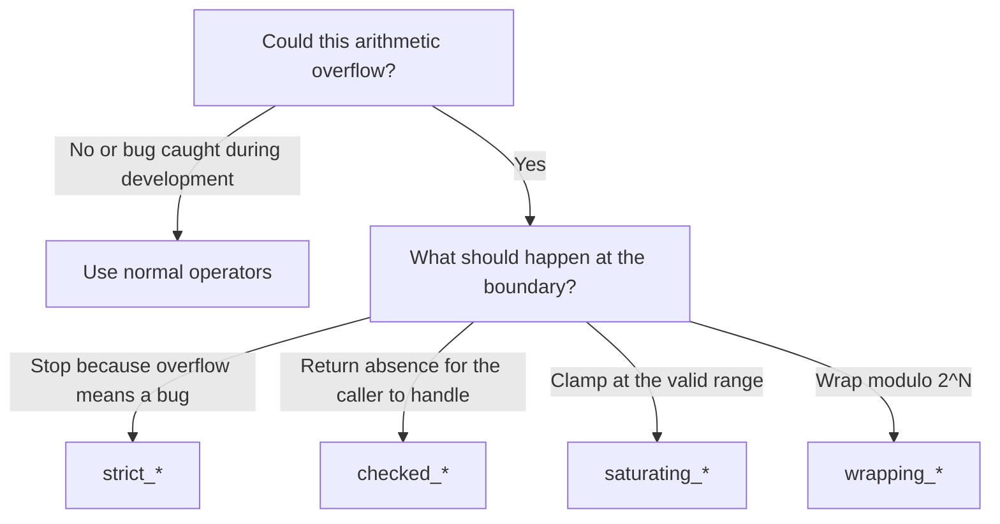

# Variables, Expressions, and Control Flow

In most languages, variables are mutable by default. You create a variable, and
you can change it whenever you want. This seems convenient — until a function
quietly modifies a value you assumed was stable, or a loop counter gets bumped
by accident, or a piece of state changes in a code path you did not expect. The
bugs that come from uncontrolled mutation are some of the most common and
hardest to track down in software.

Rust makes a different choice: variables are _immutable_ by default. When you
create a binding with `let`, the value cannot change. This is not a limitation
— it is a feature. Immutability by default means that when you read code, you
can trust that a value stays what it was set to unless the code _explicitly_
says otherwise. Mutation exists when you need it, marked clearly with `mut`, so
it stands out as a deliberate decision rather than the invisible default.

This chapter covers how Rust handles data at the most fundamental level:
bindings, types, expressions, and the control flow constructs you will use in
every program you write.

> **How to Read This Chapter**
>
> - Understand now: Rust defaults to immutability, `if` and blocks return
>   values, and numeric code should make edge-case behavior explicit.
> - Memorize: `let`, `mut`, `const`, `static`, `if`, `loop`, `while`, `for`,
>   `..`, and `..=`.
> - Use as reference: integer widths, overflow method families, float helper
>   methods, and standard math constants.
> - Skim on first pass: the longer numeric method catalogs. Come back to them
>   when a real calculation needs them.

## Bindings and Mutability

A `let` binding introduces a variable:

```rust
fn main() {
    let x = 5;
    println!("x = {x}");
}
```

Output: `x = 5`

The value of `x` cannot change. If you try to reassign it, the compiler stops
you:

```rust,does_not_compile
fn main() {
    let x = 5;
    x = 10; // error[E0384]: cannot assign twice to immutable variable `x`
    println!("x = {x}");
}
```

The error is clear and actionable. When you genuinely need a variable to change,
add `mut`:

```rust
fn main() {
    let mut count = 0;
    count = 1;
    count = 2;
    println!("count = {count}");
}
```

Output: `count = 2`

The `mut` keyword serves as documentation. Anyone reading the code knows
immediately: this variable _will_ change. If you see a binding without `mut`,
you know it will not. This makes reasoning about code dramatically easier,
especially in larger programs.

### Shadowing

Rust lets you declare a new binding with the same name as an existing one. The
new binding _shadows_ the old one — it does not modify it:

```rust
fn main() {
    let x = 5;
    let x = x + 1;
    let x = x * 2;
    println!("x = {x}");
}
```

Output: `x = 12`

Each `let x` creates an entirely new variable. The previous `x` still exists
in memory until it goes out of scope, but the name `x` now refers to the new
binding.

Shadowing differs from `mut` in a critical way: it can change the _type_ of the
binding. This is useful when you want to transform a value and keep using the
same meaningful name:

```rust
fn main() {
    let input = "  42  ";
    let input = input.trim();
    let input: i32 = input.parse().expect("not a number");
    println!("input = {input}");
}
```

Output: `input = 42`

Here, `input` starts as a `&str`, becomes a trimmed `&str`, and finally becomes
an `i32`. Each shadowed binding is immutable — you cannot accidentally mutate
any of the intermediate values. With `mut`, changing a variable's type would be
a compile error.

## Types and Type Inference

Rust is a statically typed language — every value has a type known at compile
time. But you rarely need to write types explicitly, because the compiler
_infers_ them from context.

### Scalar Types

Rust has four categories of scalar types — types that represent a single value.
Treat the numeric sections that follow as a repeating loop: identify the edge
case, work one concrete number example, then learn the Rust API that makes the
intended behavior explicit.

**Integers.** Rust provides signed and unsigned integers in several sizes:

| Signed | Unsigned | Size |
|--------|----------|------|
| `i8` | `u8` | 8 bits |
| `i16` | `u16` | 16 bits |
| `i32` | `u32` | 32 bits |
| `i64` | `u64` | 64 bits |
| `i128` | `u128` | 128 bits |
| `isize` | `usize` | pointer-sized |

When you write `let x = 42;` without specifying a type, Rust defaults to `i32`
— a 32-bit signed integer. This is a good default for most purposes.

Use `usize` when you need a number that represents a size or index — it matches
the pointer width of the target platform (64 bits on modern machines). You will
see `usize` frequently because it is the type Rust uses for array indices and
collection lengths.

You can use underscores as visual separators in numeric literals to improve
readability: `1_000_000` is the same as `1000000`.

#### What happens when integers overflow

What happens when you add 1 to the largest value a type can hold? In C, signed
overflow is undefined behavior — the compiler can do literally anything. Rust
takes a safer, more predictable approach, but the behavior depends on how you
build your program:

Worked example: in `u8`, the largest possible value is 255. So `255 + 1` forces
you to choose a policy. Should the program return "no answer," clamp at 255,
wrap to 0, or stop because overflow means the program's reasoning has gone
wrong?

```rust
fn main() {
    let x: u8 = 255;
    let y: u8 = x.wrapping_add(1);
    println!("255 wrapping + 1 = {y}");
}
```

Output: `255 wrapping + 1 = 0`

In _debug_ mode (the default when you run **`cargo run`** or **`cargo build`**),
arithmetic overflow causes a _panic_ — the program stops immediately with an
error message. This catches bugs during development. In _release_ mode
(**`cargo build --release`**), overflow silently wraps using two's complement
arithmetic — `255_u8 + 1` becomes `0`, not an error. This is faster, but it
means bugs can hide in release builds if you are not careful.

Relying on this silent wrapping is considered a mistake. When you need specific
overflow behavior, Rust provides explicit methods on every integer type:

| Method family | Returns | Overflow behavior |
|---|---|---|
| `checked_add` | `Option<T>` | Returns `None` on overflow |
| `saturating_add` | `T` | Clamps to `MIN` or `MAX` |
| `wrapping_add` | `T` | Two's complement wrap |
| `strict_add` | `T` | Panics in _all_ build modes |

Each family covers all arithmetic operations — `_sub`, `_mul`, `_div`, and
more. Choose the one that matches your intent:

Figure 2-1. Choosing an integer overflow strategy



Example 2-1. Comparing explicit overflow behaviors

```rust
fn main() {
    let max: i32 = i32::MAX;

    println!("checked:    {:?}", max.checked_add(1));
    println!("saturating: {}", max.saturating_add(1));
    println!("wrapping:   {}", max.wrapping_add(1));
}
```

Output:

```
checked:    None
saturating: 2147483647
wrapping:   -2147483648
```

> **Warning**
>
> Debug builds panic on plain overflow, but release builds wrap unless you pick
> an explicit method. A debug-time panic is not a production policy.

For most code, the default `+` and `-` operators are fine — the debug-mode
panic catches bugs early. When arithmetic overflow is a real possibility in
your domain, reach for the explicit methods to make your intent clear in the
code.

#### Overflow that is always a bug

There is a subtle gap in the default behavior. The `+` operator panics on
overflow in debug mode but wraps silently in release mode. If your program's
correctness depends on the panic — say, a financial calculation that must
never produce a wrapped-around result — you have a bug that only appears in
production.

The `strict_*` family closes this gap. It behaves identically to the default
operators when values are in range, but panics on overflow in _every_ build
mode — debug and release alike:

```rust
fn main() {
    let balance: u32 = 1_000_000;
    let deposit: u32 = 250_000;

    let total = balance.strict_add(deposit);
    println!("balance after deposit: {total}");
}
```

Output: `balance after deposit: 1250000`

When values are in range, `strict_add` returns the sum directly — no
`Option` wrapping, no clamping. It is a drop-in replacement for `+`. The
difference appears only at the boundary: if `balance` and `deposit` were
large enough to overflow a `u32`, this code panics immediately, whether you
built with **`cargo build`** or **`cargo build --release`**.

Use `strict_*` when overflow would be a logic error, not merely a
development-time concern. For counters, sizes, and financial amounts where a
wrapped-around value would corrupt your program's state, `strict_add`,
`strict_sub`, and `strict_mul` make the invariant explicit and enforced.

**Check Yourself.** If overflow would corrupt money, inventory, or a byte count,
which family makes that invariant explicit in both debug and release builds?

#### Testing divisibility

A common task in programming is checking whether a number divides evenly by
another — is it even? A multiple of 10? A leap year? The traditional approach
uses the remainder operator: `n % 2 == 0`. It works, but you have to decode the
intent: "remainder equals zero" is a roundabout way of saying "is a multiple
of."

Rust provides a method that says exactly what you mean:

```rust
fn main() {
    let year: u32 = 2024;
    let is_leap = year.is_multiple_of(4)
        && (!year.is_multiple_of(100) || year.is_multiple_of(400));
    println!("{year} is a leap year: {is_leap}");
}
```

Output: `2024 is a leap year: true`

Compare `year.is_multiple_of(4)` with `year % 4 == 0`. Both produce the same
result, but the method reads like the rule it implements. When the logic
involves several divisibility checks — as leap year rules do — the intent
becomes significantly clearer.

`is_multiple_of` is available on all unsigned integer types (`u8` through
`u128` and `usize`). Unlike the `%` operator, it does not panic when the
divisor is zero — it simply returns `false` (or `true` when both values are
zero). This makes it safe to use without guarding against division by zero.

This is a recurring theme in Rust's standard library: where a raw operator
leaves you to remember the idiom, a named method makes the intent explicit and
eliminates edge-case surprises.

#### Computing the midpoint without overflow

One of the most infamous bugs in computer science hid inside binary search for
decades. The line `let mid = (low + high) / 2;` looks correct — and it is,
until `low + high` overflows the integer type. In a debug build, Rust would
panic. In a release build, the sum wraps and the result is wrong. This bug
shipped in production implementations of binary search across many languages
before being widely recognized.

Equation 2-1. The naive midpoint formula

\[
\text{mid}(low, high) = \frac{low + high}{2}
\]

Worked example: the midpoint of 2,000,000,000 and 3,000,000,000 is
2,500,000,000, which _does_ fit in `u32`. The trap is the intermediate sum:
5,000,000,000 does _not_ fit in `u32`. The final answer is valid, but the naive
path to it is not.

Rust provides a method that eliminates the problem entirely:

Example 2-2. Computing a midpoint without overflow

```rust
fn main() {
    let low: u32 = 2_000_000_000;
    let high: u32 = 3_000_000_000;

    // Naive approach: low + high would overflow u32::MAX (4,294,967,295)
    let safe_mid = low.midpoint(high);
    println!("midpoint: {safe_mid}");
}
```

Output: `midpoint: 2500000000`

`midpoint` computes `(self + rhs) / 2` as if the addition were performed in a
type wide enough to never overflow, then returns the result in the original
type. No panic, no wrapping, no silent wrong answer.

For integer types, when the true midpoint falls between two whole numbers,
`midpoint` rounds toward zero:

```rust
fn main() {
    println!("{}", 1u32.midpoint(4));   // 2.5 → rounds to 2
    println!("{}", 0u32.midpoint(3));   // 1.5 → rounds to 1
    println!("{}", (-3i32).midpoint(2)); // -0.5 → rounds to 0
}
```

Output:

```
2
1
0
```

The method is available on all integer types — unsigned (`u8` through `u128`
and `usize`) and signed (`i8` through `i128` and `isize`) — as well as `f32`
and `f64` for floating-point averages. It is a `const fn`, so you can use it in
constant expressions.

Like `is_multiple_of`, `midpoint` replaces a manual calculation that looks
simple but hides an overflow trap. The named method makes the intent clear and
the result correct by construction.

**Check Yourself.** Why can `(low + high) / 2` fail even when the final midpoint
still fits in the type?

#### Converting between signed and unsigned

Sometimes you have an unsigned integer and need to reinterpret its bits as
signed, or vice versa. Networking protocols, file formats, and hardware
registers frequently pack signed values into unsigned fields. The `as` keyword
can do this — `200u8 as i8` produces `-56` — but `as` is overloaded: it also
truncates, extends, and converts between floats and integers. When you write
`value as i8`, a reader cannot tell at a glance whether you intend to change
the sign interpretation, narrow the width, or both. A typo like `value as i16`
instead of `value as i8` compiles silently and produces a completely different
result.

Rust provides methods that say exactly what you mean:

```rust
fn main() {
    // A sensor sends temperature as an unsigned byte.
    // Values above 127 represent negative temperatures.
    let raw_byte: u8 = 200;
    let temperature: i8 = raw_byte.cast_signed();
    println!("{raw_byte} as signed: {temperature}");

    let difference: i32 = -42;
    let as_unsigned: u32 = difference.cast_unsigned();
    println!("{difference} as unsigned: {as_unsigned}");
}
```

Output:

```
200 as signed: -56
-42 as unsigned: 4294967254
```

`cast_signed()` is available on all unsigned integer types and returns the
signed type of the same width: `u8` → `i8`, `u32` → `i32`, and so on.
`cast_unsigned()` does the reverse on all signed types. Neither method can
change the width — the compiler enforces this — so you cannot accidentally
truncate a `u32` to an `i8`. The bits are reinterpreted, never modified.

Both are `const fn`, so you can use them in constant expressions. And because
they cannot panic or produce surprising results, they are the preferred way to
convert between signed and unsigned integers of the same size.

This continues the theme: where a raw operator or `as` cast leaves the intent
ambiguous, a named method communicates exactly what is happening and prevents
an entire category of mistakes.

> **Tip**
>
> Use `cast_signed` and `cast_unsigned` when you mean "reinterpret these same
> bits." Use `try_from` when you mean "change width only if the value fits."

**Floating-point numbers.** Rust has `f32` (32-bit) and `f64` (64-bit). The
default is `f64`, because on modern hardware it is nearly as fast as `f32` but
offers significantly more precision:

```rust
fn main() {
    let pi = 3.14159;
    let radius = 5.0;
    let area = pi * radius * radius;
    println!("area = {area}");
}
```

Output: `area = 78.53975`

#### Common float methods

Integers in Rust have named methods for overflow, divisibility, and midpoints.
Floats follow the same philosophy: instead of importing a math library or
memorizing operator tricks, you call a method that says what you mean.

The most common float methods cover everyday math operations — rounding,
absolute value, exponentiation, and clamping a value to a range:

```rust
fn main() {
    let x: f64 = -3.7;

    println!("abs:   {}", x.abs());
    println!("sqrt:  {}", 16.0_f64.sqrt());
    println!("round: {}", x.round());
    println!("ceil:  {}", x.ceil());
    println!("floor: {}", x.floor());
    println!("powi:  {}", 2.5_f64.powi(3));
    println!("clamp: {}", x.clamp(-2.0, 2.0));
}
```

Output:

```text
abs:   3.7
sqrt:  4
round: -4
ceil:  -3
floor: -4
powi:  15.625
clamp: -2
```

A few details worth noting:

- `abs` returns the distance from zero — always non-negative
- `round` rounds to the nearest integer, with ties (`.5`) rounding away from
  zero
- `ceil` rounds toward positive infinity; `floor` toward negative infinity
- `powi` raises to an integer power (use `powf` for a float exponent)
- `clamp` constrains a value to a range — useful for ensuring a result stays
  within valid bounds, like pixel coordinates or volume levels

**Banker's rounding.** The `round` method rounds ties away from zero: `2.5`
becomes `3.0` and `-2.5` becomes `-3.0`. This introduces a slight upward bias
when rounding many values — each tie rounds up, nudging totals higher.
The `round_ties_even` method eliminates this bias by rounding ties to the
nearest _even_ number: `2.5` rounds to `2.0`, `3.5` rounds to `4.0`. This is
the IEEE 754 default rounding mode, and it is the right choice for financial
calculations, statistics, and any domain where accumulated rounding error
matters:

Worked example: `2.5 + 3.5 = 6.0`. If you round both values away from zero
first, you get `3.0 + 4.0 = 7.0`. If you round ties to even first, you get
`2.0 + 4.0 = 6.0`. That is the whole reason this method exists: it removes
systematic bias across many rounded values.

Example 2-3. Comparing everyday rounding with banker's rounding

```rust
fn main() {
    // round:           ties go away from zero (upward bias)
    // round_ties_even: ties go to nearest even (no bias)
    println!("2.5 → round: {}  ties_even: {}", 2.5_f64.round(), 2.5_f64.round_ties_even());
    println!("3.5 → round: {}  ties_even: {}", 3.5_f64.round(), 3.5_f64.round_ties_even());
    println!("0.5 → round: {}  ties_even: {}", 0.5_f64.round(), 0.5_f64.round_ties_even());
    println!("1.5 → round: {}  ties_even: {}", 1.5_f64.round(), 1.5_f64.round_ties_even());
}
```

Output:

```text
2.5 → round: 3  ties_even: 2
3.5 → round: 4  ties_even: 4
0.5 → round: 1  ties_even: 0
1.5 → round: 2  ties_even: 2
```

Notice the pattern: `round_ties_even` alternates between rounding up and
rounding down at the `.5` boundary, so over many values the rounding errors
cancel out. Use `round` when you want the behavior most people expect from
"rounding" in everyday life. Use `round_ties_even` when accuracy across many
values matters more than matching human intuition for a single value.

**Check Yourself.** If you round thousands of `.5` values before summing them,
which method avoids pushing the total upward over time?

The type suffix `_f64` in `16.0_f64.sqrt()` tells the compiler which float
type to use. Without it, a bare `16.0` cannot call methods directly because the
compiler has not yet decided whether it is `f32` or `f64`.

#### Special values and NaN

Floating-point numbers can represent two values that have no integer equivalent:
infinity and "not a number." These arise naturally from arithmetic — you do not
need to construct them explicitly:

```rust
fn main() {
    let result = 0.0_f64 / 0.0;
    println!("0 / 0 = {result}");
    println!("is NaN: {}", result.is_nan());

    let inf = 1.0_f64 / 0.0;
    println!("1 / 0 = {inf}");
    println!("is infinite: {}", inf.is_infinite());

    // NaN breaks the usual rules of equality
    println!("NaN == NaN: {}", result == result);
    println!("is_nan:     {}", result.is_nan());
}
```

Output:

```text
0 / 0 = NaN
is NaN: true
1 / 0 = inf
is infinite: true
NaN == NaN: false
is_nan:     true
```

The most surprising line is `NaN == NaN: false`. By the IEEE 754 standard, NaN
is not equal to _anything_ — not even itself. This means you cannot check for
NaN with `==`. Use `is_nan()` instead.

> **Warning**
>
> Never test for NaN with `==`. The correct questions are "is this NaN?" with
> `is_nan()` and "is this still an ordinary finite value?" with `is_finite()`.

This quirk has a practical consequence: floats implement `PartialEq` (some
pairs can be compared) but not `Eq` (not all pairs produce a meaningful answer).
Similarly, floats implement `PartialOrd` but not `Ord`, which means they cannot
be sorted or used as `HashMap` keys directly.

The `total_cmp` method solves this problem. It defines a _total ordering_ for
floats: every value, including NaN and negative zero, has a well-defined
position. NaN sorts after infinity, and negative zero sorts before positive
zero. The result is an `Ordering` value — `Less`, `Equal`, or `Greater` — that
works everywhere a comparison is needed.

Worked example: imagine sensor readings `[-0.0, 0.0, 2.72, 3.14, inf, NaN]`.
Ordinary float comparison cannot define a total order for the whole list
because NaN refuses to participate. `total_cmp` gives you a stable answer that
sorting code can trust.

Example 2-4. Sorting floats with total_cmp

```rust
fn main() {
    let mut readings = [3.14_f64, f64::NAN, -0.0, 0.0, 2.72, f64::INFINITY];
    readings.sort_by(f64::total_cmp);
    println!("{readings:?}");
}
```

Output:

```text
[-0.0, 0.0, 2.72, 3.14, inf, NaN]
```

Unlike `==`, which says `NaN != NaN`, `total_cmp` gives sorting code a stable,
production-grade rule. Use it any time floats need a definitive order — sorting
collections, computing medians, or picking minimum and maximum values.

The `is_finite()` method returns `true` for ordinary numbers and `false` for
both infinity and NaN. It is a quick sanity check after a chain of arithmetic:
if your result is not finite, something went wrong upstream.

**Check Yourself.** Why can a type implement `PartialOrd` but still be unusable
for sorting without `total_cmp`?

#### Mathematical constants

Hardcoding `3.14159` in your source code is fragile and imprecise. Rust provides
full-precision constants for the values that appear most often in mathematics
and science. They live in the `std::f64::consts` module (and `std::f32::consts`
for 32-bit floats):

```rust
use std::f64::consts;

fn main() {
    let radius = 5.0;

    let circumference = 2.0 * consts::PI * radius;
    let area = consts::PI * radius * radius;
    println!("radius {radius}: circumference = {circumference:.2}, area = {area:.2}");

    // TAU is 2π — one full turn
    let full_turn = consts::TAU * radius;
    println!("TAU × radius = {full_turn:.2}");

    // Natural exponential: e^1
    println!("e = {:.4}", consts::E);

    // √2 — the diagonal of a unit square
    println!("√2 = {:.4}", consts::SQRT_2);

}
```

Output:

```text
radius 5: circumference = 31.42, area = 78.54
TAU × radius = 31.42
e = 2.7183
√2 = 1.4142
```

The most commonly used constants are:

- `PI` — the ratio of a circle's circumference to its diameter (~3.14159)
- `TAU` — a full turn in radians, equal to 2π (~6.28318). Use `TAU` when the
  formula naturally involves full turns — `circumference = TAU * radius` reads
  more clearly than `2.0 * PI * radius`
- `E` — the base of natural logarithms (~2.71828)
- `SQRT_2` — the square root of two (~1.41421)

The module also provides fractions of π (`FRAC_PI_2`, `FRAC_PI_4`), logarithms
(`LN_2`, `LN_10`, `LOG2_E`, `LOG10_E`), and reciprocal square roots
(`FRAC_1_SQRT_2`). You can browse the full list at _doc.rust-lang.org_ — the
four above cover the vast majority of real-world use.

**Booleans.** The `bool` type has exactly two values: `true` and `false`.

```rust
fn main() {
    let is_rust = true;
    let is_slow = false;
    println!("Rust: {is_rust}, slow: {is_slow}");
}
```

Output: `Rust: true, slow: false`

**Characters.** The `char` type represents a single Unicode scalar value. Use
single quotes for characters, double quotes for strings:

```rust
fn main() {
    let letter = 'R';
    let emoji = '🦀';
    println!("{letter} {emoji}");
}
```

Output: `R 🦀`

A Rust `char` is always 4 bytes — it can represent any Unicode character, not
just ASCII.

### Type Annotations

When the compiler cannot infer a type, you provide an annotation. The most
common place this happens is when parsing strings into numbers:

```rust
fn main() {
    let guess: i32 = "42".parse().expect("not a number");
    println!("guess = {guess}");
}
```

Output: `guess = 42`

Without the `: i32` annotation, the compiler would not know what type to parse
into and would ask you to add one. Type annotations always follow the variable
name, separated by a colon.

**Providing the type on the call.** Sometimes there is no `let` binding to
annotate — you might be calling `parse` in the middle of a method chain, or
passing the result directly to another function. In those cases, you can attach
the type hint directly to the function call with `::<>`:

```rust
fn main() {
    let doubled = "21".parse::<i32>().expect("not a number") * 2;
    println!("doubled = {doubled}");
}
```

Output: `doubled = 42`

The `::<i32>` after `parse` tells the compiler the same thing as `: i32` on a
`let` binding — "parse this string as an `i32`." The community calls this
notation the _turbofish_ because `::<>` looks vaguely like a fish. You will see
it throughout Rust code whenever a function or method needs a type parameter and
the compiler cannot infer it from context.

## Constants

For values that are truly fixed — known at compile time and never changing —
use `const` instead of `let`:

```rust
const MAX_SCORE: u32 = 100;
const THREE_HOURS_IN_SECONDS: u32 = 60 * 60 * 3;

fn main() {
    println!("max score: {MAX_SCORE}");
    println!("three hours: {THREE_HOURS_IN_SECONDS} seconds");
}
```

Output:

```
max score: 100
three hours: 10800 seconds
```

Constants differ from `let` bindings in three ways:

1. They must always have an explicit type annotation.
2. They can be declared in any scope, including outside functions — making them
   available everywhere in your program.
3. They must be set to a constant expression that the compiler can evaluate at
   compile time. You can use arithmetic, other constants, and functions marked
   `const fn` — but not arbitrary runtime function calls.

The naming convention for constants is `SCREAMING_SNAKE_CASE`. This is not just
style — it is what the compiler expects, and **`cargo clippy`** will warn you
if you deviate.

Constants are inlined wherever they are used. The compiler replaces every
occurrence of `MAX_SCORE` with the value `100` directly. This makes them
zero-cost abstractions for naming important values in your program.

## Statics

Constants are inlined — the compiler copies the value into every place it is
used. Sometimes you need a value that lives at a _single, fixed location_ in
memory for the entire run of the program. That is what `static` provides:

```rust
static MAX_PLAYERS: u32 = 4;
static GREETING: &str = "Welcome to the game!";

fn main() {
    for n in 1..=MAX_PLAYERS {
        println!("Player {n}: {GREETING}");
    }
}
```

Output:

```
Player 1: Welcome to the game!
Player 2: Welcome to the game!
Player 3: Welcome to the game!
Player 4: Welcome to the game!
```

A `static` item has a fixed memory address that never changes. Every part of
your program that reads `GREETING` reads from the same location. With `const`,
the compiler might place a separate copy at each use site.

### When to Use Const vs Static

For most named values, `const` is the right choice — it is simpler, and the
compiler can optimize it more aggressively. Reach for `static` when you need a
guaranteed single address: large lookup tables where duplication would waste
memory, or values shared across your program that must live at one location.

| | `const` | `static` |
|---|---|---|
| Memory | Inlined at each use | Single fixed address |
| Mutability | Always immutable | Immutable by default |
| Naming convention | `SCREAMING_SNAKE_CASE` | `SCREAMING_SNAKE_CASE` |
| Type annotation | Required | Required |
| Best for | Named constants, small values | Large data, fixed-address values |

Like constants, statics require an explicit type annotation and use
`SCREAMING_SNAKE_CASE` names.

### What About Mutable Globals?

If you are coming from another language, you might wonder about global mutable
state — a counter that any function can increment, or a configuration that
changes at runtime. Rust makes this deliberately difficult, because shared
mutable state is the root cause of data races and many of the hardest bugs
in concurrent programs.

Rust _does_ have tools for safe shared mutation — `Mutex`, `Atomic` types, and
others. They work by wrapping the data in a type that enforces access rules at
runtime, so the compiler can guarantee that no two parts of your program modify
the same value at the same time. Here is the general shape — you do not need to
memorize the details yet, but seeing it demystifies the pattern:

```rust
use std::sync::atomic::{AtomicU32, Ordering};

static REQUEST_COUNT: AtomicU32 = AtomicU32::new(0);

fn handle_request() {
    REQUEST_COUNT.fetch_add(1, Ordering::Relaxed);
}

fn main() {
    handle_request();
    handle_request();
    handle_request();
    println!("total requests: {}", REQUEST_COUNT.load(Ordering::Relaxed));
}
```

Output: `total requests: 3`

The `AtomicU32` type wraps a `u32` and provides thread-safe modification
through methods like `fetch_add` instead of raw `+= 1`. The `Ordering`
parameter tells the hardware how strictly to synchronize — `Relaxed` is
sufficient for a simple counter.

The key takeaway: if you need a named, fixed value, use `const`. If it must
live at a single address, use `static`. If you need shared mutable state, use
an atomic or a lock — the type system will guide you.

### Lazy Initialization

Both `const` and `static` require values that the compiler can evaluate at
compile time. But what if your global needs a value that can only be computed at
runtime — a list built from a function call, a configuration assembled from
environment variables, or a lookup table too complex for a constant expression?

`LazyLock` solves this. It wraps a value that is computed _once_, on first
access, and then cached for every subsequent use:

```rust
use std::sync::LazyLock;

static DEFAULT_PORTS: LazyLock<Vec<u16>> = LazyLock::new(|| {
    vec![80, 443, 8080, 8443]
});

fn is_default_port(port: u16) -> bool {
    DEFAULT_PORTS.contains(&port)
}

fn main() {
    println!("8080 is default: {}", is_default_port(8080));
    println!("3000 is default: {}", is_default_port(3000));
    println!("all defaults: {:?}", *DEFAULT_PORTS);
}
```

Output:

```
8080 is default: true
3000 is default: false
all defaults: [80, 443, 8080, 8443]
```

You cannot write `static DEFAULT_PORTS: Vec<u16> = vec![80, 443, 8080, 8443];`
because `vec![]` allocates heap memory, which requires runtime code. `LazyLock`
defers that work to the first time any code reads the value. After that first
access, the result is stored and every subsequent read returns instantly — no
recomputation, no locking overhead.

The `|| { ... }` syntax is a _closure_ — a small inline function that takes no
arguments and returns the value inside the braces. Read it as "the code that
produces the initial value."

`LazyLock` lives in `std::sync` because it is safe to access from multiple
threads simultaneously. The initialization runs at most once, even if several
threads race to access the value at the same time.

Before `LazyLock` was added to the standard library (Rust 1.80), this pattern
required third-party crates like lazy_static or once_cell. In modern Rust, the
standard library handles it directly.

## Everything Is an Expression

Here is the single most important idea in this chapter, and the one that
separates Rust from most C-family languages: _almost everything in Rust is an
expression that produces a value_.

In languages like C, Java, or Go, `if` is a _statement_ — it performs an
action but does not produce a value. If you want to assign a result based on a
condition, you need either a ternary operator (`condition ? a : b`) or a mutable
variable that you assign inside each branch.

In Rust, `if` is an _expression_. It evaluates to a value, and you can bind
that value directly:

```rust
fn main() {
    let temperature = 35;
    let status = if temperature > 30 { "hot" } else { "comfortable" };
    println!("It is {status}");
}
```

Output: `It is hot`

No ternary operator needed — `if` already is one. Both branches must produce
values of the same type, and the compiler checks this for you.

### Block Expressions

A block — code enclosed in `{` and `}` — is also an expression. It evaluates
to the value of its last expression, as long as that expression does _not_ end
with a semicolon:

```rust
fn main() {
    let area = {
        let width = 5;
        let height = 10;
        width * height
    };
    println!("area = {area}");
}
```

Output: `area = 50`

The last line of the block, `width * height`, has no semicolon. That makes it
an expression whose value becomes the value of the entire block. If you added
a semicolon, the block would return `()` — Rust's _unit type_, which represents
"no meaningful value" — and the compiler would reject the assignment because
`()` is not a number.

This is a fundamental pattern in Rust. The distinction between an expression
(produces a value, no trailing semicolon) and a statement (performs an action,
ends with a semicolon) appears everywhere: in functions, in `if` branches, in
`match` arms, and in any block of code.

## Control Flow

With values and expressions in hand, you need ways to choose between paths and
repeat actions. Rust's control flow constructs are expressions too — they
produce values just like everything else.

### If and Else

You have already seen `if` as an expression. Here is the full form:

```rust
fn main() {
    let number = 7;

    if number < 0 {
        println!("negative");
    } else if number == 0 {
        println!("zero");
    } else {
        println!("positive");
    }
}
```

Output: `positive`

Conditions in Rust must be `bool` — there is no implicit conversion from
integers or other types. Writing `if number {` when `number` is an `i32` is a
compile error. This explicitness prevents an entire class of bugs that plague
C programs.

### Loop

The `loop` keyword creates an infinite loop. You break out of it explicitly:

```rust
fn main() {
    let mut count = 0;

    loop {
        count += 1;
        if count == 3 {
            break;
        }
    }

    println!("count = {count}");
}
```

Output: `count = 3`

Because `loop` is an expression, `break` can carry a value — making `loop`
useful for retry patterns where you need the result:

```rust
fn main() {
    let mut attempt = 0;

    let result = loop {
        attempt += 1;
        if attempt * attempt >= 50 {
            break attempt;
        }
    };

    println!("result = {result}");
}
```

Output: `result = 8`

The `break attempt;` both exits the loop and makes the entire `loop` expression
evaluate to the value of `attempt`. Only `loop` supports this — `while` and
`for` do not, because they may exit without ever running and there would be no
value to return.

### While

A `while` loop runs as long as its condition is `true`:

```rust
fn main() {
    let mut n = 5;

    while n > 0 {
        println!("{n}");
        n -= 1;
    }

    println!("liftoff!");
}
```

Output:

```
5
4
3
2
1
liftoff!
```

Use `while` when the number of iterations depends on a condition evaluated each
time through the loop.

### For and Ranges

The `for` loop iterates over a sequence. There is no C-style
`for (i = 0; i < n; i++)` in Rust. Instead, every `for` loop works with an
_iterator_ — and the most common iterator is a _range_:

```rust
fn main() {
    for i in 0..5 {
        println!("{i}");
    }
}
```

Output:

```
0
1
2
3
4
```

The range `0..5` produces the numbers 0 through 4 — the end is _exclusive_. If
you want to include the end value, use `..=`:

```rust
fn main() {
    for i in 1..=3 {
        println!("{i}");
    }
}
```

Output:

```
1
2
3
```

To count downward, call `.rev()` on the range:

```rust
fn main() {
    for i in (1..=5).rev() {
        println!("{i}");
    }
}
```

Output:

```
5
4
3
2
1
```

`for` loops are the idiomatic way to iterate in Rust. They are impossible to
get wrong with off-by-one errors, and the compiler can optimize them into the
same tight machine code as a hand-written C loop — often _faster_, because the
compiler can prove that bounds checks are unnecessary.

### Loop Labels

When you have nested loops, you can label them to control which loop `break` or
`continue` applies to:

```rust
fn main() {
    let mut found = false;

    'outer: for x in 0..5 {
        for y in 0..5 {
            if x + y == 7 {
                println!("found: x={x}, y={y}");
                found = true;
                break 'outer;
            }
        }
    }

    println!("search complete, found = {found}");
}
```

Output:

```
found: x=3, y=4
search complete, found = true
```

Labels start with a single quote (`'outer`) and are placed before the loop
keyword. Without the label, `break` would only exit the inner loop.

## Compound Types at a Glance

You have seen scalar types. Rust also has two built-in compound types that group
multiple values together.

**Tuples** hold a fixed number of values that can be of different types:

```rust
fn main() {
    let point = (3, 4.5);
    let (x, y) = point;
    println!("x={x}, y={y}");
    println!("first element: {}", point.0);
}
```

Output:

```
x=3, y=4.5
first element: 3
```

You can _destructure_ a tuple into individual variables with `let (x, y) = point;`
or access elements by position with `.0`, `.1`, and so on.

**Arrays** hold a fixed number of values of the _same_ type:

```rust
fn main() {
    let days = ["Mon", "Tue", "Wed", "Thu", "Fri"];
    println!("first day: {}", days[0]);
    println!("total days: {}", days.len());
}
```

Output:

```
first day: Mon
total days: 5
```

Arrays live on the stack and have a fixed size known at compile time. If you
need a collection that can grow, Rust provides `Vec<T>` — a growable list that
lives on the heap. You create one with the `vec!` macro:

```rust
fn main() {
    let mut numbers = vec![1, 2, 3];
    numbers.push(4);
    println!("{numbers:?}");
}
```

Output: `[1, 2, 3, 4]`

That is all you need to start using `Vec<T>`. You will pick up the rest —
removing elements, iterating, slicing — naturally as the problems that need
them arise.

#### Array indexing requires usize

Rust uses `usize` — the pointer-sized unsigned integer — for all array and
`Vec` indices. If you try to index with a different integer type, the compiler
will stop you:

```rust
fn main() {
    let days = ["Mon", "Tue", "Wed", "Thu", "Fri"];
    let i: usize = 2;
    println!("day: {}", days[i]);
}
```

Output: `day: Wed`

If `i` were declared as `i32`, this would not compile. The compiler would tell
you that `i32` cannot be used as an index and suggest using `usize`. This
strictness prevents subtle bugs on platforms where pointer sizes differ.

Rust checks array bounds at runtime. Accessing an index outside the array's
range causes a _panic_ — an immediate, controlled crash — rather than silently
reading garbage memory as C would.

#### Numeric type conversions with as

Rust does not implicitly convert between numeric types — even when the
conversion is perfectly safe. If you have an `i32` and need an `f64`, you must
say so explicitly. The `as` keyword performs this conversion:

```rust
fn main() {
    let count: i32 = 7;
    let average = count as f64 / 2.0;
    println!("{count} / 2.0 = {average}");

    // Array length returns usize — convert to f64 for division
    let scores = [85, 92, 78, 95, 88];
    let mut sum = 0;
    for score in scores {
        sum += score;
    }
    let avg = sum as f64 / scores.len() as f64;
    println!("average = {avg:.1}");
}
```

Output:

```text
7 / 2.0 = 3.5
average = 87.6
```

The pattern `sum as f64 / scores.len() as f64` appears throughout Rust code.
Integer division truncates — `7 / 2` is `3`, not `3.5` — so converting to
`f64` first preserves the fractional part.

Conversions that _widen_ the type — `u8` to `u32`, `i32` to `f64`, `u32` to
`u64` — are always safe because the target can represent every value the source
can hold. Conversions that _narrow_ the type go the other direction and can
silently discard data: `1000_u32 as u8` quietly produces `232`. For
safety-critical narrowing, use `try_from` instead — it returns a `Result` that
is `Err` when the value does not fit, rather than silently truncating:

```rust
fn main() {
    let big: u32 = 1000;
    let small: u32 = 200;

    // try_from returns Err when the value does not fit
    let result = u8::try_from(big);
    println!("1000 -> u8: {result:?}");

    let result = u8::try_from(small);
    println!("200  -> u8: {result:?}");
}
```

Output:

```text
1000 -> u8: Err(TryFromIntError(()))
200  -> u8: Ok(200)
```

The target type appears right at the call site — `u8::try_from(big)` reads as
"try to convert `big` into a `u8`." Both `try_from` and its companion
`try_into` are available on all numeric types with no `use` statement needed.

For same-width sign reinterpretation, prefer the `cast_signed()` and
`cast_unsigned()` methods you saw earlier — they communicate intent more clearly
than `as` and prevent accidental width changes.

## Let Chains

Rust 2024 introduces a feature that makes conditional logic significantly
cleaner: _let chains_. Before explaining the syntax, here is the problem they
solve.

Sometimes you need to combine multiple conditions where some of them involve
testing whether a value matches a pattern and extracting data from it. In Rust,
this kind of test is written with `if let`.

Here is the minimum mental model you need right now. A `Result` is one value
with two labeled outcomes: `Ok(value)` for success and `Err(error)` for
failure. Think of it as a box that either carries the answer or carries the
reason no answer exists. `if let` asks whether a value has the shape on the
left side of `=` and, if it does, pulls out the interesting piece:

```rust
fn main() {
    let input = "42";
    let parsed = input.parse::<i32>();

    if let Ok(number) = parsed {
        println!("parsed: {number}");
    } else {
        println!("not a valid number");
    }
}
```

Output: `parsed: 42`

The `parsed` value is either `Ok(42)` or `Err(...)`. Read `if let Ok(number) =
parsed` aloud as "if `parsed` is an `Ok`, call the inner value `number`." If
the pattern does not match, the `else` branch runs. This is a _conditional
pattern match_ — a way to test a value's shape and extract data in one step.

> **Tip**
>
> Read `if let Pattern = value` as "if `value` matches `Pattern`." That mental
> translation makes the syntax much easier to recognize when you meet it in
> real code.

Now, what if you need to parse the number _and_ check that it is positive?
Before Rust 2024, you would nest the conditions:

```rust
fn main() {
    let input = "42";

    if let Ok(n) = input.parse::<i32>() {
        if n > 0 {
            println!("{n} is a positive number");
        }
    }
}
```

Output: `42 is a positive number`

With _let chains_ in Rust 2024, you can flatten this into a single condition
using `&&`:

```rust
fn main() {
    let input = "42";

    if let Ok(n) = input.parse::<i32>()
        && n > 0
    {
        println!("{n} is a positive number");
    }
}
```

Output: `42 is a positive number`

The `&&` chains a pattern match with a boolean test into one `if` condition.
Evaluation goes left to right: if the `parse` fails, the `n > 0` check never
runs. If the parse succeeds, `n` is bound and available for the boolean test
and the body.

You can chain as many conditions as you need:

```rust
fn main() {
    let input = "42";
    let max = 100;

    if let Ok(n) = input.parse::<i32>()
        && n > 0
        && n <= max
    {
        println!("{n} is valid (1 to {max})");
    } else {
        println!("invalid input");
    }
}
```

Output: `42 is valid (1 to 100)`

Let chains also work with `while`, which is useful for processing sequences
where each step might fail:

```rust
fn main() {
    let values = ["10", "20", "abc", "40"];
    let mut index = 0;

    while index < values.len()
        && let Ok(n) = values[index].parse::<i32>()
    {
        println!("got: {n}");
        index += 1;
    }

    println!("stopped at index {index}");
}
```

Output:

```
got: 10
got: 20
stopped at index 2
```

The loop stops at `"abc"` because the parse fails, making the `let` condition
evaluate to false. No explicit `break` needed.

Let chains eliminate the _pyramid of doom_ — deeply nested `if` blocks where
each level adds one more condition. They keep the code flat and readable,
which is especially valuable as conditions grow more complex.

## Why This Matters

This chapter is where Rust starts to feel different in your hands. Values stay
predictable because mutation is explicit. Numeric code stays honest because edge
cases have named APIs instead of hidden defaults. Control flow stays compact
because `if`, blocks, and `loop` all produce values. Those three habits —
explicit mutation, explicit numeric behavior, explicit value flow — are the
foundation for production Rust.

Key points from this chapter:

- **Immutability is the default.** Add `mut` only when change is part of the
  design, not an accident.
- **Shadowing creates a new binding.** It is how you transform a value while
  keeping the same meaningful name.
- **Named numeric methods encode intent.** Reach for `checked_*`,
  `saturating_*`, `wrapping_*`, `strict_*`, `midpoint`, `is_multiple_of`,
  `cast_signed`, and `cast_unsigned` when the boundary behavior matters.
- **Floats need extra care.** Use `round_ties_even` when repeated rounding must
  stay unbiased, and use `total_cmp` when floats need a total order.
- **`const` and `static` solve different problems.** `const` is inlined;
  `static` lives at one fixed address for the whole program.
- **Rust is expression-oriented.** `if`, blocks, and `loop` can all return
  values, which keeps code direct and avoids temporary mutable state.
- **Let chains are the Rust 2024 way** to combine pattern matching and boolean
  conditions without nested `if` statements.

## Check Yourself

Use these prompts to test the mental model before moving on:

- Why does Rust make you write `mut` instead of letting every binding change by
  default?
- When would shadowing be clearer than mutating a variable in place?
- If `255_u8 + 1` can mean several different things, why is picking an explicit
  overflow method better than relying on build-mode behavior?
- Why does `midpoint` exist even though the formula `\((a + b) / 2\)` looks
  simple?
- When is `as` fine, and when should you prefer `try_from` or
  `cast_signed`/`cast_unsigned`?
- Why does `NaN` force Rust to distinguish between partial ordering and total
  ordering?

---

You now know how Rust handles data at its most fundamental level: immutable
bindings that make code predictable, a type system that infers types without
sacrificing safety, and expressions that produce values everywhere. The control
flow tools — `if`, `loop`, `while`, `for`, and the new let chains — give you
everything you need to write real logic. In the next chapter, you will learn how
to organize this logic into functions and closures, building the blocks that
larger programs are made of.
