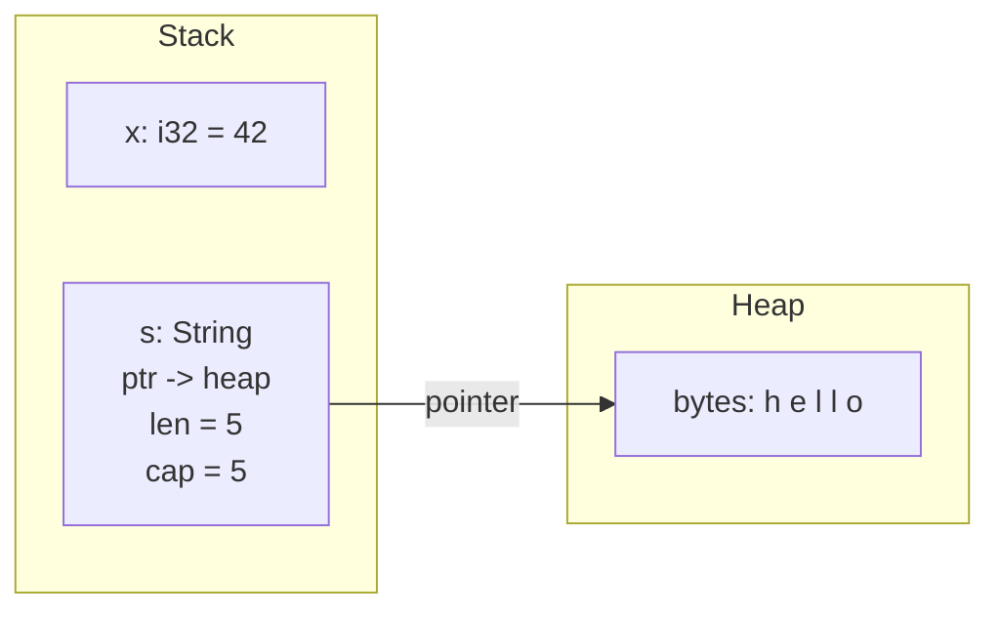
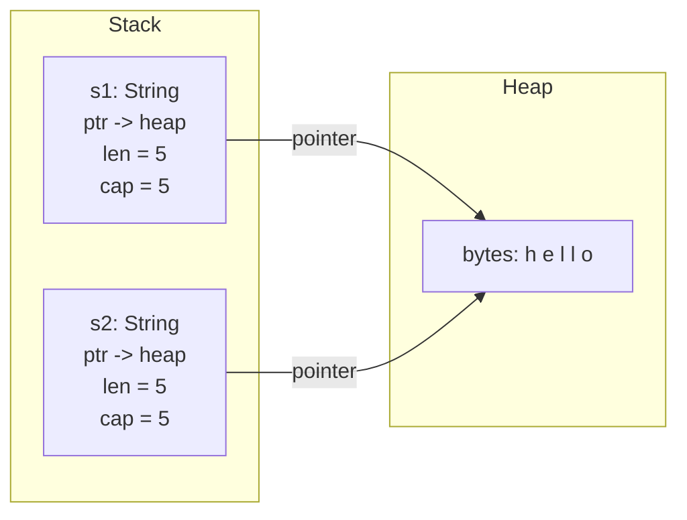

# Ownership

Every program needs to manage memory. Some languages use a garbage collector that
periodically scans for unused data. Others, like C and C++, leave memory
management entirely to the programmer — and an entire class of security
vulnerabilities exists because programmers get it wrong. Dangling pointers,
double frees, use-after-free, buffer overflows — these are not obscure edge
cases. They are the _most exploited_ bugs in the history of software.

Rust takes a third path. It manages memory through a system of _ownership_ —
a set of rules that the compiler checks at compile time. If your code violates
the rules, it does not compile. If it compiles, an entire category of bugs is
impossible. There is no garbage collector, no runtime overhead, and no manual
`free()` calls. The compiler does the work, and the resulting program runs as
fast as hand-written C.

Ownership is the single most important idea in Rust. Every concept you learn
after this chapter — borrowing, lifetimes, smart pointers, concurrency — builds
on the foundation laid here. Take your time with it.

> **How to Read This Chapter**
>
> - Understand now: every value has one owner, moves prevent double frees, and
>   `Copy`, `Clone`, and `Drop` describe three different ownership behaviors.
> - Memorize: the three ownership rules, `move`, `Copy`, `Clone`, and `drop`.
> - Use as reference: the stack-versus-heap model and the common places where
>   ownership transfers: assignment, function calls, returns, and `move`
>   closures.
> - Skim on first pass: the tiny `Drop` instrumentation examples. Keep the
>   cleanup timing, not the trait syntax, in your head.

## The Three Rules

Rust's ownership system is governed by three rules. They are simple to state and
far-reaching in their consequences:

1. Every value in Rust has exactly one _owner_ — the variable that holds it.
2. There can only be one owner at a time.
3. When the owner goes out of scope, the value is _dropped_ — its memory is
   freed automatically.

That is the entire model. Everything else in this chapter is a consequence of
these three rules.

## Where Values Live: Stack and Heap

To understand _why_ ownership matters, you need a mental model of where data
lives in memory. There are two regions: the _stack_ and the _heap_.

The stack is fast and structured. Every function call pushes a _frame_ onto the
stack containing its local variables. When the function returns, the frame is
popped off and the memory is reclaimed instantly. Allocation and deallocation
on the stack cost nothing — the CPU just moves a pointer. But the stack has a
constraint: every value on it must have a size known at compile time.

The heap is for data whose size is not known until runtime, or data that needs
to outlive the function that created it. Allocating on the heap means asking
the operating system for a chunk of memory, and deallocating means giving it
back. This is slower than the stack, and — critically — someone has to decide
_when_ to give it back. That is the problem ownership solves.

Here is the key distinction:

```rust
fn main() {
    let x = 42;             // x lives entirely on the stack
    let s = String::from("hello"); // s is on the stack, but its text is on the heap

    println!("x = {x}");
    println!("s = {s}");
}
```

Output:

```
x = 42
s = hello
```

The integer `42` is a fixed-size value — it is 4 bytes on every platform. It
lives entirely on the stack inside the variable `x`.

The `String` is different. A `String` is three values stored on the stack: a
pointer to a heap-allocated buffer, a length, and a capacity. The actual text
— the bytes `h`, `e`, `l`, `l`, `o` — lives on the heap. The variable `s`
owns that heap allocation.

Figure 2-2 shows the stack record for the `String` and the heap buffer it owns.

Figure 2-2. A String owns heap data while an integer lives entirely on the stack



When `s` goes out of scope at the end of `main`, Rust automatically frees the
heap memory. When `x` goes out of scope, its stack space is reclaimed when the
stack frame is popped. No garbage collector, no manual deallocation — ownership
handles both cases.

**Why we keep writing String::from.** You may wonder why these examples use
`String::from("hello")` instead of just `"hello"`. The answer is ownership. A
string literal like `"hello"` is baked into your compiled binary — it exists for
the entire duration of the program and never needs to be freed. Its type is
`&str`: a _reference_ to text, not owned text. Because it does not own heap
memory, it is cheap to copy and never moves.

`String::from("hello")` creates a `String` — an owned, heap-allocated, growable
piece of text. Because it owns heap memory, it must be freed when it is no
longer needed, and ownership determines when that happens. This is what makes
`String` the perfect type for demonstrating moves, clones, and drops throughout
this chapter. Integers and string literals are too simple — they are `Copy`
types that get duplicated automatically, so they never move.

## Move Semantics

Here is where ownership gets interesting. What happens when you assign one
variable to another?

For stack-only values, Rust makes a copy — because copying a few bytes on the
stack is essentially free:

```rust
fn main() {
    let a = 5;
    let b = a;     // a is copied — both a and b are valid

    println!("a = {a}, b = {b}");
}
```

Output: `a = 5, b = 5`

Both `a` and `b` exist independently. Modifying one would not affect the other.
This is intuitive because integers are small, simple values.

Now consider a `String`:

Example 2-5. Moving a String instead of duplicating its heap buffer

```rust
fn main() {
    let s1 = String::from("hello");
    let s2 = s1;   // s1's ownership MOVES to s2

    println!("s2 = {s2}");
}
```

Output: `s2 = hello`

After `let s2 = s1`, the variable `s1` is no longer valid. Ownership of the
heap data has _moved_ from `s1` to `s2`. If you try to use `s1` after the move,
the compiler stops you:

```rust,does_not_compile
fn main() {
    let s1 = String::from("hello");
    let s2 = s1;

    println!("s1 = {s1}"); // error[E0382]: borrow of moved value: `s1`
}
```

```
error[E0382]: borrow of moved value: `s1`
 --> src/main.rs:5:21
  |
2 |     let s1 = String::from("hello");
  |         -- move occurs because `s1` has type `String`, which does not implement the `Copy` trait
3 |     let s2 = s1;
  |              -- value moved here
...
5 |     println!("s1 = {s1}");
  |                     ^^ value borrowed here after move
  |
help: consider cloning the value if the performance cost is acceptable
  |
3 |     let s2 = s1.clone();
  |                ++++++++
```

Notice the compiler's suggestion: it tells you _how_ to fix the problem. If you
need both `s1` and `s2` to be valid, you can call `.clone()` to make an
explicit deep copy — the compiler even shows you where to add it.

Why does Rust do this? Consider what would happen without moves. If `let s2 = s1`
simply copied the stack data — the pointer, length, and capacity — then both
`s1` and `s2` would point to the _same_ heap buffer:

Figure 2-3 shows the bug Rust is refusing to create.

Figure 2-3. Copying a String header would make two owners point at one heap buffer



When both variables go out of scope, Rust would try to free the same heap
memory twice — a _double free_, which corrupts memory and is a serious bug.
Move semantics prevent this by ensuring that exactly one variable owns the
heap data at any time.

A move is not a deep copy. Rust moves the stack data (pointer, length, capacity)
and then _invalidates_ the source variable. No heap allocation happens, so a
move is just as cheap as a shallow copy — the difference is that the compiler
enforces that you cannot use the old variable afterward.

### Moves in Function Calls

Ownership moves happen when you pass a value to a function, too:

Example 2-6. Transferring ownership into a function

```rust
fn take_ownership(s: String) {
    println!("got: {s}");
} // s is dropped here — the heap memory is freed

fn main() {
    let greeting = String::from("hello");
    take_ownership(greeting);

    // greeting is no longer valid here — it was moved into the function
}
```

Output: `got: hello`

The value moved from `greeting` into the function parameter `s`. When
`take_ownership` returns, `s` goes out of scope and the `String` is dropped.
The calling code can no longer use `greeting`.

This is the same rule you saw with variable assignment: ownership transfers,
and the old variable becomes invalid. The compiler tracks this across function
boundaries.

### Moves and Return Values

Functions can also transfer ownership _back_ to the caller by returning a value:

```rust
fn create_greeting(name: &str) -> String {
    let mut s = String::from("Hello, ");
    s.push_str(name);
    s.push('!');
    s
}

fn main() {
    let greeting = create_greeting("Rust");
    println!("{greeting}");
}
```

Output: `Hello, Rust!`

The `String` is created inside `create_greeting`, and ownership moves to
`greeting` in `main` via the return value. No copy happens — the caller simply
takes ownership of the existing heap allocation.

This pattern — create a value, return it, let the caller own it — is how Rust
handles resource creation without garbage collection.

### Moves into Closures

In the previous chapter, you saw the `move` keyword with closures and a promise
that ownership would explain why it exists. Here is that explanation.

A closure normally captures variables by reference — borrowing them from the
surrounding scope. But when you write `move` before a closure, it takes
_ownership_ of the captured variables instead. For a `String`, this is the same
kind of move you have seen throughout this chapter:

```rust
fn main() {
    let message = String::from("hello from the closure");

    let greet = move || println!("{message}");

    greet();
    greet();

    // message is no longer accessible — it moved into the closure
}
```

Output:

```
hello from the closure
hello from the closure
```

After `move`, the variable `message` is invalid in `main` — it has been
transferred into the closure, just like passing it to a function. The closure
now owns the `String` and can use it as many times as it likes.

This matters most when a closure needs to outlive the scope it was defined in.
Consider a function that returns a closure:

```rust
fn make_greeter(name: String) -> impl Fn() {
    move || println!("Hello, {name}!")
}

fn main() {
    let greeter = make_greeter(String::from("Alice"));
    greeter();
    greeter();
}
```

Output:

```
Hello, Alice!
Hello, Alice!
```

Without `move`, the closure would try to borrow `name` from `make_greeter`'s
scope — but that scope is gone the moment the function returns. With `move`, the
closure takes ownership of `name` and carries it along. The data lives as long
as the closure does, regardless of where the original scope went.

This is the same principle at work: every value has one owner, and `move`
transfers that ownership into the closure. No dangling references, no
use-after-free — the compiler enforces the rules even across closure boundaries.

## Copy Types: When Moving Is Not Needed

Not all types move. Small, stack-only values implement the `Copy` trait, which
means they are duplicated automatically instead of moved:

```rust
fn main() {
    let x = 42;
    let y = x;     // x is COPIED, not moved
    println!("x = {x}, y = {y}");  // both are valid

    let a = true;
    let b = a;     // booleans are Copy too
    println!("a = {a}, b = {b}");
}
```

Output:

```
x = 42, y = 42
a = true, b = true
```

When a type is `Copy`, assignment duplicates the value bit-for-bit. The original
variable remains valid. This is safe because the entire value lives on the stack
— there is no heap data to accidentally share.

The following types are `Copy`:

- All integer types (`i32`, `u64`, `usize`, etc.)
- Floating-point types (`f32`, `f64`)
- `bool`
- `char`
- Tuples, if all their elements are `Copy` — `(i32, bool)` is `Copy`, but
  `(i32, String)` is not
- Shared references (`&T`) — borrowing a value does not require ownership
- Arrays of `Copy` types — `[i32; 5]` is `Copy`

The rule is straightforward: if a type manages a heap resource — like `String`,
`Vec<T>`, or any type that needs to free memory when it is dropped — it cannot
be `Copy`. Making it `Copy` would mean two variables could silently share the
same heap allocation, leading to double frees.

A type is either `Copy` (automatic, cheap duplication) or it moves. There is no
in-between. This binary distinction is one of the reasons ownership is so
predictable.

### Copy in Function Calls

`Copy` types are duplicated when passed to functions, just like they are on
assignment:

```rust
fn print_number(n: i32) {
    println!("number: {n}");
}

fn main() {
    let score = 100;
    print_number(score);
    println!("score is still: {score}"); // score was copied, not moved
}
```

Output:

```
number: 100
score is still: 100
```

The integer `score` is copied into the function parameter. The original
variable remains valid after the call. This is why you have been passing
integers and booleans to functions in earlier chapters without any issues —
`Copy` types flow freely.

## Clone: Explicit Deep Copies

Sometimes you _need_ a full, independent copy of a value that is not `Copy`.
The `Clone` trait provides this through an explicit `.clone()` call:

Example 2-7. Cloning only when two independent owners are required

```rust
fn main() {
    let s1 = String::from("hello");
    let s2 = s1.clone();  // explicit deep copy

    println!("s1 = {s1}");
    println!("s2 = {s2}");
}
```

Output:

```
s1 = hello
s2 = hello
```

After `.clone()`, `s1` and `s2` are completely independent. Each owns its own
heap allocation with its own copy of the text. Modifying one would not affect
the other.

Cloning is explicit for a reason: it may be expensive. Cloning a `String` means
allocating new heap memory and copying every byte. Cloning a `Vec` with a
million elements means allocating and copying a million elements. Rust wants you
to see that cost in the code, not hide it behind an implicit copy.

The relationship between `Copy` and `Clone`:

- Every `Copy` type also implements `Clone` — you can call `.clone()` on an
  integer, though there is no reason to.
- Not every `Clone` type is `Copy` — `String` is `Clone` but not `Copy`,
  because its clone operation is not trivially cheap.

As a guideline: use moves when you can, clone when you must, and let the
compiler tell you when you need to choose.

## Drop and Deterministic Cleanup

When a value's owner goes out of scope, Rust _drops_ it — running any cleanup
code and freeing the associated memory. This happens automatically and
deterministically: you know _exactly_ when a value is dropped, because it
happens at the closing `}` of the scope that owns it.

```rust
fn main() {
    let outer = String::from("outer");

    {
        let inner = String::from("inner");
        println!("inside: {inner}");
    } // inner is dropped here — its heap memory is freed

    println!("outside: {outer}");
} // outer is dropped here
```

Output:

```
inside: inner
outside: outer
```

When the inner block ends, `inner` is dropped immediately. There is no waiting
for a garbage collector, no uncertainty about when memory will be reclaimed.
The `outer` string remains valid because it belongs to the outer scope.

### The Drop Trait

Behind the scenes, Rust calls the `Drop` trait's `drop` method when a value
goes out of scope. Types that manage resources — heap memory, file handles,
network connections, database connections — implement `Drop` to clean up those
resources.

`String` and `Vec<T>` implement `Drop` to free their heap allocations.
`File` implements `Drop` to close the file handle. `MutexGuard` implements
`Drop` to release the lock. You do not need to call `close()` or `free()` or
`release()` — dropping handles it.

This is the pattern known as _RAII_ — Resource Acquisition Is Initialization.
When you acquire a resource, you get a value. When that value is dropped, the
resource is released. Ownership makes RAII automatic and reliable.

### Drop on Reassignment

Dropping does not happen only when a variable goes out of scope. When you assign
a new value to a mutable variable, the _previous_ value is dropped immediately:

The next example uses a tiny custom type to make cleanup visible.

> **Sidebar**
>
> The `Noisy` type is just instrumentation. You do not need to memorize `struct`
> or `impl Drop` yet. Read it as "a value that prints when Rust cleans it up."

```rust
struct Noisy {
    name: &'static str,
}

impl Drop for Noisy {
    fn drop(&mut self) {
        println!("dropping {}", self.name);
    }
}

fn main() {
    let mut item = Noisy { name: "first" };
    println!("created: {}", item.name);

    item = Noisy { name: "second" };
    println!("replaced with: {}", item.name);
}
```

Output:

```
created: first
dropping first
replaced with: second
dropping second
```

The old value `"first"` is dropped the instant `item` receives its new value —
not at the end of `main`. The replacement `"second"` is then dropped normally
when `item` goes out of scope.

The same applies to any owned type. When you write
`buffer = String::from("world")` and `buffer` previously held `"hello"`, the
heap memory for `"hello"` is freed at the point of reassignment. This follows
directly from ownership rule two: there can only be one owner at a time. The
moment `item` begins owning the new value, nothing owns the old value, so Rust
drops it.

### Drop Order

When multiple values go out of scope at the same time, Rust drops them in
_reverse_ declaration order — last created, first dropped:

```rust
struct Noisy {
    name: &'static str,
}

impl Drop for Noisy {
    fn drop(&mut self) {
        println!("dropping {}", self.name);
    }
}

fn main() {
    let _first = Noisy { name: "first" };
    let _second = Noisy { name: "second" };
    let _third = Noisy { name: "third" };
    println!("all created");
}
```

Output:

```
all created
dropping third
dropping second
dropping first
```

This reverse order is intentional: values created later may depend on values
created earlier, so dropping in reverse order ensures that dependencies are
still valid when each value's destructor runs.

### Early Drop

Sometimes you need to free a resource before the end of its scope. The
`std::mem::drop` function does this:

```rust
fn main() {
    let data = String::from("important data");
    println!("using: {data}");

    drop(data); // explicitly drop data NOW

    println!("data has been freed");
    // data is no longer valid here
}
```

Output:

```
using: important data
data has been freed
```

The `drop` function works by taking ownership of the value — the value moves
into the function and is dropped when the function returns. Its implementation
is beautifully simple:

```rust,ignore
pub fn drop<T>(_x: T) {}
```

That is not a trick. The function takes ownership of `_x`, does nothing with it,
and returns. Because `_x` goes out of scope at the closing brace, Rust drops it
automatically. The entire ownership system does the work — `drop` is just a way
to trigger it early.

## Ownership in Action

Here is a complete example that ties together moves, copies, clones, and drops.
Trace through it and predict the output before reading it:

Example 2-8. Tracing moves, clones, and drops in one complete program

```rust
fn main() {
    let name = String::from("Alice");
    let age = 30;

    // age is Copy — it gets duplicated
    let age_copy = age;
    println!("age = {age}, copy = {age_copy}");

    // name is not Copy — this MOVES ownership
    let moved_name = name;
    // println!("{name}"); // would not compile — name was moved

    // clone creates an independent copy
    let cloned_name = moved_name.clone();
    println!("original: {moved_name}");
    println!("clone: {cloned_name}");

    // passing to a function moves ownership
    let length = measure(moved_name);
    // moved_name is no longer valid
    println!("length: {length}");

    // but cloned_name is still ours
    println!("still have: {cloned_name}");
}

fn measure(s: String) -> usize {
    println!("measuring: {s}");
    s.len()
} // s is dropped here — its heap memory is freed
```

Output:

```
age = 30, copy = 30
original: Alice
clone: Alice
measuring: Alice
length: 5
still have: Alice
```

Every `String` in this program has exactly one owner at all times. Every
transfer of ownership is explicit. Every drop happens at a predictable,
deterministic point. The compiler enforces all of this without a single runtime
check.

## Why This Matters

Ownership is not a restriction that makes your life harder — it is a system
that makes entire categories of bugs impossible:

- **No dangling pointers.** A value cannot be accessed after it is freed,
  because the compiler makes the old variable unusable after a move.
- **No double frees.** A value has exactly one owner, so it is freed exactly
  once.
- **No memory leaks** (in practice). Values are dropped deterministically when
  their owner goes out of scope. You do not need to remember to free anything.
- **No data races.** Ownership ensures that a value has exactly one owner at
  a time. Combined with the borrowing rules — many readers _or_ one writer,
  never both — this guarantee extends to concurrent programs. The same system
  that prevents use-after-free also prevents data races.

The cost of these guarantees is zero at runtime. The compiler does all the
checking during compilation. The generated machine code is the same as what an
expert C programmer would write — but without the bugs.

## Check Yourself

Use these prompts to test the ownership model before moving on:

- Why does `String` move on assignment while `i32` copies?
- What bug would Rust allow if two `String` variables could silently own the
  same heap buffer?
- When is `.clone()` the right tool, and why does Rust force that cost to be
  explicit?
- Why does reassignment drop the old value immediately instead of waiting until
  the end of the scope?
- If a function only needs to read a `String`, what friction does ownership
  create, and what concept should solve that in the next chapter?

## Exercises

These micro-projects let you practice ownership hands-on. Each builds on
concepts from this chapter — moves, `Copy`, `Clone`, and `Drop`. Try to solve
them before reading the solution.

### Exercise 2-4: The Ownership Relay

**Goal.** Write three functions that transform a `String`, chaining them
together so that ownership flows through each one like a relay baton.

**Your task:**

1. Write `add_greeting` — takes a `String` name and returns a new `String`
   that starts with `"Hello, "` followed by the name.
2. Write `add_excitement` — takes a `String` message and returns it with `'!'`
   appended.
3. Write `to_uppercase` — takes a `String` and returns it fully uppercased
   (use `.to_uppercase()`).
4. In `main`, create a name, pass it through all three functions in sequence,
   and print the result.

> **Key insight.** After each function call, the previous variable is invalid —
> ownership moved into the function. The return value creates a new owner.

**Expected output:**

```
HELLO, RUST!
```

<details>
<summary>Solution</summary>

```rust
fn add_greeting(name: String) -> String {
    let mut result = String::from("Hello, ");
    result.push_str(&name);
    result
}

fn add_excitement(message: String) -> String {
    let mut result = message;
    result.push('!');
    result
}

fn to_uppercase(message: String) -> String {
    message.to_uppercase()
}

fn main() {
    let name = String::from("Rust");
    let greeting = add_greeting(name);
    // name is invalid here — it moved into add_greeting
    let excited = add_excitement(greeting);
    // greeting is invalid here — it moved into add_excitement
    let shouted = to_uppercase(excited);
    // excited is invalid here — it moved into to_uppercase
    println!("{shouted}");
}
```

Output: `HELLO, RUST!`

Each variable is used exactly once after creation: as an argument to the next
function. Ownership transfers cleanly from one stage to the next. No cloning
is needed because each function takes full ownership, transforms the data, and
passes ownership back through its return value.

</details>

### Exercise 2-5: The Playlist Manager

**Goal.** Build a small playlist program where every function takes ownership
of the `Vec<String>` and returns it — the "take and return" pattern that
ownership requires before you learn borrowing.

**Your task:**

1. Write `add_song` — takes a `Vec<String>` and a `String`, pushes the song
   onto the vector, and returns the vector.
2. Write `show_and_return` — takes a `Vec<String>`, prints a numbered list of
   songs, and returns the vector so the caller can keep using it.
3. Write `clear_playlist` — takes a `Vec<String>`, saves its length, drops it
   with `drop()`, and returns the count.
4. In `main`, build a playlist of three songs, display it, then clear it.

> **Key insight.** Because each function takes ownership, you _must_ return the
> `Vec` if you want the caller to keep it. This is the friction that borrowing
> will solve in the next chapter.

**Expected output:**

```
Playlist (3 songs):
  1. Crab Rave
  2. Ferris Wheel
  3. Rusty Chains
Cleared 3 songs
```

<details>
<summary>Solution</summary>

```rust
fn add_song(mut playlist: Vec<String>, song: String) -> Vec<String> {
    playlist.push(song);
    playlist
}

fn show_and_return(playlist: Vec<String>) -> Vec<String> {
    println!("Playlist ({} songs):", playlist.len());
    for (i, song) in playlist.iter().enumerate() {
        println!("  {}. {song}", i + 1);
    }
    playlist
}

fn clear_playlist(playlist: Vec<String>) -> usize {
    let count = playlist.len();
    drop(playlist);
    count
}

fn main() {
    let playlist = Vec::new();
    let playlist = add_song(playlist, String::from("Crab Rave"));
    let playlist = add_song(playlist, String::from("Ferris Wheel"));
    let playlist = add_song(playlist, String::from("Rusty Chains"));

    let playlist = show_and_return(playlist);

    let removed = clear_playlist(playlist);
    println!("Cleared {removed} songs");
}
```

Output:

```
Playlist (3 songs):
  1. Crab Rave
  2. Ferris Wheel
  3. Rusty Chains
Cleared 3 songs
```

Notice the repeated `let playlist = ...` shadowing — each call moves the vector
in and the return value creates a new binding. The `mut` parameter in `add_song`
makes the vector mutable _inside_ the function without affecting the caller.
The `clear_playlist` function demonstrates explicit `drop()`: ownership moves
in, we extract what we need, then `drop` frees the vector and all its strings.

</details>

### Exercise 2-6: The Cleanup Log

**Goal.** Predict and verify when Rust drops values by building a type with
a custom `Drop` implementation.

**Your task:**

1. Create a `Connection` struct with a `label: &'static str` field.
2. Implement a `new` associated function that prints `[open] {label}` and
   returns a `Connection`.
3. Implement the `Drop` trait to print `[close] {label}` when the value is
   cleaned up.
4. In `main`, create a `"database"` connection in the outer scope. Then open
   an inner block `{ }` and create `"cache"` and `"logger"` connections inside
   it. Print `"-- inner scope work --"` while all inner connections are alive.
   After the inner block closes, print `"-- outer scope work --"`.

**Before you run it, predict the exact output.** Pay attention to:

- _When_ does each inner connection close relative to the scope boundary?
- _In what order_ are the inner connections dropped?
- _When_ does the database connection close?

**Expected output:**

```
[open] database
[open] cache
[open] logger
-- inner scope work --
[close] logger
[close] cache
-- outer scope work --
[close] database
```

<details>
<summary>Solution</summary>

```rust
struct Connection {
    label: &'static str,
}

impl Connection {
    fn new(label: &'static str) -> Self {
        println!("[open] {label}");
        Connection { label }
    }
}

impl Drop for Connection {
    fn drop(&mut self) {
        println!("[close] {}", self.label);
    }
}

fn main() {
    let _db = Connection::new("database");

    {
        let _cache = Connection::new("cache");
        let _logger = Connection::new("logger");
        println!("-- inner scope work --");
    } // logger dropped first (reverse order), then cache

    println!("-- outer scope work --");
} // database dropped here
```

Output:

```
[open] database
[open] cache
[open] logger
-- inner scope work --
[close] logger
[close] cache
-- outer scope work --
[close] database
```

Three ownership principles are visible in the output:

- **Scope-based cleanup.** The inner connections are dropped at the `}` of
  the inner block, not at the end of `main`.
- **Reverse drop order.** `logger` was created after `cache`, so it is
  dropped first — last in, first out.
- **Deterministic timing.** The `"-- outer scope work --"` message appears
  _between_ the inner drops and the outer drop, proving that cleanup happens
  at exactly the right moment.

</details>

---

You now understand ownership: every value has one owner, ownership can be
transferred through moves, small values are copied automatically, and values are
cleaned up deterministically when their owner goes out of scope. This system is
the foundation of Rust's safety guarantees, and every concept from here forward
builds on it.

In the next chapter, you will learn about _borrowing_ — how to let other parts
of your code use a value without taking ownership of it. Borrowing is what makes
ownership practical: without it, you would have to move values back and forth
constantly — exactly the friction you felt in Exercise 2-5. References solve
this elegantly.
