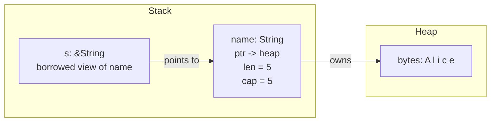

# Borrowing and References

Ownership solves memory safety, but it creates a practical problem. If passing a
value to a function means giving up ownership, you would have to move values into
functions and then move them back — every single time:

```rust
fn calculate_length(s: String) -> (String, usize) {
    let len = s.len();
    (s, len) // return the String AND the length
}

fn main() {
    let name = String::from("Alice");
    let (name, length) = calculate_length(name);
    println!("{name} is {length} characters");
}
```

Output: `Alice is 5 characters`

This works, but it is tedious. Every function that reads a value would need to
return it. Code would be littered with tuples shuttling ownership back and forth.
Rust has a better answer: _borrowing_.

Borrowing lets you use a value without taking ownership of it. You hand out a
_reference_ — a pointer that the compiler guarantees is always valid — and the
original owner keeps its value. When the reference goes out of scope, nothing is
freed, because the reference never owned anything.

This is the second pillar of Rust's memory model. Ownership says _who_ is
responsible for a value. Borrowing says _who else_ can look at it, and under what
conditions.

> **How to Read This Chapter**
>
> - Understand now: borrowing lets code use data without taking ownership, the
>   core rule is many readers or one writer, and lifetime annotations describe
>   relationships the compiler must check.
> - Memorize: `&`, `&mut`, `*`, `&str`, and `&[T]`.
> - Use as reference: the borrow-checker error patterns and the API guideline to
>   prefer borrowed parameters over owned ones when a function only reads data.
> - Skim on first pass: the explicit lifetime syntax. Retain the problem it
>   solves first, then come back for the apostrophes.

## References: Looking Without Owning

A _reference_ is created with the `&` operator. It points to a value without
taking ownership:

Example 2-9. Borrowing a String without returning it to the caller

```rust
fn calculate_length(s: &String) -> usize {
    s.len()
}

fn main() {
    let name = String::from("Alice");
    let length = calculate_length(&name);
    println!("{name} is {length} characters");
}
```

Output: `Alice is 5 characters`

The `&name` creates a reference to `name`. The function `calculate_length` takes
a `&String` — a reference to a `String` — instead of taking ownership. After the
function returns, `name` is still valid in `main` because ownership never left.

Here is what this looks like in memory:

Figure 2-4. A borrowed reference points to the owner, while the owner keeps the heap data



The reference `s` points to `name`, and `name` points to the heap data. When `s`
goes out of scope at the end of `calculate_length`, nothing happens — `s` was
just a temporary view. The `String` is still owned by `name` and will be dropped
when `name` goes out of scope.

Creating a reference is called _borrowing_. Just like borrowing a book from a
friend — you can read it, but you do not own it, and you have to give it back.

### References Are Immutable by Default

A reference created with `&` is a _shared reference_. You can read the value, but
you cannot modify it:

```rust,does_not_compile
fn add_exclamation(s: &String) {
    s.push_str("!"); // error: cannot borrow `*s` as mutable
}
```

```
error[E0596]: cannot borrow `*s` as mutable, as it is behind a `&` reference
 --> src/main.rs:2:5
  |
2 |     s.push_str("!");
  |     ^ `s` is a `&` reference, so it cannot be borrowed as mutable
  |
help: consider changing this to be a mutable reference
  |
1 | fn add_exclamation(s: &mut String) {
  |                        +++
```

This is intentional. A shared reference promises that the data will not change
while you are looking at it. The compiler even suggests the fix: change `&String`
to `&mut String`. This promise is what makes shared references safe to hand out
to multiple parts of your code simultaneously.

## Mutable References: Exclusive Access

When you need to modify a borrowed value, you create a _mutable reference_ with
`&mut`:

Example 2-10. Mutating through a mutable reference

```rust
fn add_exclamation(s: &mut String) {
    s.push_str("!");
}

fn main() {
    let mut greeting = String::from("Hello");
    add_exclamation(&mut greeting);
    println!("{greeting}");
}
```

Output: `Hello!`

Three things must align for a mutable borrow to work:

1. The variable must be declared `mut` — `let mut greeting`.
2. The reference must be created with `&mut` — `&mut greeting`.
3. The function parameter must accept `&mut` — `s: &mut String`.

If any of these is missing, the compiler tells you exactly which one. This
three-way agreement makes mutation explicit at every point in the code — you can
never accidentally modify a value you intended to only read.

### Reading and Writing Through References

In the example above, `s.push_str("!")` modified the `String` through a mutable
reference without any special syntax. When you call a method on a reference,
Rust automatically follows the reference to reach the value — this is called
_automatic dereferencing_, and it applies to both `&T` and `&mut T`.

But when you need to access or replace the value behind a reference directly —
not through a method — you use the _dereference operator_ `*`:

```rust
fn double(x: &mut i32) {
    *x *= 2;
}

fn main() {
    let mut value = 10;
    let r = &mut value;

    *r += 5;
    println!("value is now {}", *r);

    let mut score = 85;
    double(&mut score);
    println!("doubled: {score}");
}
```

Output:

```
value is now 15
doubled: 170
```

The `*` operator follows a reference to the value it points to. With a shared
reference (`&T`), you can read the value. With a mutable reference (`&mut T`),
you can both read and write it. Think of `&` as "create a reference to" and `*`
as "follow the reference to its value" — they are complementary operations.

You will use `*` most often when modifying primitive values through mutable
references. For method calls and field access, automatic dereferencing handles
it — `r.some_method()` works the same whether `r` is a value or a reference.

## The One Rule

Rust's borrowing system is governed by a single rule with two parts:

> At any given time, you can have _either_:
>
> - Any number of shared references (`&T`), _or_
> - Exactly one mutable reference (`&mut T`)
>
> — but never both at the same time.

This is often called the _many readers or one writer_ rule. It is the mechanism
that prevents data races at compile time.

Think about why: if multiple parts of your code have shared references to a
value, they all expect the data to remain stable. If a mutable reference existed
at the same time, it could change the data out from under them. Rust prevents
this by making shared and mutable access mutually exclusive.

### Many Readers

Multiple shared references can coexist:

```rust
fn main() {
    let name = String::from("Alice");

    let r1 = &name;
    let r2 = &name;
    let r3 = &name;

    println!("{r1}, {r2}, {r3}");
}
```

Output: `Alice, Alice, Alice`

This is safe because none of the references can modify `name`. They all observe
the same stable data.

### One Writer

Only one mutable reference can exist at a time:

```rust,does_not_compile
fn main() {
    let mut s = String::from("hello");

    let r1 = &mut s;
    let r2 = &mut s; // error: cannot borrow `s` as mutable more than once

    println!("{r1}, {r2}");
}
```

```
error[E0499]: cannot borrow `s` as mutable more than once at a time
 --> src/main.rs:5:14
  |
4 |     let r1 = &mut s;
  |              ------ first mutable borrow occurs here
5 |     let r2 = &mut s;
  |              ^^^^^^ second mutable borrow occurs here
6 |     println!("{r1}, {r2}");
  |                -- first borrow later used here
```

Two mutable references to the same data would mean two parts of the code could
modify it simultaneously — the classic recipe for a data race.

### No Mixing

You cannot have a shared reference and a mutable reference to the same value at
the same time:

```rust,does_not_compile
fn main() {
    let mut s = String::from("hello");

    let r1 = &s;        // shared borrow
    let r2 = &mut s;    // mutable borrow — error

    println!("{r1}, {r2}");
}
```

```
error[E0502]: cannot borrow `s` as mutable because it is also borrowed as immutable
 --> src/main.rs:5:14
  |
4 |     let r1 = &s;
  |              -- immutable borrow occurs here
5 |     let r2 = &mut s;
  |              ^^^^^^ mutable borrow occurs here
6 |     println!("{r1}, {r2}");
  |                -- immutable borrow later used here
```

A shared reference promises the data will not change. A mutable reference
promises exclusive access. These promises are contradictory, so the compiler
rejects the code.

## When Borrows End

The borrow checker is smarter than you might expect. A borrow does not last until
the end of the scope — it lasts until the reference is _last used_. This is
called _Non-Lexical Lifetimes_, and it means the following code is perfectly
valid:

Example 2-11. Letting shared borrows end before a mutable one begins

```rust
fn main() {
    let mut s = String::from("hello");

    let r1 = &s;
    let r2 = &s;
    println!("{r1} and {r2}");
    // r1 and r2 are no longer used after this point

    let r3 = &mut s; // this is fine — the shared borrows have ended
    r3.push_str(" world");
    println!("{r3}");
}
```

Output:

```
hello and hello
hello world
```

The shared references `r1` and `r2` are last used in the first `println!`. After
that line, their borrows are over, and a mutable reference `r3` can be created.
The compiler tracks exactly where each reference is last used, not where it goes
out of scope.

This makes the borrow checker practical. You do not need to create artificial
scopes to "end" your borrows — just stop using the reference, and the compiler
figures it out.

## The Borrow Checker

The _borrow checker_ is the part of the Rust compiler that enforces these rules.
It analyzes your code to ensure that every reference is valid for as long as it
is used, and that the shared-or-mutable rule is never violated.

When the borrow checker rejects your code, it is not a bug in the compiler — it
has found a potential safety violation. The error messages are designed to show
you exactly what went wrong:

```rust,does_not_compile
fn main() {
    let mut data = vec![1, 2, 3];

    let first = &data[0]; // shared borrow of data

    data.push(4);         // mutable borrow of data — error

    println!("first element: {first}");
}
```

```
error[E0502]: cannot borrow `data` as mutable because it is also borrowed as immutable
 --> src/main.rs:6:5
  |
4 |     let first = &data[0];
  |                  ---- immutable borrow occurs here
6 |     data.push(4);
  |     ^^^^^^^^^^^^ mutable borrow occurs here
8 |     println!("first element: {first}");
  |                               ----- immutable borrow later used here
```

This is a real bug the compiler caught. When a `Vec` grows, it may reallocate
its internal buffer to a new location in memory. If that happened, `first` —
which points into the old buffer — would be a dangling pointer. The borrow
checker prevents this by not allowing a mutable operation on `data` while a
shared reference into it exists.

The fix is to restructure the code so that the shared borrow ends before the
mutation:

```rust
fn main() {
    let mut data = vec![1, 2, 3];

    let first = data[0]; // copy the value (i32 is Copy) instead of borrowing

    data.push(4);

    println!("first element: {first}");
    println!("data: {data:?}");
}
```

Output:

```
first element: 1
data: [1, 2, 3, 4]
```

By copying the `i32` value instead of taking a reference, we avoid the conflict
entirely. The borrow checker often steers you toward designs that are not only
safe but also clearer.

## Borrowing in Functions

References are most commonly used as function parameters. This lets functions
read or modify data without taking ownership:

```rust
fn first_word(s: &str) -> &str {
    if let Some(space) = s.find(' ') {
        &s[..space]
    } else {
        s
    }
}

fn main() {
    let sentence = String::from("hello world");
    let word = first_word(&sentence);
    println!("first word: {word}");
}
```

Output: `first word: hello`

The function `first_word` takes a `&str` and returns a `&str` — it borrows text
and returns a borrowed slice of it. The `find(' ')` method returns
`Some(position)` if a space is found, or `None` if there is no space. The `if
let` pattern from the previous chapter extracts the position, and `&s[..space]`
creates a slice of the original string up to (but not including) the space.

Notice the parameter type is `&str`, not `&String`. A `&str` is a _string
slice_ — a reference to a sequence of bytes that is valid UTF-8. It is more
flexible than `&String` because it can refer to any string data: a `String`, a
string literal, or a substring.

When you write `&sentence`, Rust automatically converts the `&String` into a
`&str`. This conversion is free — it just reinterprets the pointer and length.
Prefer `&str` over `&String` in function parameters, because it accepts both
owned strings and string literals without requiring the caller to own a `String`.

> **Tip**
>
> In APIs, default to `&str` for read-only text parameters. It accepts both
> `String` and string literals, so callers get flexibility without extra
> allocation. The same logic extends to slices: prefer `&[&str]` over
> `&[String]` when a function only reads text. With `&[String]`, callers who
> have string literals must allocate `String`s just to call you. The tradeoff
> is that `&[&str]` may require a lifetime annotation on the return type —
> a one-time cost in the signature that gives every caller flexibility.

> **Warning**
>
> `vec!["hello", "world"]` produces a `Vec<&str>`, not a `Vec<String>`,
> because string literals are `&str`. If your function expects `&[String]`,
> this will not match. Either change the function to accept `&[&str]`, or
> convert the literals: `["hello", "world"].map(String::from)`.

### Slices: References to Sequences

A _slice_ is a reference to a contiguous sequence of elements. String slices
(`&str`) are one example. Array and vector slices (`&[T]`) are another:

```rust
fn sum(numbers: &[i32]) -> i32 {
    let mut total = 0;
    for n in numbers {
        total += n;
    }
    total
}

fn main() {
    let data = vec![10, 20, 30, 40, 50];

    let total = sum(&data);
    let partial = sum(&data[1..4]); // slice of elements at index 1, 2, 3

    println!("total: {total}");
    println!("partial (index 1..4): {partial}");
}
```

Output:

```
total: 150
partial (index 1..4): 90
```

The `&data` expression creates a `&[i32]` — a slice referring to the entire
vector. The `&data[1..4]` creates a slice referring to a sub-range. In both
cases, `sum` borrows the data without taking ownership.

Slices are one of the most common types in Rust. They let you write functions
that work with any contiguous data — arrays, vectors, or sub-ranges of either —
without caring how that data was allocated.

## Dangling References: The Compiler Says No

One of the most dangerous bugs in C and C++ is the _dangling reference_ — a
pointer to memory that has been freed. Rust makes dangling references impossible:

```rust,does_not_compile
fn dangle() -> &String {
    let s = String::from("hello");
    &s
} // s is dropped here, so &s would point to freed memory
```

```
error[E0106]: missing lifetime specifier
 --> src/main.rs:1:16
  |
1 | fn dangle() -> &String {
  |                ^ expected named lifetime parameter
  |
  = help: this function's return type contains a borrowed value, but there is
          no value for it to be borrowed from
help: instead, you are more likely to want to return an owned value
  |
1 - fn dangle() -> &String {
1 + fn dangle() -> String {
  |
```

The compiler refuses to compile this because `s` is dropped at the end of
`dangle`, and returning a reference to it would create a dangling pointer. The
compiler even suggests the fix: return the owned value instead of a reference:

```rust
fn no_dangle() -> String {
    let s = String::from("hello");
    s // return the owned String — ownership moves to the caller
}

fn main() {
    let s = no_dangle();
    println!("{s}");
}
```

Output: `hello`

By returning the `String` directly, ownership transfers to the caller and no
reference is left pointing at freed memory.

> **Warning**
>
> The dangling reference trap also appears in a subtler form: building an owned
> value _inside_ a function with iterators or `clone`, then trying to return a
> reference to it.
>
> ```rust,does_not_compile
> fn longest(items: &[String]) -> &str {
>     let owned = items.iter()
>         .max_by_key(|s| s.len())
>         .cloned()       // creates a new String
>         .unwrap();
>     owned.as_str()  // error: returns a reference to local data
> }
> ```
>
> The fix is the same principle: do not create a local owner and then borrow
> from it. Instead, keep working with references to the _input_ data so the
> returned reference borrows from something the caller owns.

## Lifetimes: How Long a Reference Is Valid

Every reference in Rust has a _lifetime_ — the region of code where the
reference is valid. Most of the time, lifetimes are inferred by the compiler,
just like types are inferred. You do not need to write them.

But sometimes the compiler needs a hint. Consider a function that takes two
string slices and returns whichever is longer:

```rust
fn longer<'a>(s1: &'a str, s2: &'a str) -> &'a str {
    if s1.len() >= s2.len() {
        s1
    } else {
        s2
    }
}

fn main() {
    let result;

    let s1 = String::from("long string");
    {
        let s2 = String::from("short");
        result = longer(&s1, &s2);
        println!("longer: {result}");
    }
}
```

Output: `longer: long string`

The `'a` in `fn longer<'a>(s1: &'a str, s2: &'a str) -> &'a str` is a _lifetime
annotation_. It tells the compiler: "the returned reference will live at least as
long as the shorter of the two input references."

> **Sidebar**
>
> A lifetime annotation does not make data live longer. It only gives the
> compiler a name for an existing borrowing relationship so it can reject
> dangling references.

Why is this necessary? The compiler cannot see inside the function body when
checking the caller. It does not know whether the function will return `s1` or
`s2`. The lifetime annotation tells the compiler what to expect, so it can verify
that the caller uses the result safely.

Watch what happens if you try to use `result` after the shorter-lived `s2` is
dropped:

```rust,does_not_compile
fn longer<'a>(s1: &'a str, s2: &'a str) -> &'a str {
    if s1.len() >= s2.len() {
        s1
    } else {
        s2
    }
}

fn main() {
    let s1 = String::from("long string");
    let result;
    {
        let s2 = String::from("short");
        result = longer(&s1, &s2);
    }
    println!("longer: {result}");
}
```

```
error[E0597]: `s2` does not live long enough
  --> src/main.rs:14:30
   |
13 |         let s2 = String::from("short");
   |             -- binding `s2` declared here
14 |         result = longer(&s1, &s2);
   |                              ^^^ borrowed value does not live long enough
15 |     }
   |     - `s2` dropped here while still borrowed
16 |     println!("longer: {result}");
   |                        ------ borrow later used here
```

The lifetime annotation `'a` ties the return value to the shorter of the two
input lifetimes. Since `s2` lives only inside the inner block, the compiler knows
that `result` might reference `s2`'s data — and `s2` is dropped before `result`
is used. The compiler catches the dangling reference at compile time, not at
runtime.

### When You Do Not Need Lifetime Annotations

In most cases, the compiler figures lifetimes out on its own through a process
called _lifetime elision_. There are simple rules the compiler follows, and they
cover the vast majority of real code:

```rust
// The compiler infers the lifetime — no annotation needed
fn first_char(s: &str) -> &str {
    &s[..1]
}

fn main() {
    let name = String::from("Rust");
    let ch = first_char(&name);
    println!("first character: {ch}");
}
```

Output: `first character: R`

When a function takes a single reference and returns a reference, the compiler
knows the output must borrow from the input. No annotation needed. You will find
that the vast majority of functions you write never need explicit lifetimes.

The key takeaway: lifetimes exist to prevent dangling references. The compiler
checks them automatically. You only write annotations when the compiler cannot
figure out the relationships on its own — primarily when multiple references go
in and a reference comes out.

> **Tip**
>
> Watch for _hidden_ multiple lifetimes. A parameter like `&[&str]` contains
> two: the outer reference to the slice and the inner `&str` references. Even
> though you wrote only one parameter, the compiler sees two lifetimes and
> cannot guess which one the return value borrows from. That is why
> `fn longest(items: &[&str]) -> &str` fails while
> `fn longest(items: &[String]) -> &str` compiles — `&[String]` has only one
> lifetime, so elision works.

## Working with the Borrow Checker

The borrow checker is not an obstacle to work around — it is a tool that catches
real bugs. Here are patterns that work naturally with it.

### Separate Your Reads and Writes

When you need both shared and mutable access, finish reading before you start
writing:

```rust
fn main() {
    let mut scores = vec![85, 92, 78, 95, 88];

    // read phase: find the maximum
    let mut max = scores[0];
    for i in 1..scores.len() {
        if scores[i] > max {
            max = scores[i];
        }
    }

    // write phase: normalize all scores relative to max
    for score in &mut scores {
        *score = (*score * 100) / max;
    }

    println!("normalized: {scores:?}");
}
```

Output: `normalized: [89, 96, 82, 100, 92]`

The read phase copies values out of the vector using indexing — `scores[i]`
borrows only for the duration of each access, and `i32` values are `Copy`, so
`max` is an independent value. By the time the write phase begins with `&mut
scores`, no shared borrows remain. In the write phase, `for score in &mut
scores` gives a `&mut i32` for each element, and `*score` dereferences it to
read and write the value directly.

### Use Indices When You Need to Mutate While Referring to the Collection

Sometimes you need to read from one part of a collection while writing to
another. Indices avoid borrow conflicts:

```rust
fn main() {
    let mut data = vec![3, 1, 4, 1, 5];

    for i in 0..data.len() - 1 {
        if data[i] > data[i + 1] {
            data.swap(i, i + 1);
        }
    }

    println!("{data:?}");
}
```

Output: `[1, 3, 1, 4, 5]`

Indexing with `data[i]` does not create a persistent borrow, so `data.swap()` can
modify the vector within the same loop.

### Scope Your Borrows Narrowly

If you have a complex function, limit how far a reference reaches. Smaller scopes
mean shorter borrows:

```rust
fn main() {
    let mut log = String::new();

    // borrow log briefly to check its state
    let is_empty = log.is_empty();

    if is_empty {
        log.push_str("started");
    }
    log.push_str(" | running");

    println!("{log}");
}
```

Output: `started | running`

The `is_empty()` call borrows `log` only for the duration of the method call.
By storing the result in a `bool` (a `Copy` type), the borrow ends immediately,
and `log` is free to be mutated afterward.

## Borrowing in Action

Here is a complete example that ties together shared references, mutable
references, slices, and the borrow checker. Trace through it and predict the
output:

Example 2-12. Combining shared borrows, mutable borrows, and slices

```rust
fn longest_name<'a>(names: &'a [&str]) -> &'a str {
    let mut longest = names[0];
    for name in &names[1..] {
        if name.len() > longest.len() {
            longest = name;
        }
    }
    longest
}

fn add_greeting(buffer: &mut String, name: &str) {
    buffer.push_str("Hello, ");
    buffer.push_str(name);
    buffer.push('!');
}

fn main() {
    let names = ["Alice", "Bob", "Charlie", "Eve"];

    // shared borrow: read the names to find the longest
    let star = longest_name(&names);
    println!("longest name: {star}");

    // mutable borrow: build a greeting
    let mut message = String::new();
    add_greeting(&mut message, star);
    println!("{message}");

    // shared borrows: iterate over all names
    for name in &names {
        println!("  - {name}");
    }
}
```

Output:

```
longest name: Charlie
Hello, Charlie!
  - Alice
  - Bob
  - Charlie
  - Eve
```

Every reference in this program is valid. Every borrow ends before a conflicting
one begins. The compiler verified all of this at compile time, and the generated
code has zero runtime overhead — references are just pointers, and the borrowing
rules exist only during compilation.

## Why This Matters

Ownership tells you _who_ is responsible for a value. Borrowing tells you _who
else_ can access it:

- **Shared references** (`&T`) give read-only access. Many can exist at once.
  They are free to create and carry no overhead beyond a pointer.
- **Mutable references** (`&mut T`) give exclusive read-write access. Only one
  can exist at a time, guaranteeing no other code can observe the value while
  it is being changed.
- **The dereference operator** (`*`) follows a reference to its value. Method
  calls dereference automatically, but direct reads and writes through a
  reference use `*r` explicitly.
- **The borrow checker** enforces these rules at compile time. No runtime checks,
  no garbage collector, no data-race potential.
- **Lifetimes** ensure references never outlive the data they point to. The
  compiler infers them in most cases; you only annotate when it needs help.

Together, ownership and borrowing form Rust's complete memory safety story: values
are freed exactly once, at a predictable time, and no reference ever points to
freed memory. This is not a theoretical guarantee — the compiler _proves_ it for
every program that compiles.

## Check Yourself

Use these prompts to test the borrowing model before moving on:

- Why is borrowing necessary if ownership already keeps memory safe?
- What promise does `&T` make that `&mut T` is not allowed to break?
- Why can a borrow end before the closing brace even when the reference variable
  is still in scope?
- Why is `&str` usually a better parameter type than `&String` for read-only
  text?
- What information does a lifetime annotation add to `longer`, and what does it
  _not_ do?

## Exercises

These micro-projects practice the core borrowing patterns from this chapter.
Each uses only concepts from this and earlier chapters.

### Exercise 2-10: Playlist Stats (Borrowing Edition)

In the ownership chapter, Exercise 2-8 built a playlist manager that had to move
the `Vec` into each function and return it. That friction motivated borrowing.
Now rewrite the idea with references: functions that _borrow_ the playlist
instead of taking ownership.

Write three functions:

- `longest_title` takes a `&[&str]` and returns `Option<&str>` — the longest
  song title in the playlist, or `None` if the slice is empty. Because
  `&[&str]` has two lifetimes, you will need a lifetime annotation to tell
  the compiler which one the return value borrows from.
- `total_characters` takes a `&[&str]` and returns the sum of all title
  lengths as a `usize`.
- `display_playlist` takes a `&[&str]` and prints a numbered list.

In `main`, create an array of four song titles. Call all three functions, then
print the playlist's length to confirm it is still usable.

Expected output:

```
Playlist (4 songs):
  1. Bohemian Rhapsody
  2. Stairway to Heaven
  3. Hotel California
  4. Imagine
Longest title: Stairway to Heaven
Total characters: 58
Still have 4 songs!
```

> **Key insight**
>
> Compare this to Exercise 2-8. Every function borrows the playlist with `&` —
> no need to return it to keep using it. Borrowing eliminates the
> take-and-return choreography that ownership alone requires. Returning
> `Option<&str>` instead of panicking on empty input is idiomatic Rust —
> let the caller decide how to handle the absence of a value.

<details>
<summary>Solution</summary>

```rust
fn longest_title<'a>(playlist: &[&'a str]) -> Option<&'a str> {
    playlist.iter().max_by_key(|s| s.len()).copied()
}

fn total_characters(playlist: &[&str]) -> usize {
    playlist.iter().map(|s| s.len()).sum()
}

fn display_playlist(playlist: &[&str]) {
    println!("Playlist ({} songs):", playlist.len());
    playlist.iter().enumerate().for_each(|(i, title)| {
        println!("  {}. {title}", i + 1);
    });
}

fn main() {
    let playlist = ["Bohemian Rhapsody", "Stairway to Heaven",
                     "Hotel California", "Imagine"];

    display_playlist(&playlist);

    let longest = longest_title(&playlist).unwrap();
    println!("Longest title: {longest}");

    println!("Total characters: {}", total_characters(&playlist));

    // playlist is still usable — we only borrowed it
    println!("Still have {} songs!", playlist.len());
}
```

`longest_title` returns `Option<&str>` — `None` for an empty playlist,
`Some` with a `&str` borrowed from the input slice otherwise. The `'a`
lifetime annotation is needed here because `&[&str]` contains two lifetimes —
the outer slice reference and the inner `&str` references — and the compiler
cannot tell which one the return value borrows from. The annotation says "the
returned `&str` lives as long as the string data inside the slice."

</details>

### Exercise 2-11: In-Place Temperature Converter

Practice the _read-then-write_ pattern and the dereference operator `*` by
converting temperatures in place.

Write three functions:

- `summary` takes a `&[f64]` (shared borrow) and returns the minimum and maximum
  as a `(f64, f64)` tuple.
- `celsius_to_fahrenheit` takes a `&mut [f64]` (mutable borrow) and converts
  each value in place using the formula `F = C × 1.8 + 32`.
- `clamp_range` takes a `&mut [f64]`, a `min`, and a `max`, and clamps each
  value to the given range using the `clamp` method.

In `main`, create a `Vec` of five Celsius temperatures. Print the summary (shared
borrow), convert to Fahrenheit (mutable borrow), clamp to a body-safe range
(mutable borrow), then print the summary again (shared borrow).

Expected output:

```
Celsius: [0.0, 15.5, -10.0, 37.0, 100.0]
Range: -10.0°C to 100.0°C
Fahrenheit: [32.0, 59.9, 14.0, 98.6, 212.0]
Clamped to body-safe range: [32.0, 59.9, 32.0, 98.6, 98.6]
New range: 32.0°F to 98.6°F
```

> **Key insight**
>
> The shared borrows in `summary` and the mutable borrows in
> `celsius_to_fahrenheit` never overlap — each borrow ends before the next
> begins. This is the read-then-write pattern the borrow checker rewards.

<details>
<summary>Solution</summary>

```rust
fn summary(temps: &[f64]) -> (f64, f64) {
    let mut min = temps[0];
    let mut max = temps[0];
    for &t in &temps[1..] {
        if t < min {
            min = t;
        }
        if t > max {
            max = t;
        }
    }
    (min, max)
}

fn celsius_to_fahrenheit(temps: &mut [f64]) {
    for t in temps.iter_mut() {
        *t = *t * 1.8 + 32.0;
    }
}

fn clamp_range(values: &mut [f64], min: f64, max: f64) {
    for v in values.iter_mut() {
        *v = v.clamp(min, max);
    }
}

fn main() {
    let mut temps = vec![0.0, 15.5, -10.0, 37.0, 100.0];
    println!("Celsius: {temps:.1?}");

    let (min, max) = summary(&temps);
    println!("Range: {min:.1}°C to {max:.1}°C");

    celsius_to_fahrenheit(&mut temps);
    println!("Fahrenheit: {temps:.1?}");

    clamp_range(&mut temps, 32.0, 98.6);
    println!("Clamped to body-safe range: {temps:.1?}");

    let (min, max) = summary(&temps);
    println!("New range: {min:.1}°F to {max:.1}°F");
}
```

Notice `*t = *t * 1.8 + 32.0` in `celsius_to_fahrenheit` — the `*` dereferences
the `&mut f64` to read and write the value. In `summary`, `for &t in
&temps[1..]` destructures each `&f64` into a plain `f64`, avoiding the need for
explicit `*`.

</details>

### Exercise 2-12: The Word Analyzer

Practice `&str` parameters, returning borrowed slices, and the transition from
shared to mutable borrows.

Write three functions:

- `first_word` takes a `&str` and returns a `&str` — the text up to the first
  space, or the entire string if there is no space. Use `find(' ')` and slicing.
- `longest_word` takes a `&str` and returns a `&str` — the longest word. Walk
  through the string with `find(' ')` and slicing to extract each word.
- `append_word` takes a `&mut String` and a `&str`, adding a space separator if
  the buffer is not empty, then appending the word.

In `main`, start with a `&str` literal. Call `first_word` and `longest_word`
(shared borrows of the literal), then build a summary `String` using
`append_word` (mutable borrows of the new `String`). Print the original text at
the end to confirm it was never consumed.

Expected output:

```
Text: "Rust ownership and borrowing make memory safe"
First word: "Rust"
Longest word: "ownership"
Summary: "Rust ownership"
Original still here: "Rust ownership and borrowing make memory safe"
```

> **Key insight**
>
> `first_word` and `longest_word` accept `&str`, which works with both `String`
> values and string literals. The returned `&str` borrows directly from the input
> — no allocation, no copying. The mutable `append_word` operates on a separate
> `String`, so there is no borrow conflict with the original text.

<details>
<summary>Solution</summary>

```rust
fn first_word(text: &str) -> &str {
    if let Some(space) = text.find(' ') {
        &text[..space]
    } else {
        text
    }
}

fn longest_word(text: &str) -> &str {
    let mut longest = "";
    let mut remaining = text;
    while !remaining.is_empty() {
        let word;
        if let Some(space) = remaining.find(' ') {
            word = &remaining[..space];
            remaining = &remaining[space + 1..];
        } else {
            word = remaining;
            remaining = "";
        }
        if word.len() > longest.len() {
            longest = word;
        }
    }
    longest
}

fn append_word(buffer: &mut String, word: &str) {
    if !buffer.is_empty() {
        buffer.push(' ');
    }
    buffer.push_str(word);
}

fn main() {
    let text = "Rust ownership and borrowing make memory safe";
    println!("Text: \"{text}\"");

    let first = first_word(text);
    println!("First word: \"{first}\"");

    let longest = longest_word(text);
    println!("Longest word: \"{longest}\"");

    // Build a summary using mutable borrows
    let mut summary = String::new();
    append_word(&mut summary, first);
    append_word(&mut summary, longest);
    println!("Summary: \"{summary}\"");

    // The original text is still available — we only borrowed it
    println!("Original still here: \"{text}\"");
}
```

`longest_word` walks through the string by repeatedly finding spaces and slicing.
Each `word` is a `&str` borrowed from `remaining`, which is itself a `&str`
borrowed from the original `text`. The compiler verifies that all these slices
remain valid — no lifetime annotations needed because there is only one input
reference.

</details>

---

You now have the two foundational concepts that make Rust unique: ownership and
borrowing. Every value has one owner, and other code can borrow it through
references — either shared or exclusive, never both. The borrow checker enforces
these rules automatically, catching bugs that would be invisible in other
languages.

In the next chapter, you will put these concepts to work by building custom data
types with _structs_ — grouping related data together and attaching behavior to
it. Ownership and borrowing will guide how you design your types, choosing when
methods should read, modify, or consume the values they operate on.
