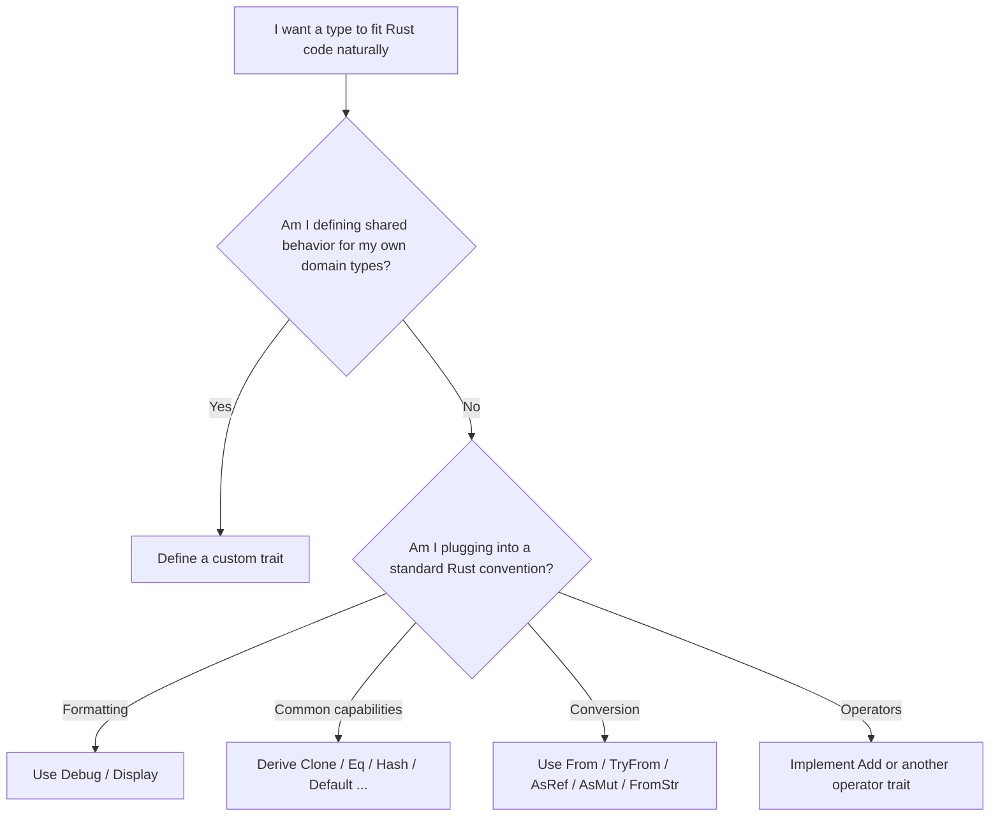

# Traits

In the previous chapters, you built types — structs and enums — and attached
behavior to them with `impl` blocks. Each type knew how to do its own thing:
`Score` could grade itself, `Connection` could describe its state, `Ticket`
could display its priority. But every function you wrote expected a _specific_
type. If you wanted the same operation — say, printing a summary — for two
different types, you had to write two separate functions.

Most languages solve this with inheritance: create a base class, put the shared
behavior there, and have concrete types extend it. This works until it does not.
Inheritance hierarchies grow deep and rigid. Adding a new behavior means finding
the right place in the tree. A type can only have one parent, so cross-cutting
concerns — "this type can be printed _and_ compared _and_ serialized" — require
awkward multiple-inheritance or mixin schemes.

Rust takes a different path: _traits_. A trait defines a set of behaviors — a
contract that says "any type that implements me can do these things." Types opt
in to traits individually. A struct can implement one trait, ten traits, or none
at all. There is no hierarchy, no parent class, no inheritance tree. Traits are
flat, composable, and independent.

This chapter introduces traits from the ground up: how to define them, implement
them, and use the ones the standard library provides. By the end, you will
understand the system that makes Rust's generic, reusable code possible — and
you will already be using it.

> **How to Read This Chapter**
>
> - Understand now: traits describe capabilities, and standard traits are how
>   your types plug into the broader Rust ecosystem.
> - Memorize: `trait`, `impl`, `#[derive(...)]`, `Display`, `From`, `TryFrom`,
>   `AsRef`, `AsMut`, and `FromStr`.
> - Use as reference: the derive/default guidance and the standard conversion
>   traits section.
> - Skim on first pass: ad-hoc formatting with `fmt::from_fn` and the
>   supertrait/orphan-rule details. Keep the design intuition, not every edge
>   case.

Before the syntax branches, keep the main decision simple:

Figure 4-1. Choosing the right trait tool



## Defining a Trait

A _trait_ declares a set of methods that a type must provide. Think of it as a
contract: "if you implement this trait, you promise to have these methods with
these signatures."

```rust
trait Summary {
    fn summarize(&self) -> String;
}
```

This defines a trait called `Summary` with one required method: `summarize`.
Any type that implements `Summary` must provide a `summarize` method that takes
a shared reference to `self` and returns a `String`. The trait does not say
_how_ to summarize — that is up to each type.

## Implementing a Trait

You implement a trait for a type with an `impl Trait for Type` block:

Example 4-1. Teaching one behavior to two different concrete types

```rust
trait Summary {
    fn summarize(&self) -> String;
}

struct Article {
    title: String,
    author: String,
}

impl Summary for Article {
    fn summarize(&self) -> String {
        format!("{} by {}", self.title, self.author)
    }
}

struct Tweet {
    username: String,
    body: String,
}

impl Summary for Tweet {
    fn summarize(&self) -> String {
        format!("@{}: {}", self.username, self.body)
    }
}

fn main() {
    let article = Article {
        title: String::from("Rust 2024 Released"),
        author: String::from("The Rust Team"),
    };

    let tweet = Tweet {
        username: String::from("rustlang"),
        body: String::from("Rust 2024 is here!"),
    };

    println!("{}", article.summarize());
    println!("{}", tweet.summarize());
}
```

Output:

```
Rust 2024 Released by The Rust Team
@rustlang: Rust 2024 is here!
```

Both `Article` and `Tweet` implement `Summary`, but each in its own way. The
trait defines _what_ the behavior is. The `impl` block defines _how_ each type
provides it. This is fundamentally different from inheritance: there is no base
class, no shared implementation to inherit. Each type stands on its own.

### Default Methods

A trait can provide a default implementation that types get for free:

```rust
trait Summary {
    fn summarize_author(&self) -> String;

    fn summarize(&self) -> String {
        format!("(read more from {}...)", self.summarize_author())
    }
}

struct Article {
    author: String,
}

impl Summary for Article {
    fn summarize_author(&self) -> String {
        self.author.clone()
    }
    // Uses the default summarize
}

struct Tweet {
    username: String,
    body: String,
}

impl Summary for Tweet {
    fn summarize_author(&self) -> String {
        format!("@{}", self.username)
    }

    fn summarize(&self) -> String {
        format!("{}: {}", self.summarize_author(), self.body)
    }
}

fn main() {
    let article = Article {
        author: String::from("The Rust Team"),
    };

    let tweet = Tweet {
        username: String::from("rustlang"),
        body: String::from("Rust 2024 is here!"),
    };

    println!("{}", article.summarize());
    println!("{}", tweet.summarize());
}
```

Output:

```
(read more from The Rust Team...)
@rustlang: Rust 2024 is here!
```

`Article` only implements `summarize_author` and gets the default `summarize`
for free. `Tweet` overrides the default with its own version. Default methods
let you add new behavior to a trait without breaking every existing
implementation — types that do not need custom behavior simply inherit the
default.

### Traits as Parameters

The real power of traits emerges when you use them in function signatures. You
can write a function that accepts _any_ type implementing a trait:

```rust
trait Summary {
    fn summarize(&self) -> String;
}

struct Article {
    title: String,
    author: String,
}

impl Summary for Article {
    fn summarize(&self) -> String {
        format!("{} by {}", self.title, self.author)
    }
}

struct Tweet {
    username: String,
    body: String,
}

impl Summary for Tweet {
    fn summarize(&self) -> String {
        format!("@{}: {}", self.username, self.body)
    }
}

fn notify(item: &impl Summary) {
    println!("breaking: {}", item.summarize());
}

fn main() {
    let article = Article {
        title: String::from("Rust 2024 Released"),
        author: String::from("The Rust Team"),
    };

    let tweet = Tweet {
        username: String::from("rustlang"),
        body: String::from("Rust 2024 is here!"),
    };

    notify(&article);
    notify(&tweet);
}
```

Output:

```
breaking: Rust 2024 Released by The Rust Team
breaking: @rustlang: Rust 2024 is here!
```

The parameter type `&impl Summary` means "a reference to any type that
implements `Summary`." The function does not know or care whether it receives an
`Article`, a `Tweet`, or any other type — as long as that type provides a
`summarize` method.

This is _bounded polymorphism_: the function is generic over any type, but
bounded by the requirement that the type implements `Summary`. Behind the scenes,
the compiler generates a separate version of `notify` for each concrete type you
pass — one for `Article`, one for `Tweet`. This means there is no runtime
overhead: trait-bounded calls are as fast as calling a function written for a
specific type. The `impl Trait` syntax in argument position is the most common
and readable way to write trait-bounded functions.

## Traits the Standard Library Gives You

You have already used several standard library traits without knowing their
names. `Debug`, `Display`, `Clone` — these are all traits. The standard library
defines dozens of traits that form a shared vocabulary across the entire Rust
ecosystem. When your types implement these traits, they plug into that
vocabulary seamlessly.

### Derive: Asking the Compiler to Implement Traits

Some traits have such predictable implementations that the compiler can generate
them for you. You have already seen `#[derive(Debug)]`:

```rust
#[derive(Debug, Clone, PartialEq)]
struct Point {
    x: f64,
    y: f64,
}

fn main() {
    let a = Point { x: 1.0, y: 2.0 };
    let b = a.clone();
    let c = Point { x: 3.0, y: 4.0 };

    println!("a = {a:?}");
    println!("a == b: {}", a == b);
    println!("a == c: {}", a == c);
}
```

Output:

```
a = Point { x: 1.0, y: 2.0 }
a == b: true
a == c: false
```

A single `#[derive(...)]` line gave `Point` three capabilities: debug printing,
cloning, and equality comparison. The compiler generates the implementation by
applying the trait's operation to each field — `Debug` prints each field,
`Clone` clones each field, `PartialEq` compares each field.

Here are the most commonly derived traits:

| Trait | What It Provides | Derive Requirement |
|---|---|---|
| `Debug` | `{:?}` formatting for developers | All fields implement `Debug` |
| `Clone` | Explicit deep copy via `.clone()` | All fields implement `Clone` |
| `Copy` | Implicit bitwise copy on assignment | All fields implement `Copy` (also requires `Clone`) |
| `PartialEq` | `==` and `!=` comparison | All fields implement `PartialEq` |
| `Eq` | Marker: equality is reflexive | Also requires `PartialEq`; all fields implement `Eq` |
| `Hash` | Hashing for use in `HashMap`/`HashSet` | All fields implement `Hash` |
| `Default` | A sensible default value via `Default::default()` | All fields implement `Default` |
| `PartialOrd` | `<`, `>`, `<=`, `>=` comparison | All fields implement `PartialOrd` |
| `Ord` | Total ordering | Also requires `Eq` + `PartialOrd`; all fields implement `Ord` |

Each derived trait has one requirement: every field in your struct (or every
variant's data in your enum) must already implement that trait. This is
recursive — if your struct contains a `String`, you can derive `Debug` because
`String` implements `Debug`. If it contains a type that does not implement
`Debug`, the derive will fail with a clear compiler error.

### Default Values

The `Default` trait provides a way to create a sensible "zero value" for a type:

```rust
#[derive(Debug, Default)]
struct Config {
    verbose: bool,
    retries: u32,
    timeout_secs: u64,
}

fn main() {
    let config = Config::default();
    println!("{config:#?}");

    // Override just the fields you care about
    let custom = Config {
        retries: 5,
        ..Config::default()
    };
    println!("verbose: {}", custom.verbose);
    println!("retries: {}", custom.retries);
    println!("timeout: {}", custom.timeout_secs);
}
```

Output:

```
Config {
    verbose: false,
    retries: 0,
    timeout_secs: 0,
}
verbose: false
retries: 5
timeout: 0
```

The derived `Default` sets each field to its type's default: `false` for `bool`,
`0` for numbers, an empty string for `String`. The struct update syntax
(`..Config::default()`) combines naturally with `Default` — set the fields you
care about and let the rest take their default values.

#### Custom default values

The derived defaults are all zeros and empties. In production code, you usually
want meaningful starting values — a server that listens on port 8080, not port
0. When the derived implementation is not right, implement the trait yourself:

```rust
#[derive(Debug)]
struct ServerConfig {
    host: String,
    port: u16,
    max_connections: u32,
}

impl Default for ServerConfig {
    fn default() -> Self {
        ServerConfig {
            host: String::from("localhost"),
            port: 8080,
            max_connections: 100,
        }
    }
}

fn main() {
    let config = ServerConfig::default();
    println!("{config:#?}");

    let custom = ServerConfig {
        port: 3000,
        ..ServerConfig::default()
    };
    println!("{}:{} (max {})", custom.host, custom.port, custom.max_connections);
}
```

Output:

```
ServerConfig {
    host: "localhost",
    port: 8080,
    max_connections: 100,
}
localhost:3000 (max 100)
```

The manual implementation replaces `#[derive(Default)]` — you cannot use both.
Every field gets the value you choose, and the struct update syntax still works.
When you write `..ServerConfig::default()`, Rust calls your `default()` method
and fills in the remaining fields from it.

#### Default for enums

Enums can also derive `Default`, but the compiler needs you to mark which
variant is the default. Annotate it with `#[default]`:

```rust
#[derive(Debug, Default, PartialEq)]
enum LogLevel {
    #[default]
    Info,
    Warn,
    Error,
}

fn log(level: &LogLevel, message: &str) {
    println!("[{level:?}] {message}");
}

fn main() {
    let level = LogLevel::default();
    println!("default level: {level:?}");

    log(&LogLevel::Info, "server started");
    log(&LogLevel::Warn, "disk usage at 90%");
    log(&LogLevel::Error, "connection lost");
}
```

Output:

```
default level: Info
[Info] server started
[Warn] disk usage at 90%
[Error] connection lost
```

The `#[default]` attribute can only appear on a unit variant — one that carries
no data. This makes sense: a default value must be constructible without any
arguments. Enum defaults appear naturally with `Default`-powered patterns you
will use throughout the rest of the book — `or_default()` for grouping in hash
maps, `mem::take` for swapping values out of references, and
`unwrap_or_default` as a concise fallback.

## Formatting: Debug and Display

You have used `{:?}` and `{}` throughout this book. Now you know the traits
behind them.

`Debug` is the developer-facing format, available through `{:?}` and `{:#?}`
(pretty-printed). It is meant for logging, debugging, and error messages — not
for end users. Derive it on virtually every type you create:

```rust
#[derive(Debug)]
enum Status {
    Active,
    Suspended { reason: String },
}

impl Status {
    fn label(&self) -> &str {
        match self {
            Status::Active => "active",
            Status::Suspended { reason } => reason,
        }
    }
}

fn main() {
    let a = Status::Active;
    let s = Status::Suspended {
        reason: String::from("payment overdue"),
    };
    println!("{a:?} — {}", a.label());
    println!("{s:?} — {}", s.label());
    println!("{s:#?}");
}
```

Output:

```
Active — active
Suspended { reason: "payment overdue" } — payment overdue
Suspended {
    reason: "payment overdue",
}
```

`Display` is the user-facing format, available through `{}`. It cannot be
derived — you must implement it manually, because only you know how your type
should look to end users:

```rust
use std::fmt;

enum Status {
    Active,
    Suspended { reason: String },
}

impl fmt::Display for Status {
    fn fmt(&self, f: &mut fmt::Formatter<'_>) -> fmt::Result {
        match self {
            Status::Active => write!(f, "active"),
            Status::Suspended { reason } => {
                write!(f, "suspended: {reason}")
            }
        }
    }
}

fn main() {
    let a = Status::Active;
    let s = Status::Suspended {
        reason: String::from("payment overdue"),
    };
    println!("{a}");
    println!("{s}");
}
```

Output:

```
active
suspended: payment overdue
```

A type can implement both `Debug` and `Display`. Use `Debug` for internal
logging and diagnostics. Use `Display` for output that users or external systems
will see.

**Display gives you to_string for free.** The standard library contains a
_blanket implementation_ — roughly `impl<T: Display> ToString for T` — that
calls your `fmt` method and collects the output into a `String`. Every type
that implements `Display` automatically gets a `.to_string()` method:

```rust
use std::fmt;

struct Celsius(f64);

impl fmt::Display for Celsius {
    fn fmt(&self, f: &mut fmt::Formatter<'_>) -> fmt::Result {
        write!(f, "{:.1}°C", self.0)
    }
}

fn main() {
    let temp = Celsius(36.6);
    println!("{temp}");              // Display: {}

    let label: String = temp.to_string(); // also works
    println!("stored: {label}");

    // Works on any Display type — integers, booleans, your own types
    let n: String = 42.to_string();
    let b: String = true.to_string();
    println!("{n}, {b}");
}
```

Output:

```
36.6°C
stored: 36.6°C
42, true
```

This is why `42.to_string()` and `true.to_string()` work: both `i32` and
`bool` implement `Display`. Never implement `ToString` directly — implement
`Display` instead, and you get both `{}` formatting and `.to_string()`
conversion from a single trait.

### Ad-Hoc Formatting with from_fn

Implementing `Display` makes sense when a type has a canonical string
representation. But sometimes you need custom formatting for a one-off
situation — displaying a number in binary, joining a list with commas, or
formatting a value differently depending on context. Creating a newtype wrapper
just to implement `Display` once is a lot of ceremony for a small job.

`fmt::from_fn` solves this. It takes a closure and returns a value that
implements both `Display` and `Debug` by calling that closure:

```rust
use std::fmt;

fn main() {
    let bits: u8 = 0b1010_1100;
    let binary = fmt::from_fn(|f| write!(f, "0b{bits:08b}"));
    println!("flags: {binary}");

    let colors = ["red", "green", "blue"];
    let list = fmt::from_fn(|f| {
        for (i, color) in colors.iter().enumerate() {
            if i > 0 {
                write!(f, ", ")?;
            }
            write!(f, "{color}")?;
        }
        Ok(())
    });
    println!("colors: {list}");
}
```

Output:

```
flags: 0b10101100
colors: red, green, blue
```

No struct, no `impl` block, no trait boilerplate — just a closure that writes
to a formatter. The value is _lazy_: the closure does not run until you
actually print or format the value, so there is no wasted allocation if the
value is never displayed.

You can also return `fmt::from_fn` from a function to build reusable
formatters. Here is a helper that joins any slice with a separator:

```rust
use std::fmt;

fn join<'a, T: fmt::Display>(items: &'a [T], sep: &'a str) -> impl fmt::Display + 'a {
    fmt::from_fn(move |f| {
        for (i, item) in items.iter().enumerate() {
            if i > 0 {
                f.write_str(sep)?;
            }
            write!(f, "{item}")?;
        }
        Ok(())
    })
}

fn main() {
    let names = ["Alice", "Bob", "Charlie"];
    println!("team: {}", join(&names, ", "));

    let scores = [95, 87, 92];
    println!("scores: {}", join(&scores, " | "));
}
```

Output:

```
team: Alice, Bob, Charlie
scores: 95 | 87 | 92
```

The `join` function introduces a piece of syntax in the angle brackets:
`<'a, T: fmt::Display>`. This declares a _generic function_ — one that works
with any type `T`, as long as `T` implements `Display`. That is why the same
function handles both `&str` values and integers. The `'a` is a lifetime
annotation (you saw these in the borrowing chapter); it tells the compiler that
the returned value borrows from both `items` and `sep`, so it cannot outlive
either one. The result type `impl fmt::Display` means the function returns some
value that can be printed — you can pass it directly to `println!`, `format!`,
or `write!` without allocating a `String`. The `move` keyword transfers the
borrows into the closure so they remain valid as long as the formatter exists.

Use `fmt::from_fn` when you need a one-off `Display` value. Implement `Display`
on the type itself when every instance should format the same way.

## Standard Conversion Traits

Rust's standard library defines a family of traits for converting between types.
These traits are the glue that makes APIs feel ergonomic — when you implement
them, your types work naturally with the rest of the ecosystem.

### From and Into

`From` defines how to create one type from another, when the conversion cannot
fail:

```rust
struct Meters(f64);

impl From<f64> for Meters {
    fn from(value: f64) -> Self {
        Meters(value)
    }
}

fn main() {
    // Explicit conversion with From
    let distance = Meters::from(42.5);
    println!("distance: {} m", distance.0);

    // Into is the mirror — you get it for free
    let distance: Meters = 100.0.into();
    println!("distance: {} m", distance.0);
}
```

Output:

```
distance: 42.5 m
distance: 100 m
```

When you implement `From<T> for U`, Rust automatically provides `Into<U> for T`.
You never need to implement `Into` manually. The convention: implement `From`,
use `Into`.

> **Warning**
>
> Only implement `From` when the conversion cannot fail and does not discard
> meaning. If the conversion can fail, use `TryFrom`; if you only need a
> borrowed view, use `AsRef` or `AsMut`.

`From` is everywhere in the standard library. `String::from("hello")` — which
you have used since your first Rust program — is `From<&str> for String`. When the `?`
operator converts one error type to another, it uses `From` under the hood.

#### Using Into in function parameters

`Into` shines as a parameter bound, making your functions accept multiple types
naturally:

```rust
struct Greeting {
    message: String,
}

impl Greeting {
    fn new(message: impl Into<String>) -> Self {
        Greeting {
            message: message.into(),
        }
    }
}

fn main() {
    let a = Greeting::new("hello");           // &str
    let b = Greeting::new(String::from("hi")); // String

    println!("{}", a.message);
    println!("{}", b.message);
}
```

Output:

```
hello
hi
```

The `impl Into<String>` parameter accepts anything that can be converted into a
`String` — both `&str` and `String` work without the caller needing `.to_string()`
or `String::from()`. This pattern is idiomatic in Rust APIs and you will see it
throughout the ecosystem.

### TryFrom and TryInto

When a conversion can fail, use `TryFrom`. It returns a `Result` instead of the
value directly:

```rust
#[derive(Debug)]
struct Percentage {
    value: u8,
}

#[derive(Debug)]
enum PercentageError {
    OutOfRange(i32),
}

impl TryFrom<i32> for Percentage {
    type Error = PercentageError;

    fn try_from(value: i32) -> Result<Self, Self::Error> {
        if value < 0 || value > 100 {
            Err(PercentageError::OutOfRange(value))
        } else {
            Ok(Percentage { value: value as u8 })
        }
    }
}

impl std::fmt::Display for PercentageError {
    fn fmt(&self, f: &mut std::fmt::Formatter<'_>) -> std::fmt::Result {
        let PercentageError::OutOfRange(v) = self;
        write!(f, "{v} is not in 0..=100")
    }
}

fn main() {
    match Percentage::try_from(85) {
        Ok(p) => println!("85  -> {}%", p.value),
        Err(e) => println!("85  -> error: {e}"),
    }

    match Percentage::try_from(150) {
        Ok(p) => println!("150 -> {}%", p.value),
        Err(e) => println!("150 -> error: {e}"),
    }

    // TryInto works too (you get it for free)
    let result: Result<Percentage, _> = 42.try_into();
    println!("42  -> {result:?}");
}
```

Output:

```
85  -> 85%
150 -> error: 150 is not in 0..=100
42  -> Ok(Percentage { value: 42 })
```

Notice how the `Display` implementation for `PercentageError` produces a
human-readable message — the same pattern you learned earlier in this chapter.
This is the validated construction pattern from the previous chapter, now
expressed as a standard trait. Any code that knows about `TryFrom` can convert
into your type and handle the error, without learning a custom API.

The `type Error` line inside the `impl` block is an _associated type_ — a type
that is part of the trait's contract. Just as a method signature declares "this
function takes these parameters and returns this type," an associated type
declares "any implementation must fill in this type." Here, `TryFrom` requires
each implementation to declare what error type its conversion produces.
Different types can use different error types — `Percentage` uses
`PercentageError`, while another type might use `String` or a standard library
error type. You will see the same pattern shortly with operator traits, where
`type Output` declares the result type of an operation like `+`.

### AsRef: Cheap Reference Conversions

`AsRef<T>` converts a reference to one type into a reference to another, without
copying or allocating. It is the trait behind many flexible standard library
APIs:

```rust
fn print_bytes(data: &impl AsRef<[u8]>) {
    let bytes = data.as_ref();
    println!("{} bytes: {:?}", bytes.len(), &bytes[..bytes.len().min(5)]);
}

fn main() {
    print_bytes(&"hello");               // &str implements AsRef<[u8]>
    print_bytes(&String::from("world")); // String implements AsRef<[u8]>
    print_bytes(&vec![1, 2, 3]);         // Vec<u8> implements AsRef<[u8]>
    print_bytes(&[10, 20, 30, 40, 50]);  // arrays implement AsRef<[u8]>
}
```

Output:

```
5 bytes: [104, 101, 108, 108, 111]
5 bytes: [119, 111, 114, 108, 100]
3 bytes: [1, 2, 3]
5 bytes: [10, 20, 30, 40, 50]
```

One function, four different types. `AsRef` is the most common way to write
functions that accept "anything viewable as a `&T`" — you will see
`impl AsRef<Path>` throughout file system APIs and `impl AsRef<str>` in
string-processing code.

The conversion is always cheap: `AsRef` creates a reference, never a copy.
Think of it as "I can _look at_ this value as a different type."

### AsMut: Cheap Mutable Reference Conversions

`AsRef` gives you a read-only view. When a function needs to _modify_ data
through a reference, its mutable counterpart `AsMut<T>` does the same job —
converting a mutable reference to one type into a mutable reference to another,
without copying or allocating:

```rust
fn scramble(data: &mut impl AsMut<[u8]>, key: u8) {
    for byte in data.as_mut() {
        *byte ^= key;
    }
}

fn main() {
    let mut buf = vec![72, 101, 108, 108, 111]; // "Hello" as bytes
    println!("original:  {:?}", buf);

    scramble(&mut buf, 0xAA);
    println!("scrambled: {:?}", buf);

    scramble(&mut buf, 0xAA);
    println!("restored:  {:?}", buf);

    // Same function works with a fixed-size array
    let mut arr = [1, 2, 3, 4];
    scramble(&mut arr, 0xFF);
    println!("array:     {:?}", arr);
}
```

Output:

```
original:  [72, 101, 108, 108, 111]
scrambled: [226, 207, 198, 198, 197]
restored:  [72, 101, 108, 108, 111]
array:     [254, 253, 252, 251]
```

One function modifies both a `Vec<u8>` and a `[u8; 4]` in place. `Vec<T>`,
arrays, and slices all implement `AsMut<[T]>`, so any function that accepts
`&mut impl AsMut<[T]>` works with all three. The pattern mirrors `AsRef`
exactly: `AsRef` is "I can look at this as `&T`," `AsMut` is "I can modify this
as `&mut T`."

When choosing between them, the rule is simple: use `AsRef` when you only need
to read, `AsMut` when you need to write. If a function does not modify its
input, prefer `AsRef` — it accepts a wider range of callers because it does not
require mutable access.

### FromStr: Parsing Strings into Types

You have used `.parse()` since the very first chapters — `"42".parse::<i32>()`,
`"true".parse::<bool>()`. Every call to `.parse()` works through a single trait:
`FromStr`. When you write `"42".parse::<i32>()`, Rust looks for
`impl FromStr for i32` and calls its `from_str` method. You can implement this
trait for your own types, making them parseable from strings just like the
built-in types are.

```rust
use std::str::FromStr;

#[derive(Debug, PartialEq)]
enum Color {
    Red,
    Green,
    Blue,
}

impl FromStr for Color {
    type Err = String;

    fn from_str(s: &str) -> Result<Self, Self::Err> {
        match s.to_lowercase().as_str() {
            "red" => Ok(Color::Red),
            "green" => Ok(Color::Green),
            "blue" => Ok(Color::Blue),
            other => Err(format!("unknown color: {other}")),
        }
    }
}

fn main() {
    let color: Color = "Green".parse().unwrap();
    println!("{color:?}");

    let also_green = Color::from_str("green").unwrap();
    println!("same? {}", color == also_green);

    let result: Result<Color, _> = "purple".parse();
    println!("{result:?}");
}
```

Output:

```
Green
same? true
Err("unknown color: purple")
```

The structure mirrors `TryFrom`: an associated `type Err` declares the error
type, and `from_str` returns `Result<Self, Self::Err>`. Once implemented,
`.parse()` and `FromStr::from_str()` both work — `.parse()` is simply the
more ergonomic calling style.

The standard library already implements `FromStr` for all numeric types, `bool`,
`IpAddr`, `SocketAddr`, and other common types. Implement it for your own types
whenever you need to create values from user input, configuration strings, or
command-line arguments.

## Implementing Multiple Traits

A single type can implement as many traits as it needs. There is no limit, and
no hierarchy to navigate:

```rust
use std::fmt;

#[derive(Debug, Clone, PartialEq)]
struct Temperature {
    celsius: f64,
}

impl Temperature {
    fn new(celsius: f64) -> Self {
        Temperature { celsius }
    }

    fn to_fahrenheit(&self) -> f64 {
        self.celsius * 9.0 / 5.0 + 32.0
    }
}

impl fmt::Display for Temperature {
    fn fmt(&self, f: &mut fmt::Formatter<'_>) -> fmt::Result {
        write!(f, "{:.1}°C", self.celsius)
    }
}

impl From<f64> for Temperature {
    fn from(celsius: f64) -> Self {
        Temperature { celsius }
    }
}

fn main() {
    let temp = Temperature::new(100.0);
    let same = temp.clone();

    println!("display: {temp}");
    println!("debug:   {temp:?}");
    println!("equal:   {}", temp == same);
    println!("fahr:    {:.1}°F", temp.to_fahrenheit());

    let from_float: Temperature = 37.0.into();
    println!("body:    {from_float}");
}
```

Output:

```
display: 100.0°C
debug:   Temperature { celsius: 100.0 }
equal:   true
fahr:    212.0°F
body:    37.0°C
```

`Temperature` implements five traits: `Debug`, `Clone`, `PartialEq` (derived),
plus `Display` and `From<f64>` (manual). Each trait is independent — you add
them as needed, and removing one does not affect the others. This composability
is what makes traits fundamentally more flexible than inheritance.

## Supertraits

Sometimes a trait only makes sense when the type also implements another trait.
For example, you might define a trait for types that can be logged — but logging
requires a human-readable representation, which means `Display`. Rust lets you
express this dependency directly in the trait definition:

```rust
use std::fmt;

trait Loggable: fmt::Display {
    fn log(&self) {
        println!("[LOG] {self}");
    }
}

struct Event {
    name: String,
    timestamp: u64,
}

impl fmt::Display for Event {
    fn fmt(&self, f: &mut fmt::Formatter<'_>) -> fmt::Result {
        write!(f, "{} at t={}", self.name, self.timestamp)
    }
}

impl Loggable for Event {}

fn main() {
    let event = Event {
        name: String::from("user_login"),
        timestamp: 1709567890,
    };
    event.log();
    println!("{event}");
}
```

Output:

```
[LOG] user_login at t=1709567890
user_login at t=1709567890
```

The `: fmt::Display` after `Loggable` is a _supertrait_ bound. It means: any
type that implements `Loggable` must also implement `Display`. The compiler
enforces this — if you try to implement `Loggable` for a type without `Display`,
you get an error.

A trait can require multiple supertraits with `+`:

```rust,ignore
trait Storable: fmt::Display + fmt::Debug + Clone {
    fn store(&self);
}
```

This says: to be `Storable`, a type must also implement `Display`, `Debug`, and
`Clone`. Think of supertraits as prerequisites — they guarantee that certain
capabilities are available whenever the trait is used.

You have already seen supertraits without knowing their name. In the derive
table earlier in this chapter, `Copy` requires `Clone`, `Eq` requires
`PartialEq`, and `Ord` requires `Eq + PartialOrd` — these are all supertrait
relationships. The standard library's `Error` trait requires `Debug + Display`,
so that every error can be formatted for both developers and users. When you see
`trait Foo: Bar + Baz` in Rust code, read it as: "`Foo` requires `Bar` and
`Baz` — implementing `Foo` guarantees that `Bar` and `Baz` are also available."

## Traits for Operators

In Rust, operators like `+`, `-`, `==`, and `<` are syntactic sugar for trait
methods. When you write `a + b`, Rust calls `a.add(b)` using the `Add` trait.
Implementing these traits lets your custom types work with operators naturally:

```rust
use std::ops::Add;

#[derive(Debug, Clone, Copy, PartialEq)]
struct Point {
    x: f64,
    y: f64,
}

impl Add for Point {
    type Output = Point;

    fn add(self, other: Point) -> Point {
        Point {
            x: self.x + other.x,
            y: self.y + other.y,
        }
    }
}

fn main() {
    let a = Point { x: 1.0, y: 2.0 };
    let b = Point { x: 3.0, y: 4.0 };
    let c = a + b;

    println!("{a:?} + {b:?} = {c:?}");
}
```

Output: `Point { x: 1.0, y: 2.0 } + Point { x: 3.0, y: 4.0 } = Point { x: 4.0, y: 6.0 }`

The `type Output = Point` is an associated type — it tells Rust what type the
`+` operator produces. For `Point + Point`, the result is another `Point`.

The standard library defines operator traits in the `std::ops` module: `Add`,
`Sub`, `Mul`, `Div`, `Neg`, `Index`, and more. Implement only the operators
that make semantic sense for your type — not every type needs arithmetic.

## The Orphan Rule

There is one restriction on trait implementations: you can implement a trait for
a type only if _either_ the trait _or_ the type is defined in your crate. This
is called the _orphan rule_, and it prevents conflicting implementations:

```text
impl Summary for Article    // ✓ — both Summary and Article are yours
impl Display for Temperature // ✓ — Temperature is yours
impl Debug for Vec<i32>     // ✗ — neither Debug nor Vec is yours
```

The orphan rule ensures that two different crates cannot provide competing
implementations of the same trait for the same type. Without it, adding a
dependency could silently change how your types behave. The rule trades a small
amount of flexibility for a guarantee that trait implementations are always
unambiguous.

When you need to implement a foreign trait for a foreign type, the standard
workaround is the _newtype pattern_: wrap the foreign type in a single-field
struct (which _is_ your type), and implement the trait on the wrapper. You saw
newtypes in the previous chapter for preventing value mixups — they serve double
duty here.

## Putting It All Together

Here is a complete example that combines trait definition, standard library
traits, conversion traits, and operator overloading:

Example 4-2. Combining formatting, conversion, and operator traits on newtypes

```rust
use std::fmt;
use std::ops::Add;

#[derive(Debug, Clone, Copy, PartialEq)]
struct Celsius(f64);

#[derive(Debug, Clone, Copy, PartialEq)]
struct Fahrenheit(f64);

impl Celsius {
    fn new(value: f64) -> Self {
        Celsius(value)
    }
}

impl fmt::Display for Celsius {
    fn fmt(&self, f: &mut fmt::Formatter<'_>) -> fmt::Result {
        write!(f, "{:.1}°C", self.0)
    }
}

impl fmt::Display for Fahrenheit {
    fn fmt(&self, f: &mut fmt::Formatter<'_>) -> fmt::Result {
        write!(f, "{:.1}°F", self.0)
    }
}

impl From<Celsius> for Fahrenheit {
    fn from(c: Celsius) -> Self {
        Fahrenheit(c.0 * 9.0 / 5.0 + 32.0)
    }
}

impl From<Fahrenheit> for Celsius {
    fn from(f: Fahrenheit) -> Self {
        Celsius((f.0 - 32.0) * 5.0 / 9.0)
    }
}

impl Add for Celsius {
    type Output = Celsius;

    fn add(self, other: Celsius) -> Celsius {
        Celsius(self.0 + other.0)
    }
}

fn print_both(temp: Celsius) {
    let f: Fahrenheit = temp.into();
    println!("{temp} = {f}");
}

fn main() {
    let boiling = Celsius::new(100.0);
    let freezing = Celsius::new(0.0);

    print_both(boiling);
    print_both(freezing);

    // From works in both directions
    let body_f = Fahrenheit(98.6);
    let body_c: Celsius = body_f.into();
    println!("{body_f} = {body_c}");

    // Operator overloading
    let a = Celsius::new(20.0);
    let b = Celsius::new(5.0);
    println!("{a} + {b} = {}", a + b);

    // Equality comparison (derived PartialEq)
    let same = Celsius::new(100.0);
    println!("boiling == 100°C: {}", boiling == same);
}
```

Output:

```
100.0°C = 212.0°F
0.0°C = 32.0°F
98.6°F = 37.0°C
20.0°C + 5.0°C = 25.0°C
boiling == 100°C: true
```

This example demonstrates the key patterns:

- **Newtype wrappers** (`Celsius` and `Fahrenheit`) prevent mixing up
  temperature scales — the type system catches errors at compile time.
- **`Display`** gives each type a user-facing string representation.
- **`From` conversions** in both directions let you move between scales
  naturally with `.into()`.
- **Operator overloading** with `Add` lets `Celsius` values use `+`.
- **Derived traits** (`Debug`, `Clone`, `Copy`, `PartialEq`) provide common
  capabilities with a single annotation.
- **`impl Into` in disguise:** `print_both` calls `.into()` because
  `From<Celsius> for Fahrenheit` automatically provides `Into<Fahrenheit>
  for Celsius`.

## Why This Matters

Traits are Rust's answer to the fundamental question of code reuse: how do you
write code that works with many types without sacrificing type safety? Inheritance
answers this question with "is-a" relationships — a `Dog` _is an_ `Animal`. Traits
answer it with "can-do" relationships — a `Dog` _can_ `Display` itself, _can_ be
`Clone`d, _can_ be compared for equality. This composable approach means you
never have to choose: should `Dog` inherit from `Animal` or `Pet`? With traits,
it simply implements both.

Key points from this chapter:

- **A trait defines shared behavior** — a contract that types opt into
  independently, with no inheritance hierarchy.
- **Default methods** let you add behavior to a trait without breaking existing
  implementations.
- **`impl Trait` in function parameters** lets you write functions that accept
  any type with the right capabilities.
- **`#[derive(...)]`** asks the compiler to generate trait implementations
  automatically. Use it for `Debug`, `Clone`, `PartialEq`, `Hash`, `Default`,
  and other standard traits.
- **`Display`** is for users (`{}`); **`Debug`** is for developers (`{:?}`).
  Derive `Debug`; implement `Display` manually.
- **`From`/`Into`** handle infallible conversions. **`TryFrom`/`TryInto`**
  handle fallible ones. Implement `From`; use `Into`.
- **`AsRef`** provides cheap read-only reference conversions; **`AsMut`** is its
  mutable counterpart. Use `AsRef` when you only read, `AsMut` when you write.
- **`FromStr`** is the trait behind `.parse()` — implement it to make your
  types parseable from strings.
- **Supertraits** (`trait Foo: Bar`) express that implementing one trait
  requires implementing another. This is how the standard library enforces
  that every `Error` type has both `Debug` and `Display`.
- **Operator traits** (`Add`, `Sub`, etc.) let your types work with `+`, `-`,
  and other operators.
- **The orphan rule** ensures trait implementations are always unambiguous:
  either the trait or the type must be yours.

## Check Yourself

Use these prompts to test whether the chapter feels like one trait system rather
than a bag of unrelated APIs:

- When should you define a custom trait instead of implementing a standard one?
- Why does Rust ask you to implement `From` rather than `Into`?
- When is `TryFrom` the correct choice even if a plain cast would compile?
- Why is `AsRef` a better fit for read-only APIs, but `impl Into<String>` often
  a better fit at ownership boundaries?
- What does implementing `FromStr` buy your type that a custom `parse_thing`
  function does not?
- How does the orphan rule keep trait resolution predictable across crates?

## Exercises

These micro-projects practice custom traits, standard trait implementations,
conversion traits, operator overloading, and `impl Trait` parameters. Each uses
only concepts from this and earlier chapters.

### Exercise 4-1: Weight Converter

Build a weight-conversion system with two newtype structs, `Kilograms` and
`Pounds`, and a custom `Describable` trait. This exercises custom trait
definition with a supertrait, `Display`, `From` conversions, and `impl Trait`
parameters.

Build these pieces:

- `Kilograms(f64)` and `Pounds(f64)` newtype structs with `Debug`, `Clone`,
  and `PartialEq` derived.
- `Display` implementations that format to two decimal places with units
  (`"2.50 kg"`, `"1.10 lb"`).
- `From<Kilograms> for Pounds` (multiply by 2.20462) and the reverse.
- A `Describable` trait with supertrait `Display`, a `kind(&self) -> &str`
  method, and a default `describe(&self)` method that prints
  `[{kind}] {self}`.
- Implement `Describable` for both types (`"metric"` and `"imperial"`).
- A free function `print_weight(w: &impl Describable)` that calls `describe`.
- In `main`, create a `Kilograms` value, convert another to `Pounds` with
  `.into()`, call `print_weight` on both, show a round-trip conversion, and
  demonstrate `.to_string()` from the `Display` implementation.

Expected output:

```
[metric] 2.50 kg
[imperial] 1.10 lb
2.50 kg = 5.51 lb
round-trip equal: true
label: 2.50 kg
```

<details>
<summary>Solution</summary>

```rust
use std::fmt;

trait Describable: fmt::Display {
    fn kind(&self) -> &str;
    fn describe(&self) {
        println!("[{}] {self}", self.kind());
    }
}

#[derive(Debug, Clone, PartialEq)]
struct Kilograms(f64);

#[derive(Debug, Clone, PartialEq)]
struct Pounds(f64);

impl Kilograms {
    fn new(value: f64) -> Self {
        Kilograms(value)
    }
}

impl fmt::Display for Kilograms {
    fn fmt(&self, f: &mut fmt::Formatter<'_>) -> fmt::Result {
        write!(f, "{:.2} kg", self.0)
    }
}

impl fmt::Display for Pounds {
    fn fmt(&self, f: &mut fmt::Formatter<'_>) -> fmt::Result {
        write!(f, "{:.2} lb", self.0)
    }
}

impl From<Kilograms> for Pounds {
    fn from(kg: Kilograms) -> Self {
        Pounds(kg.0 * 2.20462)
    }
}

impl From<Pounds> for Kilograms {
    fn from(lb: Pounds) -> Self {
        Kilograms(lb.0 / 2.20462)
    }
}

impl Describable for Kilograms {
    fn kind(&self) -> &str {
        "metric"
    }
}

impl Describable for Pounds {
    fn kind(&self) -> &str {
        "imperial"
    }
}

fn print_weight(w: &impl Describable) {
    w.describe();
}

fn main() {
    let flour = Kilograms::new(2.5);
    let butter: Pounds = Kilograms::new(0.5).into();

    print_weight(&flour);
    print_weight(&butter);

    // Convert and compare
    let flour_lb: Pounds = flour.clone().into();
    println!("{flour} = {flour_lb}");

    let back: Kilograms = flour_lb.into();
    println!("round-trip equal: {}", flour == back);

    // Display via .to_string()
    let label = flour.to_string();
    println!("label: {label}");
}
```

</details>

### Exercise 4-2: Shape Parser

Write a shape system that parses shapes from strings, displays them, and sums
their areas using operator overloading. This exercises `FromStr`, `Display`,
`Add`, and combining multiple traits on related types.

Build these pieces:

- An `Area(f64)` newtype with `Display` (formats as `"78.54 sq units"`) and
  `Add` (so two `Area` values can be combined with `+`).
- A `Shape` enum with variants `Circle(f64)`, `Rectangle(f64, f64)`, and
  `Triangle(f64, f64)`, plus an `area(&self) -> Area` method.
- `Display` for `Shape` producing strings like `"circle(r=5)"`,
  `"rect(4x6)"`, `"tri(b=3, h=8)"`.
- `FromStr` for `Shape` that parses formats `"circle:5"`, `"rect:4,6"`, and
  `"tri:3,8"`. Return descriptive errors for unknown shapes and invalid
  numbers.
- A free function `total_area(shapes: &[Shape]) -> Area` that sums all areas
  using `+`.
- In `main`, parse three shapes from string inputs, print each with its area,
  print the total, and show an error case for `"hexagon:3"`.

Expected output:

```
circle(r=5) -> area = 78.54 sq units
rect(4x6) -> area = 24.00 sq units
tri(b=3, h=8) -> area = 12.00 sq units

total area: 114.54 sq units

parsing 'hexagon:3': Err("unknown shape: 'hexagon:3'")
```

<details>
<summary>Solution</summary>

```rust
use std::fmt;
use std::ops::Add;
use std::str::FromStr;

#[derive(Debug, Clone, Copy, PartialEq)]
struct Area(f64);

impl fmt::Display for Area {
    fn fmt(&self, f: &mut fmt::Formatter<'_>) -> fmt::Result {
        write!(f, "{:.2} sq units", self.0)
    }
}

impl Add for Area {
    type Output = Area;

    fn add(self, other: Area) -> Area {
        Area(self.0 + other.0)
    }
}

#[derive(Debug, Clone)]
enum Shape {
    Circle(f64),
    Rectangle(f64, f64),
    Triangle(f64, f64),
}

impl Shape {
    fn area(&self) -> Area {
        match self {
            Shape::Circle(r) => Area(std::f64::consts::PI * r * r),
            Shape::Rectangle(w, h) => Area(w * h),
            Shape::Triangle(b, h) => Area(0.5 * b * h),
        }
    }
}

impl fmt::Display for Shape {
    fn fmt(&self, f: &mut fmt::Formatter<'_>) -> fmt::Result {
        match self {
            Shape::Circle(r) => write!(f, "circle(r={r})"),
            Shape::Rectangle(w, h) => write!(f, "rect({w}x{h})"),
            Shape::Triangle(b, h) => write!(f, "tri(b={b}, h={h})"),
        }
    }
}

impl FromStr for Shape {
    type Err = String;

    fn from_str(s: &str) -> Result<Self, Self::Err> {
        let s = s.trim();
        if let Some(rest) = s.strip_prefix("circle:") {
            let r: f64 = rest.trim().parse()
                .map_err(|_| format!("invalid radius: '{}'", rest.trim()))?;
            Ok(Shape::Circle(r))
        } else if let Some(rest) = s.strip_prefix("rect:") {
            let (w_str, h_str) = rest.trim().split_once(',')
                .ok_or(format!("expected 'w,h': '{}'", rest.trim()))?;
            let w: f64 = w_str.trim().parse()
                .map_err(|_| format!("invalid width: '{}'", w_str.trim()))?;
            let h: f64 = h_str.trim().parse()
                .map_err(|_| format!("invalid height: '{}'", h_str.trim()))?;
            Ok(Shape::Rectangle(w, h))
        } else if let Some(rest) = s.strip_prefix("tri:") {
            let (b_str, h_str) = rest.trim().split_once(',')
                .ok_or(format!("expected 'b,h': '{}'", rest.trim()))?;
            let b: f64 = b_str.trim().parse()
                .map_err(|_| format!("invalid base: '{}'", b_str.trim()))?;
            let h: f64 = h_str.trim().parse()
                .map_err(|_| format!("invalid height: '{}'", h_str.trim()))?;
            Ok(Shape::Triangle(b, h))
        } else {
            Err(format!("unknown shape: '{s}'"))
        }
    }
}

fn total_area(shapes: &[Shape]) -> Area {
    let mut total = Area(0.0);
    for shape in shapes {
        total = total + shape.area();
    }
    total
}

fn main() {
    let inputs = ["circle:5", "rect:4,6", "tri:3,8"];

    let mut shapes = Vec::new();
    for input in &inputs {
        match input.parse::<Shape>() {
            Ok(shape) => {
                println!("{shape} -> area = {}", shape.area());
                shapes.push(shape);
            }
            Err(e) => println!("error: {e}"),
        }
    }

    println!("\ntotal area: {}", total_area(&shapes));

    // Error case
    let bad: Result<Shape, _> = "hexagon:3".parse();
    println!("\nparsing 'hexagon:3': {bad:?}");
}
```

</details>

### Exercise 4-3: Task Tracker

Build a sortable task tracker that uses manual trait implementations for
ordering, default priority, display, and generic access. This exercises
`PartialEq`/`Eq`/`PartialOrd`/`Ord` (manual), `Default`, `Display`,
`AsRef<str>`, and `impl Into<String>`.

Build these pieces:

- A `Priority` enum with variants `Low`, `Medium`, `High`. Derive `Debug`,
  `Clone`, `PartialEq`, `Eq`.
- Implement `Ord` and `PartialOrd` manually using a `rank(&self) -> u8`
  helper (Low=1, Medium=2, High=3) so priorities sort by importance.
- Implement `Display` for `Priority` (`"LOW"`, `"MED"`, `"HIGH"`).
- Implement `Default` for `Priority` returning `Medium`.
- A `Task` struct with `title: String`, `priority: Priority`, and
  `done: bool`. Derive `Debug` and `Clone`.
- `Task::new(title: impl Into<String>, priority: Priority)` that creates a
  task with `done: false`.
- `Display` for `Task` formatting as `"[ ] (MED) Code review"` or
  `"[x] (HIGH) Fix login bug"`.
- `AsRef<str>` for `Task` returning the title.
- A free function `longest_title(tasks: &[impl AsRef<str>]) -> usize`
  returning the length of the longest title.
- In `main`, create several tasks (including one with `Priority::default()`),
  display them, sort by priority (highest first), mark one done, and
  demonstrate `longest_title`, priority comparison, and `.to_string()`.

Expected output:

```
--- Task List ---
[ ] (LOW) Write docs
[ ] (HIGH) Fix login bug
[ ] (MED) Code review
[ ] (HIGH) Deploy

--- Sorted by Priority ---
[ ] (HIGH) Fix login bug
[ ] (HIGH) Deploy
[ ] (MED) Code review
[ ] (LOW) Write docs

--- After Completing Top Task ---
[x] (HIGH) Fix login bug

longest title: 13 chars

High > Low: true
Default priority: MED
label: [x] (HIGH) Fix login bug
```

<details>
<summary>Solution</summary>

```rust
use std::fmt;

#[derive(Debug, Clone, PartialEq, Eq)]
enum Priority {
    Low,
    Medium,
    High,
}

impl Priority {
    fn rank(&self) -> u8 {
        match self {
            Priority::Low => 1,
            Priority::Medium => 2,
            Priority::High => 3,
        }
    }
}

impl PartialOrd for Priority {
    fn partial_cmp(&self, other: &Self) -> Option<std::cmp::Ordering> {
        Some(self.cmp(other))
    }
}

impl Ord for Priority {
    fn cmp(&self, other: &Self) -> std::cmp::Ordering {
        self.rank().cmp(&other.rank())
    }
}

impl fmt::Display for Priority {
    fn fmt(&self, f: &mut fmt::Formatter<'_>) -> fmt::Result {
        match self {
            Priority::Low => write!(f, "LOW"),
            Priority::Medium => write!(f, "MED"),
            Priority::High => write!(f, "HIGH"),
        }
    }
}

impl Default for Priority {
    fn default() -> Self {
        Priority::Medium
    }
}

#[derive(Debug, Clone)]
struct Task {
    title: String,
    priority: Priority,
    done: bool,
}

impl Task {
    fn new(title: impl Into<String>, priority: Priority) -> Self {
        Task {
            title: title.into(),
            priority,
            done: false,
        }
    }
}

impl fmt::Display for Task {
    fn fmt(&self, f: &mut fmt::Formatter<'_>) -> fmt::Result {
        let status = if self.done { "x" } else { " " };
        write!(f, "[{status}] ({}) {}", self.priority, self.title)
    }
}

impl AsRef<str> for Task {
    fn as_ref(&self) -> &str {
        &self.title
    }
}

fn longest_title(tasks: &[impl AsRef<str>]) -> usize {
    let mut max = 0;
    for task in tasks {
        let len = task.as_ref().len();
        if len > max {
            max = len;
        }
    }
    max
}

fn main() {
    let mut tasks = vec![
        Task::new("Write docs", Priority::Low),
        Task::new("Fix login bug", Priority::High),
        Task::new("Code review", Priority::default()),
        Task::new("Deploy", Priority::High),
    ];

    // Display all tasks
    println!("--- Task List ---");
    for task in &tasks {
        println!("{task}");
    }

    // Sort by priority (highest first)
    tasks.sort_by(|a, b| b.priority.cmp(&a.priority));

    println!("\n--- Sorted by Priority ---");
    for task in &tasks {
        println!("{task}");
    }

    // Mark one as done
    tasks[0].done = true;
    println!("\n--- After Completing Top Task ---");
    println!("{}", tasks[0]);

    // Use AsRef<str> with the generic function
    println!("\nlongest title: {} chars", longest_title(&tasks));

    // Priority comparison
    println!("\nHigh > Low: {}", Priority::High > Priority::Low);
    println!("Default priority: {}", Priority::default());

    // Display → to_string
    let label = tasks[0].to_string();
    println!("label: {label}");
}
```

</details>

---

With traits, you can define shared behavior and implement it for any type. But
you may have noticed that each function still names a specific trait — `impl
Summary`, `impl AsRef<[u8]>`. What if you want to write a data structure that
holds _any_ type, not just types implementing a particular trait? In the next
chapter, you will learn how _generics_ let you write code that is parameterized
over types — and how trait bounds and generics work together to give you
abstraction with zero runtime cost.
