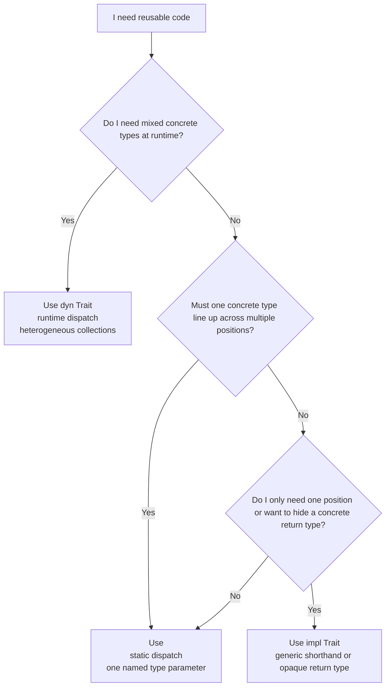

# Generics

In the previous chapter, you learned how traits define shared behavior — a
contract that any type can opt into. You wrote functions like
`fn notify(item: &impl Summary)` that accept any type with the right
capabilities. But every time you used `impl Trait`, you were already using
generics without seeing the full picture.

Generics are the mechanism behind that flexibility. They let you write a
function, a struct, or an enum _once_ and use it with many different types —
without sacrificing type safety and without any runtime cost. The `Vec<T>` you
have been using is generic: it works with `i32`, `String`, `Point`,
or any type you create. `Option<T>` and `Result<T, E>` are
generic. Generics are everywhere in Rust because they are Rust's answer to a
fundamental programming question: _how do you write reusable code without
giving up the performance and safety guarantees that the compiler provides?_

Many languages answer this question with runtime indirection — virtual method
tables, type erasure, or reflection. Rust answers it at compile time. When you
write a generic function, the compiler generates a specialized version for each
concrete type you actually use. The result is the same machine code you would
write by hand for each type — no indirection, no boxing, no overhead. This is
what Rust means by _zero-cost abstraction_: the abstraction exists in your
source code, but it vanishes completely in the compiled binary.

This chapter shows you how to write generic code, how to constrain it with
trait bounds, how to parameterize by compile-time values as well as types, and
when the rare situation calls for runtime dispatch instead.

> **How to Read This Chapter**
>
> - Understand now: generic code means "the same idea for many concrete
>   types," trait bounds describe capabilities, and `dyn Trait` is the runtime
>   escape hatch.
> - Memorize: `<T>`, `T: Trait`, `impl Trait`, `dyn Trait`, and `where`.
> - Use as reference: const generics, associated type constraints, and the dyn
>   compatibility checklist.
> - Skim on first pass: the precise Rust 2024 lifetime-capture details. Keep
>   the intuition that returned `impl Trait` values often borrow from their
>   inputs.

Before the syntax starts piling up, keep the dispatch choices straight in your
head:

Figure 4-2. Choosing between generics, impl Trait, and dyn Trait



## Generic Functions

A _generic function_ works with any type that meets its requirements. You
declare a type parameter in angle brackets after the function name:

Example 4-3. Comparing values with a trait-bounded generic function

```rust
fn largest<T: PartialOrd>(a: T, b: T) -> T {
    if a > b { a } else { b }
}

fn main() {
    println!("{}", largest(10, 20));
    println!("{}", largest(3.14, 2.72));
    println!("{}", largest("apple", "banana"));
}
```

Output:

```
20
3.14
banana
```

The `<T: PartialOrd>` declares a type parameter `T` with a _trait bound_: `T`
can be any type, as long as it implements `PartialOrd` (the trait behind `>`,
`<`, `>=`, `<=`). The compiler checks this at compile time. If you try to call
`largest` with a type that does not implement `PartialOrd`, you get a clear
error — not a runtime failure.

The bound is the key. Without it, the compiler has no way to know that `>` is
valid for `T`:

```rust,does_not_compile
fn largest<T>(a: T, b: T) -> T {
    if a > b { a } else { b }
}
```

```
error[E0369]: binary operation `>` cannot be applied to type `T`
 --> src/main.rs:2:10
  |
2 |     if a > b { a } else { b }
  |        - ^ - T
  |        |
  |        T
  |
help: consider restricting type parameter `T` with trait `PartialOrd`
  |
1 | fn largest<T: std::cmp::PartialOrd>(a: T, b: T) -> T {
  |             ++++++++++++++++++++++
```

The compiler tells you exactly what is missing and how to fix it. This is the
pattern: generics give you flexibility, trait bounds give you guarantees.

### Multiple Trait Bounds

A type parameter can require multiple traits using `+`:

```rust
use std::fmt;

fn print_largest<T: PartialOrd + fmt::Display>(a: T, b: T) {
    let winner = if a > b { a } else { b };
    println!("the largest is {winner}");
}

fn main() {
    print_largest(10, 20);
    print_largest("apple", "banana");
}
```

Output:

```
the largest is 20
the largest is banana
```

`T: PartialOrd + fmt::Display` means "`T` must be both comparable _and_
printable." The `+` syntax composes trait bounds — you can add as many as you
need.

## Impl Trait: The Shorthand

You have already seen `impl Trait` in the previous chapter. It is syntactic
sugar for a generic type parameter with a trait bound:

```rust
// These two signatures are equivalent:
fn notify(item: &impl std::fmt::Display) {
    println!("notice: {item}");
}

fn notify_generic<T: std::fmt::Display>(item: &T) {
    println!("notice: {item}");
}

fn main() {
    notify(&42);
    notify_generic(&42);
}
```

Output:

```
notice: 42
notice: 42
```

Use `impl Trait` when the type parameter appears only once in the signature —
it is shorter and reads more naturally. Use the explicit `<T: Trait>` syntax
when you need the same type in multiple positions.

The distinction matters because each `impl Trait` in a signature introduces a
_separate_ anonymous type parameter. When two parameters both say `impl Trait`,
the caller can pass different types for each one:

```rust
use std::fmt::Display;

// Each `impl Display` is independent — the caller can mix types.
fn show_any(a: impl Display, b: impl Display) {
    println!("{a} and {b}");
}

// Both parameters must be the SAME type T.
fn show_pair<T: Display>(a: T, b: T) {
    println!("{a} and {b}");
}

fn main() {
    show_any(42, "hello"); // i32 and &str — different types, fine
    show_any(1, 2);        // both i32 — also fine

    show_pair(1, 2);       // both i32 — fine
    // show_pair(42, "hello"); // error: expected integer, found &str
}
```

Output:

```
42 and hello
1 and 2
1 and 2
```

The `show_any` function is equivalent to writing
`fn show_any<A: Display, B: Display>(a: A, b: B)` — two independent type
parameters. The `show_pair` function uses one type parameter `T` for both
arguments, so both must resolve to the same concrete type.

For a function like `largest`, where you need to compare `a` and `b` to each
other, the explicit generic is the right choice — it guarantees both values
are the same type and therefore comparable:

```rust
fn largest<T: PartialOrd>(a: T, b: T) -> T {
    if a > b { a } else { b }
}

fn main() {
    println!("{}", largest(10, 20));
}
```

Output: `20`

## Where Clauses

When trait bounds get long or involve multiple type parameters, inline bounds
become hard to read. A `where` clause moves the bounds after the parameter list:

```rust
use std::fmt;

fn summarize<T, U>(item: &T, label: &U) -> String
where
    T: fmt::Display + Clone,
    U: fmt::Display,
{
    format!("{label}: {item}")
}

fn main() {
    let result = summarize(&42, &"count");
    println!("{result}");
}
```

Output: `count: 42`

The `where` clause is purely a readability tool — it produces identical code to
inline bounds. Use whichever form is clearer. A common guideline: if the
bounds fit comfortably on one line, write them inline. If the signature starts
to feel crowded, use `where`.

`where` clauses also allow bounds that inline syntax cannot express. You can
constrain types that are not parameters themselves. This is a niche power, not
an everyday pattern. The idea to keep is simple: sometimes the thing you need
to talk about is not `T` by itself, but a type _built from_ `T`:

```rust
fn debug_pair<T>(pair: (T, T))
where
    (T, T): std::fmt::Debug,
{
    println!("{pair:?}");
}

fn main() {
    debug_pair((1, 2));
    debug_pair(("hello", "world"));
}
```

Output:

```
(1, 2)
("hello", "world")
```

Here the bound is on `(T, T)` — the whole tuple — rather than on `T` alone.
You will not write tuple bounds every day, but this pattern is the reason
`where` clauses matter: they can describe the exact type your function uses,
not just the original parameters.

## Generic Structs

Structs can also be generic. You have used `Vec<T>`, `Option<T>`, and
`Result<T, E>` — all generic structs. Here is how to define your own:

```rust
#[derive(Debug)]
struct Pair<T> {
    first: T,
    second: T,
}

impl<T> Pair<T> {
    fn new(first: T, second: T) -> Self {
        Pair { first, second }
    }
}

impl<T: std::fmt::Display + PartialOrd> Pair<T> {
    fn larger(&self) -> &T {
        if self.first > self.second {
            &self.first
        } else {
            &self.second
        }
    }
}

fn main() {
    let numbers = Pair::new(10, 20);
    println!("pair: {numbers:?}");
    println!("larger: {}", numbers.larger());

    let words = Pair::new("apple", "banana");
    println!("larger: {}", words.larger());
}
```

Output:

```
pair: Pair { first: 10, second: 20 }
larger: 20
larger: banana
```

Two things to notice here. First, the `impl<T>` block declares that the `impl`
itself is generic — `T` is a placeholder, not a concrete type. Second, you can
have multiple `impl` blocks with different bounds. The `new` method is available
for _any_ `Pair<T>`. The `larger` method is only available when `T` implements
both `Display` and `PartialOrd`. If you call `larger()` on a `Pair` whose type
does not meet those bounds, the compiler tells you exactly which trait is
missing.

### Multiple Type Parameters

A struct can have more than one type parameter:

```rust
#[derive(Debug)]
struct KeyValue<K, V> {
    key: K,
    value: V,
}

impl<K: std::fmt::Display, V: std::fmt::Display> KeyValue<K, V> {
    fn display(&self) {
        println!("{}: {}", self.key, self.value);
    }
}

fn main() {
    let entry = KeyValue {
        key: "name",
        value: String::from("Rust"),
    };
    entry.display();

    let score = KeyValue { key: 1, value: 99.5 };
    score.display();
}
```

Output:

```
name: Rust
1: 99.5
```

This is the same pattern behind `HashMap<K, V>` and `Result<T, E>` — different
type parameters for different roles.

## Generic Enums

You have used generic enums throughout this book. `Option<T>` and
`Result<T, E>` are both generic enums:

```rust
// This is how Option is defined in the standard library:
// enum Option<T> {
//     Some(T),
//     None,
// }

// And Result:
// enum Result<T, E> {
//     Ok(T),
//     Err(E),
// }
```

Here is a custom generic enum — a simple binary tree node:

```rust
#[derive(Debug)]
enum Tree<T> {
    Leaf(T),
    Branch {
        left: Box<Tree<T>>,
        right: Box<Tree<T>>,
    },
}

impl<T: std::fmt::Display> Tree<T> {
    fn sum_display(&self) -> String {
        match self {
            Tree::Leaf(value) => format!("{value}"),
            Tree::Branch { left, right } => {
                format!("({} + {})", left.sum_display(), right.sum_display())
            }
        }
    }
}

fn main() {
    let tree = Tree::Branch {
        left: Box::new(Tree::Leaf(1)),
        right: Box::new(Tree::Branch {
            left: Box::new(Tree::Leaf(2)),
            right: Box::new(Tree::Leaf(3)),
        }),
    };

    println!("{}", tree.sum_display());
}
```

Output: `(1 + (2 + 3))`

The `Box<Tree<T>>` is necessary because `Tree` is recursive — without `Box`,
the compiler cannot determine the size of the type. `Box<T>` allocates data on
the heap behind a fixed-size pointer, giving the compiler a known size for the
field. You saw this same pattern with the recursive `Expr` enum in the
pattern matching chapter.

## Const Generics

So far, every generic parameter has been a _type_. But types are not the only
thing you might want to parameterize. Consider arrays: `[i32; 3]` and
`[i32; 5]` are different types in Rust — a function that accepts one cannot
accept the other. Without a way to make the size itself generic, you would need
a separate function for every array length.

_Const generics_ solve this. A const generic parameter is a compile-time
constant — typically a `usize` — declared alongside type parameters in angle
brackets:

```rust
fn average<const N: usize>(values: [f64; N]) -> f64 {
    let mut total = 0.0;
    for v in values {
        total += v;
    }
    total / N as f64
}

fn main() {
    println!("{:.1}", average([10.0, 20.0, 30.0]));     // N = 3
    println!("{:.1}", average([2.0, 4.0, 6.0, 8.0]));   // N = 4
}
```

Output:

```
20.0
5.0
```

The `<const N: usize>` declares that `N` is a constant known at compile time.
The compiler generates a separate version of `average` for `N = 3` and `N = 4`
— the same monomorphization that happens with type parameters. No runtime cost,
no dynamic sizing.

Const generics compose naturally with type parameters. This function fills an
array of any size with the default value of any type:

```rust
fn filled<T: Default + Copy, const N: usize>() -> [T; N] {
    [T::default(); N]
}

fn main() {
    let zeros: [i32; 4] = filled();
    let falses: [bool; 3] = filled();
    println!("{zeros:?}");
    println!("{falses:?}");
}
```

Output:

```
[0, 0, 0, 0]
[false, false, false]
```

The compiler infers both `T` and `N` from the return type — `filled()` called
in a context expecting `[i32; 4]` produces `T = i32`, `N = 4`.

Const generic parameters can be any integer type (`usize`, `i32`, etc.),
`bool`, or `char`. The standard library uses const generics extensively —
array conversion functions like `as_array::<N>()` and chunk splitting methods
like `as_chunks::<N>()` rely on const generic parameters to provide
compile-time size guarantees.

## Returning Impl Trait

In the previous chapter, you saw `impl Trait` in argument position. It also
works in return position — and this is where it becomes essential:

```rust
fn evens_up_to(limit: i32) -> impl Iterator<Item = i32> {
    (0..limit).filter(|x| x % 2 == 0)
}

fn main() {
    for n in evens_up_to(10) {
        print!("{n} ");
    }
    println!();
}
```

Output: `0 2 4 6 8`

The return type `impl Iterator<Item = i32>` means "this function returns some
type that implements `Iterator` — but I am not telling you which specific type."
This matters because the actual type of a filter chain is something like
`Filter<Range<i32>, [closure]>` — a type that depends on the closure and is
impossible to write out by hand. `impl Trait` lets you return these complex
types without naming them.

The function still returns a single, concrete type — the compiler knows exactly
what it is. Only the _caller_ sees an opaque `impl Iterator`. This is static
dispatch: no boxing, no heap allocation, no overhead.

### The Rust 2024 Lifetime Rule

When a function takes a reference and returns `impl Trait`, the Rust 2024
edition automatically captures the reference's lifetime in the return type.
This means the code you would naturally write just works:

```rust
fn words(text: &str) -> impl Iterator<Item = &str> {
    text.split_whitespace()
}

fn main() {
    let sentence = String::from("hello world from rust");
    for word in words(&sentence) {
        print!("{word} ");
    }
    println!();
}
```

Output: `hello world from rust`

The iterator borrows from `text`, and the compiler understands this
automatically in the 2024 edition. The returned iterator cannot outlive the
string it borrows from — the borrow checker enforces this at every call site.

In older code, you may see this written as
`-> impl Iterator<Item = &str> + '_'`. That `+ '_'` meant "the returned
iterator borrows from the inputs." Rust 2024 makes that capture the default,
so the simpler signature is usually the right one to write and teach.

> **Tip**
>
> Read `fn words(text: &str) -> impl Iterator<Item = &str>` as "returns an
> iterator tied to `text`." The hidden iterator type is omitted, not the
> borrowing rule.

The lifetime is still real even though you did not write it explicitly:

```rust,does_not_compile
fn words(text: &str) -> impl Iterator<Item = &str> {
    text.split_whitespace()
}

fn main() {
    let iter = {
        let sentence = String::from("hello world");
        words(&sentence)
    };

    for word in iter {
        println!("{word}");
    }
}
```

This fails because `sentence` is dropped at the end of the inner block, so the
iterator cannot escape it. Rust 2024 removes lifetime bookkeeping from the
signature, but the returned iterator still lives only as long as the borrowed
text.

### Impl Trait in Trait Methods

So far, `impl Trait` return types have appeared only in free functions. But the
same problem arises in traits: you want a method that returns "some type
implementing a trait" without forcing every implementor to agree on a single
concrete type. Since Rust 1.75, you can write `-> impl Trait` directly in trait
method signatures:

```rust
trait Summarizable {
    fn summary_lines(&self) -> impl Iterator<Item = String>;
}

struct Article {
    title: String,
    body: String,
}

impl Summarizable for Article {
    fn summary_lines(&self) -> impl Iterator<Item = String> {
        let title_line = format!("Title: {}", self.title);
        let word_count = self.body.split_whitespace().count();
        let stats_line = format!("Words: {word_count}");
        [title_line, stats_line].into_iter()
    }
}

struct Tweet {
    author: String,
    text: String,
}

impl Summarizable for Tweet {
    fn summary_lines(&self) -> impl Iterator<Item = String> {
        std::iter::once(format!("@{}: {}", self.author, self.text))
    }
}

fn print_summary(item: &impl Summarizable) {
    for line in item.summary_lines() {
        println!("  {line}");
    }
}

fn main() {
    let article = Article {
        title: String::from("Rust 2024 Edition"),
        body: String::from("The new edition brings exciting changes to the language"),
    };
    let tweet = Tweet {
        author: String::from("rustlang"),
        text: String::from("Rust 2024 is here!"),
    };

    print_summary(&article);
    print_summary(&tweet);
}
```

Output:

```
  Title: Rust 2024 Edition
  Words: 9
  @rustlang: Rust 2024 is here!
```

Each implementor returns a _different_ concrete iterator type — `Article`
returns an array iterator, `Tweet` returns `std::iter::Once` — but the caller
only sees `impl Iterator<Item = String>`. The compiler monomorphizes each call
site just as it does for free functions, so there is no boxing and no runtime
cost.

Under the hood, the compiler desugars the `-> impl Trait` return into an
anonymous associated type. This has one important consequence: traits with
`impl Trait` return types are not dyn compatible, because the vtable cannot
represent an opaque type that differs per implementor. If you need dynamic
dispatch _and_ opaque returns, you can exclude the method from the vtable with
`where Self: Sized` (as shown in the Dyn Compatibility section below) or return
`Box<dyn Trait>` instead.

## Associated Types vs Type Parameters

In the traits chapter, you saw `type Output` and `type Error` inside traits
like `Add` and `TryFrom`. These are _associated types_ — and they solve a
different problem than generic type parameters.

The key question: _how many implementations of this trait should a single type
have?_

When the answer is "exactly one," use an associated type. When the answer is
"potentially many," use a type parameter.

Consider `Iterator`. A `Vec<i32>` iterator always yields `i32`. There is one
natural item type per iterator. Making `Item` an associated type enforces this:

```rust
// Standard library definition (simplified):
// trait Iterator {
//     type Item;
//     fn next(&mut self) -> Option<Self::Item>;
// }
```

Now consider `From`. A type can convert _from_ many different sources —
`String` implements `From<&str>`, `From<char>`, `From<Vec<u8>>`, and more.
Making the source a type parameter allows multiple implementations:

```rust
// Standard library definition (simplified):
// trait From<T> {
//     fn from(value: T) -> Self;
// }
```

Here is a practical example showing the difference:

```rust
trait Summarize {
    type Summary;

    fn summarize(&self) -> Self::Summary;
}

struct Article {
    title: String,
    body: String,
}

impl Summarize for Article {
    type Summary = String;

    fn summarize(&self) -> String {
        format!("{} ({}...)", self.title, &self.body[..20.min(self.body.len())])
    }
}

struct Score {
    home: u32,
    away: u32,
}

impl Summarize for Score {
    type Summary = String;

    fn summarize(&self) -> String {
        format!("{}-{}", self.home, self.away)
    }
}

fn print_summary(item: &impl Summarize<Summary = String>) {
    println!("{}", item.summarize());
}

fn main() {
    let article = Article {
        title: String::from("Rust 2024"),
        body: String::from("The new edition brings many improvements"),
    };
    let score = Score { home: 3, away: 1 };

    print_summary(&article);
    print_summary(&score);
}
```

Output:

```
Rust 2024 (The new edition brin...)
3-1
```

Each type has exactly one `Summary` type. The associated type makes this
relationship clear and unambiguous — you never need to specify it at the call
site.

The rule of thumb: use an associated type when there is one natural answer per
implementing type. Use a type parameter when a type might implement the trait
in multiple ways.

#### Constraining associated types

When you write a function that accepts a generic iterator, you often need to
constrain its `Item` type. One approach scatters the constraint across two
separate `where` bounds:

```rust,ignore
fn print_items<I>(iter: I)
where
    I: Iterator,
    I::Item: std::fmt::Display,
```

This works, but the relationship between `I` and its `Item` is spread across
two lines. Rust offers a more direct syntax — constrain the associated type
right where it appears:

```rust
fn print_items<I: Iterator<Item: std::fmt::Display>>(iter: I) {
    for item in iter {
        println!("{item}");
    }
}

fn main() {
    print_items(vec![1, 2, 3].into_iter());
    print_items(["hello", "world"].into_iter());
}
```

Output:

```
1
2
3
hello
world
```

`Item: Display` means "the associated type `Item` must implement `Display`."
You can add multiple bounds with `+`, just as you do with type parameters:

```rust
fn inspect<I: Iterator<Item: std::fmt::Display + std::fmt::Debug>>(iter: I) {
    for item in iter {
        println!("{item} (debug: {item:?})");
    }
}

fn main() {
    inspect(["hello", "world"].into_iter());
}
```

Output:

```
hello (debug: "hello")
world (debug: "world")
```

The key distinction from the `= Type` syntax you saw earlier: `Item = i32`
pins the associated type to a specific concrete type, while `Item: Display`
constrains what the type can _do_ without choosing it. Use `= Type` when you
need a specific type, and `: Trait` when any type with the right capabilities
will work.

## Trait Objects and Dynamic Dispatch

Everything you have seen so far uses _static dispatch_: the compiler generates
specialized code for each concrete type. But sometimes you do not know the type
at compile time. You might have a collection of different types that all share
a trait, or a function that returns one of several types based on a runtime
condition.

For these cases, Rust provides _trait objects_: `dyn Trait`.

```rust
trait Describe {
    fn describe(&self) -> String;
}

struct Circle {
    radius: f64,
}

struct Rectangle {
    width: f64,
    height: f64,
}

impl Describe for Circle {
    fn describe(&self) -> String {
        format!("circle with radius {:.1}", self.radius)
    }
}

impl Describe for Rectangle {
    fn describe(&self) -> String {
        format!("{}×{:.1} rectangle", self.width, self.height)
    }
}

fn print_shape(shape: &dyn Describe) {
    println!("{}", shape.describe());
}

fn main() {
    let shapes: Vec<Box<dyn Describe>> = vec![
        Box::new(Circle { radius: 3.0 }),
        Box::new(Rectangle { width: 4.0, height: 5.0 }),
        Box::new(Circle { radius: 1.5 }),
    ];

    for shape in &shapes {
        print_shape(shape.as_ref());
    }
}
```

Output:

```
circle with radius 3.0
4×5.0 rectangle
circle with radius 1.5
```

A `Vec<Box<dyn Describe>>` holds different types in the same collection —
something a `Vec<T>` with a single generic `T` cannot do. Each element is a
`Box` pointing to a heap-allocated value along with a pointer to that type's
implementation of `Describe`.

This is _dynamic dispatch_: instead of the compiler generating specialized
code, each method call goes through a lookup table (called a _vtable_) at
runtime. The cost is small — one pointer indirection per method call — but it
is not zero.

### When to Use Each

Static dispatch (generics, `impl Trait`) is the default in Rust, and the right
choice most of the time:

| | Static dispatch | Dynamic dispatch |
|---|---|---|
| Syntax | `impl Trait` or `<T: Trait>` | `dyn Trait` |
| Type resolution | Compile time | Runtime |
| Performance | No overhead — same as hand-written code | Small overhead per method call |
| Inlining | Yes — the compiler sees the concrete type | No — the type is opaque |
| Heterogeneous collections | No — all elements must be the same type | Yes — mix different types |
| Binary size | Larger — one copy per concrete type | Smaller — one shared copy |

Use `dyn Trait` when you genuinely need heterogeneous types at runtime — plugin
systems, mixed collections, or return types determined by runtime conditions.
For everything else, prefer generics.

### Dyn Compatibility

Not every trait can be used as `dyn Trait`. A trait is _dyn compatible_
(sometimes called "object safe" in older documentation) when Rust can construct
a vtable for it. The main rules:

- Methods must take `self` by reference (`&self` or `&mut self`) or by `Box<Self>`,
  not by value (`self`) — because the concrete type's size is unknown.
- Methods must not return `Self` — because the caller does not know the
  concrete type.
- Methods must not have generic type parameters — because generics require
  monomorphization, which is impossible when the type is unknown.
- Methods must not return `impl Trait` — because the hidden type differs per
  implementor, and the vtable needs a single concrete type.

When you need a method that violates these rules in a trait you also want to
use as `dyn Trait`, you can exclude that method with a `where Self: Sized`
bound:

```rust
trait Describe {
    fn describe(&self) -> String;

    // This method is NOT available on dyn Describe,
    // but the trait itself remains dyn compatible.
    fn clone_self(&self) -> Self
    where
        Self: Sized + Clone,
    {
        self.clone()
    }
}

#[derive(Clone)]
struct Circle {
    radius: f64,
}

impl Describe for Circle {
    fn describe(&self) -> String {
        format!("circle r={:.1}", self.radius)
    }
}

fn print_it(shape: &dyn Describe) {
    println!("{}", shape.describe());
    // shape.clone_self(); // would not compile — not available on dyn Describe
}

fn main() {
    let c = Circle { radius: 2.0 };
    print_it(&c);

    // clone_self works on concrete types — the compiler knows the size
    let c2 = c.clone_self();
    println!("{}", c2.describe());
}
```

Output:

```
circle r=2.0
circle r=2.0
```

The `where Self: Sized` bound tells the compiler: "this method requires
knowing the concrete type at compile time, so do not include it in the vtable."
The trait stays dyn compatible, and you can still use the excluded methods on
concrete types.

### Trait Upcasting

If a trait has a supertrait (introduced in the previous chapter), any concrete
type that implements the subtrait also implements the supertrait. This feels
natural — a `Shape` that requires `Display` can always be displayed. But before
Rust 1.86, this intuition did not extend to trait objects: a `dyn Shape` could
not be used where a `dyn Display` was expected, even though every `Shape` is
displayable.

Rust 1.86 fixed this. _Trait upcasting_ lets you coerce a `dyn SubTrait` into
a `dyn SuperTrait` automatically, at any coercion site — function arguments,
`let` bindings, or return values:

```rust
use std::fmt;

trait Shape: fmt::Display {
    fn area(&self) -> f64;
}

struct Circle {
    radius: f64,
}

impl fmt::Display for Circle {
    fn fmt(&self, f: &mut fmt::Formatter<'_>) -> fmt::Result {
        write!(f, "circle r={:.1}", self.radius)
    }
}

impl Shape for Circle {
    fn area(&self) -> f64 {
        std::f64::consts::PI * self.radius * self.radius
    }
}

struct Square {
    side: f64,
}

impl fmt::Display for Square {
    fn fmt(&self, f: &mut fmt::Formatter<'_>) -> fmt::Result {
        write!(f, "square s={:.1}", self.side)
    }
}

impl Shape for Square {
    fn area(&self) -> f64 {
        self.side * self.side
    }
}

// This function only knows about Display — it cannot call area().
fn log(item: &dyn fmt::Display) {
    println!("[log] {item}");
}

fn report(shapes: &[Box<dyn Shape>]) {
    for shape in shapes {
        println!("{} has area {:.1}", shape, shape.area());

        // Trait upcasting: &dyn Shape → &dyn Display.
        // Shape requires Display, so the compiler allows this coercion.
        log(shape.as_ref());
    }
}

fn main() {
    let shapes: Vec<Box<dyn Shape>> = vec![
        Box::new(Circle { radius: 3.0 }),
        Box::new(Square { side: 2.0 }),
    ];

    report(&shapes);
}
```

Output:

```
circle r=3.0 has area 28.3
[log] circle r=3.0
square s=2.0 has area 4.0
[log] square s=2.0
```

The call `log(shape.as_ref())` passes `&dyn Shape` to a function expecting
`&dyn Display`. The compiler rewrites the vtable pointer to the supertrait's
vtable — one pointer adjustment, no allocation, no runtime lookup.

The same coercion works through smart pointers. A `Box<dyn Shape>` can become
a `Box<dyn Display>`, and an `Arc<dyn Shape>` can become an `Arc<dyn Display>`:

```rust
use std::fmt;

trait Shape: fmt::Display {
    fn area(&self) -> f64;
}

struct Circle {
    radius: f64,
}

impl fmt::Display for Circle {
    fn fmt(&self, f: &mut fmt::Formatter<'_>) -> fmt::Result {
        write!(f, "circle r={:.1}", self.radius)
    }
}

impl Shape for Circle {
    fn area(&self) -> f64 {
        std::f64::consts::PI * self.radius * self.radius
    }
}

fn as_displayable(shape: Box<dyn Shape>) -> Box<dyn fmt::Display> {
    shape // trait upcasting: Box<dyn Shape> → Box<dyn Display>
}

fn main() {
    let c: Box<dyn Shape> = Box::new(Circle { radius: 3.0 });

    println!("area: {:.1}", c.area());

    let displayable: Box<dyn fmt::Display> = as_displayable(c);
    println!("display: {displayable}");
}
```

Output:

```
area: 28.3
display: circle r=3.0
```

Upcasting is a one-way narrowing: when you go from `dyn Shape` to
`dyn Display`, you lose access to `area()`. The supertrait methods remain, but
the subtrait methods are gone — just like moving from a specific type to a more
general one. This is the right trade-off: the receiving code asked for
`dyn Display` because that is all it needs.

## Monomorphization: Zero-Cost in Practice

When you write a generic function, the compiler produces one specialized
version for every concrete type you use it with. This process is called
_monomorphization_:

```rust
fn double<T: std::ops::Add<Output = T> + Copy>(value: T) -> T {
    value + value
}

fn main() {
    let a = double(5);       // compiler generates: double_i32(5) → 10
    let b = double(3.14);    // compiler generates: double_f64(3.14) → 6.28
    println!("{a}, {b}");
}
```

Output: `10, 6.28`

At runtime, there is no `double<T>`. There is a `double` specialized for `i32`
and another specialized for `f64`. Each is a direct function call — no vtable,
no indirection, no runtime type checks. The optimizer can even inline them.

This is what _zero-cost abstraction_ means: you write high-level, generic code,
and the compiler produces the same machine code you would get from writing
separate functions by hand for each type. You pay nothing at runtime for the
generality.

The trade-off is compile time and binary size. Each specialization is compiled
independently, which can increase build time and the size of the final binary.
For most programs, this is negligible. When it matters — large libraries with
dozens of generic instantiations — `dyn Trait` offers an alternative that
trades a small runtime cost for a single, shared implementation.

## Putting It All Together

Here is a complete example that combines generic structs, trait bounds,
associated types, `impl Trait`, and `dyn Trait`:

Example 4-4. Combining static dispatch, opaque returns, and trait objects

```rust
use std::fmt;

trait Measurable {
    fn value(&self) -> f64;
    fn unit(&self) -> &str;
}

#[derive(Debug, Clone, Copy)]
struct Meters(f64);

#[derive(Debug, Clone, Copy)]
struct Kilograms(f64);

impl Measurable for Meters {
    fn value(&self) -> f64 { self.0 }
    fn unit(&self) -> &str { "m" }
}

impl Measurable for Kilograms {
    fn value(&self) -> f64 { self.0 }
    fn unit(&self) -> &str { "kg" }
}

impl fmt::Display for Meters {
    fn fmt(&self, f: &mut fmt::Formatter<'_>) -> fmt::Result {
        write!(f, "{:.2} m", self.0)
    }
}

impl fmt::Display for Kilograms {
    fn fmt(&self, f: &mut fmt::Formatter<'_>) -> fmt::Result {
        write!(f, "{:.2} kg", self.0)
    }
}

// Generic function: static dispatch, works with any single Measurable type
fn largest_measurement<T: Measurable + fmt::Display>(items: &[T]) -> &T {
    let mut largest = &items[0];
    for item in &items[1..] {
        if item.value() > largest.value() {
            largest = item;
        }
    }
    largest
}

// impl Trait return: hides the concrete iterator type
fn above_threshold(items: &[Box<dyn Measurable>], threshold: f64)
    -> impl Iterator<Item = &Box<dyn Measurable>>
{
    items.iter().filter(move |item| item.value() > threshold)
}

// dyn Trait: heterogeneous collection
fn print_all(items: &[Box<dyn Measurable>]) {
    for item in items {
        println!("  {:.2} {}", item.value(), item.unit());
    }
}

fn main() {
    // Static dispatch: all elements are the same type
    let distances = [Meters(100.0), Meters(42.5), Meters(200.0)];
    println!("longest distance: {}", largest_measurement(&distances));

    let weights = [Kilograms(5.0), Kilograms(12.3), Kilograms(8.1)];
    println!("heaviest weight:  {}", largest_measurement(&weights));

    // Dynamic dispatch: mixed types in one collection
    let measurements: Vec<Box<dyn Measurable>> = vec![
        Box::new(Meters(50.0)),
        Box::new(Kilograms(10.0)),
        Box::new(Meters(150.0)),
        Box::new(Kilograms(3.5)),
    ];

    println!("\nall measurements:");
    print_all(&measurements);

    println!("\nabove 20:");
    for item in above_threshold(&measurements, 20.0) {
        println!("  {:.2} {}", item.value(), item.unit());
    }
}
```

Output:

```
longest distance: 200.00 m
heaviest weight:  12.30 kg

all measurements:
  50.00 m
  10.00 kg
  150.00 m
  3.50 kg

above 20:
  50.00 m
  150.00 m
```

This example demonstrates the key patterns:

- **Generic functions** (`largest_measurement`) use static dispatch — no
  runtime cost, and the compiler specializes the code for `Meters` and
  `Kilograms` separately.
- **`impl Trait` in return position** (`above_threshold`) hides a complex
  iterator type behind a clean interface.
- **`dyn Trait`** (`Vec<Box<dyn Measurable>>`) enables a heterogeneous
  collection that mixes different measurement types at runtime.
- **Trait bounds** (`T: Measurable + fmt::Display`) constrain generic types
  to exactly the capabilities each function needs.

## Why This Matters

Generics are the engine behind Rust's promise of abstraction without cost. Every
time you use `Vec<T>`, iterate with a `for` loop, or propagate errors with `?`,
generics are at work — compiling down to the same machine code you would write
by hand for each specific type.

Key points from this chapter:

- **Generic functions** use type parameters (`<T>`) to work with many types.
  Trait bounds (`T: Trait`) constrain what the type can do.
- **`impl Trait`** is shorthand for a generic parameter with a bound. Use it
  in argument position for simple cases, and in return position to hide complex
  types like iterators and closures.
- **`where` clauses** are a readability tool for complex bounds — they produce
  identical code to inline bounds.
- **Generic structs and enums** parameterize data structures over types. You
  can write different `impl` blocks with different trait bounds on the same
  generic type.
- **Const generics** (`<const N: usize>`) parameterize code over compile-time
  values, not just types. This is how functions and structs work with arrays of
  any size — `[T; N]` where `N` is determined at the call site.
- **Associated types** (`type Item`) define a one-to-one relationship between
  a type and a trait. Type parameters define a one-to-many relationship.
- **`dyn Trait`** provides dynamic dispatch — method calls resolved at runtime
  through a vtable. Use it for heterogeneous collections and runtime-determined
  types. A trait must be _dyn compatible_ to be used this way.
- **Monomorphization** is how generics achieve zero cost: the compiler
  generates specialized code for each concrete type, producing the same machine
  code as hand-written, type-specific functions.

## Exercises

These micro-projects practice generic functions, trait bounds, const generics,
`impl Trait`, `where` clauses, and `dyn Trait`. Each uses only concepts from
this and earlier chapters.

### Exercise 4-4: Generic Statistics Calculator

Build a statistics calculator that works with any ordered, copyable type. This
exercises generic functions with multiple trait bounds, generic structs, a
`Display` implementation using a `where` clause, and `impl Trait` parameters.

Build these pieces:

- A `Stats<T>` struct with fields `min: T`, `max: T`, and `count: usize`.
  Derive `Debug`.
- A generic function `compute_stats<T>(values: &[T]) -> Option<Stats<T>>`
  that returns `None` for an empty slice. Bound `T` with `PartialOrd + Copy`.
- A `Display` implementation for `Stats<T>` that formats as
  `"count=N, min=M, max=X"`. Use a `where T: Display` clause.
- A free function `print_stats(stats: &impl Display)` that prints the stats
  with two-space indentation.
- In `main`, compute and print stats for a `[f64; 5]` temperature array,
  a `[i32; 6]` score array, and handle the empty-slice case.

Expected output:

```
temperature stats:
  count=5, min=68.1, max=75.9
score stats:
  count=6, min=64, max=100
empty stats:
  no data
```

<details>
<summary>Solution</summary>

```rust
use std::fmt;

#[derive(Debug)]
struct Stats<T> {
    min: T,
    max: T,
    count: usize,
}

fn compute_stats<T: PartialOrd + Copy>(values: &[T]) -> Option<Stats<T>> {
    let first = *values.first()?;
    let mut min = first;
    let mut max = first;

    for &v in &values[1..] {
        if v < min {
            min = v;
        }
        if v > max {
            max = v;
        }
    }

    Some(Stats {
        min,
        max,
        count: values.len(),
    })
}

impl<T: fmt::Display> fmt::Display for Stats<T> {
    fn fmt(&self, f: &mut fmt::Formatter<'_>) -> fmt::Result {
        write!(
            f,
            "count={}, min={}, max={}",
            self.count, self.min, self.max
        )
    }
}

fn print_stats(stats: &impl fmt::Display) {
    println!("  {stats}");
}

fn main() {
    let temperatures = [72.3, 68.1, 75.9, 70.0, 69.4];
    let scores = [88, 95, 72, 100, 64, 83];

    println!("temperature stats:");
    if let Some(stats) = compute_stats(&temperatures) {
        print_stats(&stats);
    }

    println!("score stats:");
    if let Some(stats) = compute_stats(&scores) {
        print_stats(&stats);
    }

    println!("empty stats:");
    let empty: &[i32] = &[];
    match compute_stats(empty) {
        Some(stats) => print_stats(&stats),
        None => println!("  no data"),
    }
}
```

</details>

### Exercise 4-5: Fixed-Size Buffer

Build a fixed-capacity buffer that uses const generics to set its size at
compile time. This exercises const generic parameters composed with type
parameters, `Result` for fallible operations, `impl Trait` return types, and
`Display` with a `where` clause.

Build these pieces:

- A `Buffer<T, const N: usize>` struct storing `data: [Option<T>; N]` and
  `len: usize`. Derive `Debug`.
- An `impl` block bounded on `T: Copy + Default` with methods:
  - `new() -> Self` returning an empty buffer.
  - `push(&mut self, item: T) -> Result<(), T>` that returns `Err(item)` when
    full.
  - `items(&self) -> impl Iterator<Item = &T>` that yields only the filled
    slots.
  - `is_full(&self) -> bool`, `len(&self) -> usize`, `capacity(&self) -> usize`.
- A `Display` implementation (add a `T: Display` bound) that formats as
  `"[len/capacity] item1 item2 ..."`.
- In `main`, create a `Buffer<f64, 4>` for temperatures, fill it, show it is
  full, attempt to push one more (print the rejection), then create a partially
  filled `Buffer<u32, 3>` for IDs and display it.

Expected output:

```
temps: [4/4] 72.3 68.1 75.9 70
full: true
buffer full, rejected 99.9
ids: [2/3] 1001 1002
full: false
```

<details>
<summary>Solution</summary>

```rust
use std::fmt;

#[derive(Debug)]
struct Buffer<T, const N: usize> {
    data: [Option<T>; N],
    len: usize,
}

impl<T: Copy + Default, const N: usize> Buffer<T, N> {
    fn new() -> Self {
        Buffer {
            data: [None; N],
            len: 0,
        }
    }

    fn push(&mut self, item: T) -> Result<(), T> {
        if self.len >= N {
            return Err(item);
        }
        self.data[self.len] = Some(item);
        self.len += 1;
        Ok(())
    }

    fn items(&self) -> impl Iterator<Item = &T> {
        self.data[..self.len]
            .iter()
            .filter_map(|slot| slot.as_ref())
    }

    fn is_full(&self) -> bool {
        self.len >= N
    }

    fn len(&self) -> usize {
        self.len
    }

    fn capacity(&self) -> usize {
        N
    }
}

impl<T: Copy + Default + fmt::Display, const N: usize> fmt::Display for Buffer<T, N> {
    fn fmt(&self, f: &mut fmt::Formatter<'_>) -> fmt::Result {
        write!(f, "[{}/{}]", self.len(), self.capacity())?;
        for item in self.items() {
            write!(f, " {item}")?;
        }
        Ok(())
    }
}

fn main() {
    let mut temps: Buffer<f64, 4> = Buffer::new();
    for &t in &[72.3, 68.1, 75.9, 70.0] {
        let _ = temps.push(t);
    }
    println!("temps: {temps}");
    println!("full: {}", temps.is_full());

    match temps.push(99.9) {
        Ok(()) => println!("pushed 99.9"),
        Err(rejected) => println!("buffer full, rejected {rejected}"),
    }

    let mut ids: Buffer<u32, 3> = Buffer::new();
    let _ = ids.push(1001);
    let _ = ids.push(1002);
    println!("ids: {ids}");
    println!("full: {}", ids.is_full());
}
```

</details>

### Exercise 4-6: Page Renderer with Static and Dynamic Dispatch

Build a page-rendering system that demonstrates both static and dynamic
dispatch. This exercises trait definition with a supertrait, `dyn Trait`
heterogeneous collections, `Box<dyn Trait>`, and a generic function with trait
bounds.

Build these pieces:

- A `Renderable` trait with supertrait `Display` and a method
  `fn render(&self) -> String`.
- Three types: `Heading` (with `level: u8` and `text: String`), `Paragraph`
  (with `text: String`), and `HorizontalRule` (unit struct).
- `Display` and `Renderable` implementations for each:
  - `Heading` displays as `"# text"` (number of `#` matches level).
  - `Paragraph` displays its text directly.
  - `HorizontalRule` displays as `"---"`.
- A generic function `render_all<T: Renderable>(elements: &[T]) -> String`
  (static dispatch) that joins rendered elements with newlines.
- A function `render_page(elements: &[Box<dyn Renderable>]) -> String`
  (dynamic dispatch) that does the same for a mixed collection.
- In `main`, use static dispatch to render a `[Paragraph; 2]` array, then use
  dynamic dispatch to render a `Vec<Box<dyn Renderable>>` with headings,
  paragraphs, and a rule mixed together.

Expected output:

```
--- static dispatch ---
First paragraph.
Second paragraph.

--- dynamic dispatch ---
# Welcome
Hello from Rust.
---
## Details
Generics are powerful.

element count: 5
```

<details>
<summary>Solution</summary>

```rust
use std::fmt;

trait Renderable: fmt::Display {
    fn render(&self) -> String;
}

struct Heading {
    level: u8,
    text: String,
}

struct Paragraph {
    text: String,
}

struct HorizontalRule;

impl fmt::Display for Heading {
    fn fmt(&self, f: &mut fmt::Formatter<'_>) -> fmt::Result {
        let hashes = "#".repeat(self.level as usize);
        write!(f, "{hashes} {}", self.text)
    }
}

impl fmt::Display for Paragraph {
    fn fmt(&self, f: &mut fmt::Formatter<'_>) -> fmt::Result {
        write!(f, "{}", self.text)
    }
}

impl fmt::Display for HorizontalRule {
    fn fmt(&self, f: &mut fmt::Formatter<'_>) -> fmt::Result {
        write!(f, "---")
    }
}

impl Renderable for Heading {
    fn render(&self) -> String {
        let hashes = "#".repeat(self.level as usize);
        format!("{hashes} {}", self.text)
    }
}

impl Renderable for Paragraph {
    fn render(&self) -> String {
        self.text.clone()
    }
}

impl Renderable for HorizontalRule {
    fn render(&self) -> String {
        "---".to_string()
    }
}

// Static dispatch: all elements the same type
fn render_all<T: Renderable>(elements: &[T]) -> String {
    let mut output = String::new();
    for (i, element) in elements.iter().enumerate() {
        if i > 0 {
            output.push('\n');
        }
        output.push_str(&element.render());
    }
    output
}

// Dynamic dispatch: mixed element types
fn render_page(elements: &[Box<dyn Renderable>]) -> String {
    let mut output = String::new();
    for (i, element) in elements.iter().enumerate() {
        if i > 0 {
            output.push('\n');
        }
        output.push_str(&element.render());
    }
    output
}

fn main() {
    // Static dispatch — homogeneous slice
    let paragraphs = [
        Paragraph { text: String::from("First paragraph.") },
        Paragraph { text: String::from("Second paragraph.") },
    ];
    println!("--- static dispatch ---");
    println!("{}", render_all(&paragraphs));

    // Dynamic dispatch — heterogeneous collection
    let page: Vec<Box<dyn Renderable>> = vec![
        Box::new(Heading { level: 1, text: String::from("Welcome") }),
        Box::new(Paragraph { text: String::from("Hello from Rust.") }),
        Box::new(HorizontalRule),
        Box::new(Heading { level: 2, text: String::from("Details") }),
        Box::new(Paragraph { text: String::from("Generics are powerful.") }),
    ];

    println!("\n--- dynamic dispatch ---");
    println!("{}", render_page(&page));
    println!("\nelement count: {}", page.len());
}
```

</details>

## Check Yourself

Use these prompts to test the mental model before moving on:

- When do you reach for `<T: Trait>` instead of `impl Trait`, even though both
  compile to static dispatch?
- Why does `dyn Trait` solve heterogeneous collections, but introduce a vtable
  lookup and extra indirection?
- What problem do const generics solve that ordinary type parameters cannot?
- Why does a method returning `impl Trait` usually make that trait not dyn
  compatible?
- If a returned iterator borrows from input data, what lifetime fact should you
  assume in Rust 2024 even if the signature looks compact?

---

With generics and traits, you can write code that is both abstract and
efficient — reusable across types without runtime overhead. But so far, you
have worked with individual elements: one value, one pair, one measurement. In
the next chapter, you will learn how _iterators_ let you process sequences of
values — lazily, efficiently, and with the same zero-cost guarantee that
generics provide.
