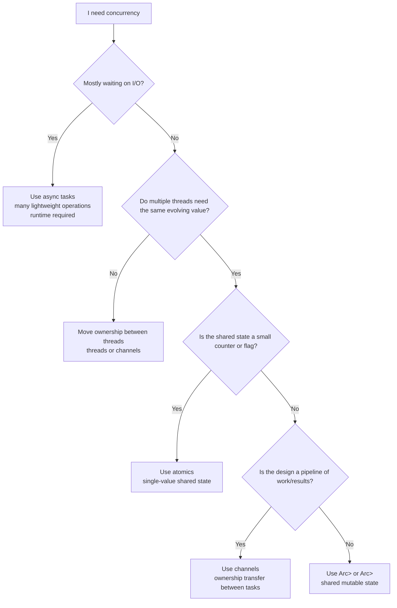

# Concurrency Without Data Races

Most languages treat concurrency as a minefield. You spawn threads, you share
data, and you hope that your locks are in the right places. When they are not,
the result is a _data race_ — two threads accessing the same memory
simultaneously, at least one of them writing. Data races produce corrupted
values, impossible states, and bugs that appear once in a million runs, always
in production, never in your debugger.

Rust takes a fundamentally different approach. The ownership and borrowing rules
you have already learned — one owner, many readers _or_ one writer — are the
_same rules_ that prevent data races. The compiler checks them at compile time.
If your concurrent code compiles, an entire class of bugs is impossible. No
runtime overhead, no special discipline required. The same system that prevents
use-after-free also prevents data races.

This chapter shows how Rust's type system extends to concurrent programming:
spawning threads, sharing data safely, communicating through channels, and a
first taste of asynchronous programming.

> **How to Read This Chapter**
>
> - Understand now: ownership rules scale to concurrency. The main design
>   choice is whether data should be moved, shared behind a lock, or represented
>   as a small atomic value.
> - Memorize: `thread::spawn`, `thread::scope`, `Arc`, `Mutex`, `RwLock`,
>   `mpsc`, `Send`, and `Sync`.
> - Use as reference: the lock-versus-channel guidance, the atomics section, and
>   the file-locking APIs.
> - Skim on first pass: memory-ordering details and the async-closure trait
>   names. Retain the shape of the tool, not every API surface.

Before you dive into the APIs, keep the tool-selection problem simple:

Figure 6-1. Choosing a concurrency tool



## Spawning Threads

A thread is an independent path of execution within your program. Rust's
standard library provides `std::thread::spawn` to create one:

Example 6-1. Spawning a thread and joining it from the main thread

```rust
use std::thread;
use std::time::Duration;

fn main() {
    let handle = thread::spawn(|| {
        for i in 1..=3 {
            println!("  spawned thread: {i}");
            thread::sleep(Duration::from_millis(1));
        }
    });

    for i in 1..=3 {
        println!("main thread: {i}");
        thread::sleep(Duration::from_millis(1));
    }

    handle.join().unwrap();
}
```

Output (order between threads may vary):

```
main thread: 1
  spawned thread: 1
main thread: 2
  spawned thread: 2
main thread: 3
  spawned thread: 3
```

`thread::spawn` takes a closure and runs it on a new operating system thread.
It returns a `JoinHandle` — a value that represents the running thread. Calling
`.join()` on the handle waits for that thread to finish. If you drop the handle
without joining, the thread is _detached_: it keeps running in the background,
but you lose the ability to wait for it or retrieve its result.

The `.join()` call returns a `Result`. If the spawned thread panicked, you get
an `Err` containing the panic payload. If it finished normally, you get `Ok`
with its return value. The `.unwrap()` here means "if the thread panicked,
panic in the main thread too" — a reasonable default.

### Moving Data into Threads

There is a constraint: spawned threads might outlive the function that created
them. The compiler enforces this by requiring the closure to be `'static` —
it cannot borrow local variables. Try it, and the compiler stops you:

```rust,does_not_compile
use std::thread;

fn main() {
    let message = String::from("hello");

    thread::spawn(|| {
        println!("{message}"); // error: closure may outlive the current function
    });
}
```

The fix is the `move` keyword, which transfers ownership of `message` into the
closure:

```rust
use std::thread;

fn main() {
    let message = String::from("hello");

    let handle = thread::spawn(move || {
        println!("{message}");
    });

    // message is no longer accessible here — it moved into the thread
    handle.join().unwrap();
}
```

Output:

```
hello
```

After the `move`, the main thread no longer owns `message`. The spawned thread
owns it exclusively. No shared mutable state, no race condition — ownership
settles the question at compile time.

### Scoped Threads

Sometimes you _do_ want threads to borrow local data. `thread::scope` creates
a scope that guarantees all spawned threads finish before the scope exits. This
makes borrowing safe — the data outlives every thread that reads it:

```rust
use std::thread;

fn main() {
    let numbers = vec![1, 2, 3, 4, 5];

    thread::scope(|s| {
        s.spawn(|| {
            let partial: i32 = numbers.iter().sum();
            println!("sum = {partial}");
        });

        s.spawn(|| {
            let count = numbers.len();
            println!("count = {count}");
        });
    });

    // All scoped threads have finished — we can use `numbers` again
    let total: i32 = numbers.iter().sum();
    println!("total from main = {total}");
}
```

Output:

```
sum = 15
count = 5
total from main = 15
```

Both threads borrow `numbers` immutably — many readers, no writers. The borrow
checker verifies this at compile time, just as it does for single-threaded code.
When the `thread::scope` closure returns, all spawned threads have been joined
automatically. No manual `.join()` calls needed, no risk of forgetting one.

Notice that scoped threads do not need `move`. The compiler knows the data will
outlive every thread in the scope, so borrowing is safe. This is the preferred
approach when your threads do not need to outlive the current function.

#### Mutable borrowing across threads

Scoped threads can borrow data mutably too — the same "many readers _or_ one
writer" rule applies. The key is giving each thread a _disjoint_ piece of the
data so no two threads write to the same memory. The `split_at_mut` method
splits a slice into two non-overlapping mutable halves, and the compiler can
prove they do not alias:

```rust
use std::thread;

fn main() {
    let mut data = vec![1, 2, 3, 4, 5, 6];

    thread::scope(|s| {
        let (left, right) = data.split_at_mut(3);

        s.spawn(|| {
            for val in left.iter_mut() {
                *val *= 10;
            }
        });

        s.spawn(|| {
            for val in right.iter_mut() {
                *val *= 10;
            }
        });
    });

    println!("{data:?}");
}
```

Output:

```
[10, 20, 30, 40, 50, 60]
```

Each thread gets exclusive mutable access to its half — one writer per slice,
no readers on the other side. The compiler accepts this because `split_at_mut`
returns two mutable references that are guaranteed not to overlap. After the
scope ends, both threads have joined and `data` is available again with all
modifications applied.

This pattern — splitting data into disjoint parts and processing them in
parallel — is one of the most powerful uses of scoped threads. It is the safe,
zero-cost equivalent of parallel array processing in C, with the compiler
proving there are no data races.

### How Many Threads to Spawn

The examples so far use a fixed number of threads. In production code,
hardcoding this number is fragile — a program that spawns four threads wastes
cores on a 32-core server, and a program that spawns 32 threads creates
contention on a 4-core laptop.

`thread::available_parallelism` reports how many threads the current hardware
can run simultaneously. Use it to size your work to the machine:

```rust
use std::thread;

fn main() {
    let cpus = thread::available_parallelism().unwrap();
    println!("available parallelism: {cpus}");

    let data: Vec<i64> = (1..=120).collect();
    let chunk_size = data.len().div_ceil(cpus.get());

    let total: i64 = thread::scope(|s| {
        let handles: Vec<_> = data.chunks(chunk_size)
            .map(|chunk| s.spawn(|| chunk.iter().sum::<i64>()))
            .collect();

        handles.into_iter()
            .map(|h| h.join().unwrap())
            .sum()
    });

    println!("sum of 1..=120 = {total}");
}
```

Output (first line varies by system):

```
available parallelism: 8
sum of 1..=120 = 7260
```

The function returns an `io::Result` wrapping a count that is guaranteed to be
at least 1. The `.get()` method extracts the `usize` value. The `div_ceil`
method divides and rounds up, ensuring the last chunk includes any remaining
elements.

For CPU-bound work — crunching numbers, transforming data — one thread per
available core is a good default. For I/O-bound work — network requests, file
reads — you can often spawn more threads than cores, since each thread spends
most of its time waiting rather than computing.

## The Send and Sync Traits

How does the compiler know what is safe to share across threads? Through two
_marker traits_: `Send` and `Sync`. You do not implement these yourself — the
compiler derives them automatically based on a type's fields.

A type is `Send` if it is safe to _transfer ownership_ to another thread. Most
types are `Send`. You can move a `String`, a `Vec<i32>`, or a `HashMap` to
another thread without any risk. The notable exception is `Rc<T>` — its
reference count is not atomic, so moving it to another thread would create a
data race on the counter itself.

A type is `Sync` if it is safe for _multiple threads to hold shared references_
to it simultaneously. A type `T` is `Sync` if and only if `&T` is `Send`. Most
types that are `Send` are also `Sync`. Types with interior mutability that is
not thread-safe — such as `Cell<T>` and `RefCell<T>` — are `Send` but not
`Sync`.

Here is the mental model:

| Trait  | Meaning | Example of non-qualifying type |
|--------|---------|-------------------------------|
| `Send` | Safe to move to another thread | `Rc<T>` (non-atomic refcount) |
| `Sync` | Safe to share references across threads | `Cell<T>` (non-atomic mutation) |

These traits are _auto traits_ — the compiler implements them automatically for
any struct whose fields are all `Send` (or all `Sync`). If you build a struct
from `String`, `i32`, and `Vec<u8>`, it is automatically `Send + Sync`. You
never write `impl Send for MyType`. The compiler does it for you, and it is
always correct.

This is why `thread::spawn` requires its closure to be `Send`:

```rust,ignore
pub fn spawn<F, T>(f: F) -> JoinHandle<T>
where
    F: FnOnce() -> T + Send + 'static,
    T: Send + 'static,
```

Both the closure _and_ its return value must be `Send`. The compiler checks
this at the call site. If you try to move an `Rc<T>` into a spawned thread, you
get a compile error — not a runtime data race.

```rust,does_not_compile
use std::rc::Rc;
use std::thread;

fn main() {
    let data = Rc::new(42);

    thread::spawn(move || {
        println!("{data}"); // error: `Rc<i32>` cannot be sent between threads safely
    });
}
```

The compiler catches this because `Rc<i32>` does not implement `Send`. The fix
is `Arc<T>` — the thread-safe version of `Rc<T>`, covered next.

## Shared State with Arc and Mutex

When multiple threads need access to the same data, you need two things: shared
ownership and synchronized access. `Arc<T>` provides the first. `Mutex<T>`
provides the second.

### Arc: Atomic Reference Counting

`Arc<T>` — short for _atomically reference-counted_ — works like the `Rc<T>`
you saw in the collections chapter, but its reference count uses atomic operations that are safe across
threads. Each call to `Arc::clone` increments the count atomically. When the
last `Arc` is dropped, the data is freed.

```rust
use std::sync::Arc;
use std::thread;

fn main() {
    let data = Arc::new(vec![1, 2, 3]);

    let mut handles = vec![];

    for i in 0..3 {
        let data = Arc::clone(&data);
        let handle = thread::spawn(move || {
            println!("thread {i} sees: {:?}", data);
        });
        handles.push(handle);
    }

    for handle in handles {
        handle.join().unwrap();
    }
}
```

Output (thread order may vary):

```
thread 0 sees: [1, 2, 3]
thread 1 sees: [1, 2, 3]
thread 2 sees: [1, 2, 3]
```

Each thread gets its own `Arc` pointing to the same data on the heap. The
`Arc::clone(&data)` call is cheap — it increments the atomic reference count,
it does not copy the vector. Convention: always write `Arc::clone(&data)` rather
than `data.clone()` to signal that this is a reference count bump, not a deep
copy.

But `Arc<T>` alone only gives you _shared, immutable_ access. The inner `Vec`
cannot be modified. For mutable access, you need a `Mutex`.

### Mutex: Mutual Exclusion

A `Mutex<T>` wraps a value and ensures that only one thread can access it at a
time. You call `.lock()` to acquire the mutex, which returns a `MutexGuard` —
an RAII guard that gives you access to the inner value and automatically
releases the lock when it goes out of scope:

```rust
use std::sync::{Arc, Mutex};
use std::thread;

fn main() {
    let counter = Arc::new(Mutex::new(0));
    let mut handles = vec![];

    for _ in 0..5 {
        let counter = Arc::clone(&counter);
        let handle = thread::spawn(move || {
            let mut num = counter.lock().unwrap();
            *num += 1;
        });
        handles.push(handle);
    }

    for handle in handles {
        handle.join().unwrap();
    }

    println!("final count: {}", counter.lock().unwrap());
}
```

Output:

```
final count: 5
```

The pattern is `Arc<Mutex<T>>`: `Arc` for shared ownership across threads,
`Mutex` for exclusive access to the value inside. This is the standard recipe
for shared mutable state in Rust.

The `.lock()` call returns `Result<MutexGuard<T>, PoisonError>`. A mutex
becomes _poisoned_ if a thread panics while holding the lock — the `Err` case
alerts other threads that the data may be in an inconsistent state. In most
programs, you `.unwrap()` this because a panic in one thread usually means the
program should stop.

#### Keep the lock scope small

The `MutexGuard` holds the lock for as long as it exists. If you hold it across
a long computation or a sleep, other threads are blocked. Keep your critical
sections short:

```rust
use std::sync::{Arc, Mutex};
use std::thread;
use std::time::Duration;

fn main() {
    let data = Arc::new(Mutex::new(vec![1, 2, 3, 4, 5]));

    let mut handles = vec![];
    for id in 0..3 {
        let data = Arc::clone(&data);
        let handle = thread::spawn(move || {
            // Lock, read what we need, and release immediately
            let snapshot = {
                let guard = data.lock().unwrap();
                guard.clone()
            }; // guard is dropped here — lock released

            // Simulate expensive work outside the lock
            thread::sleep(Duration::from_millis(1));
            let sum: i32 = snapshot.iter().sum();
            println!("thread {id}: sum = {sum}");
        });
        handles.push(handle);
    }

    for handle in handles {
        handle.join().unwrap();
    }
}
```

Output (thread order may vary):

```
thread 0: sum = 15
thread 1: sum = 15
thread 2: sum = 15
```

Each thread clones the data _inside_ a block, so the `MutexGuard` is dropped at
the closing brace. The expensive computation happens outside the lock. This
minimizes contention — other threads can acquire the lock while earlier threads
compute their results.

### RwLock: Many Readers or One Writer

A `Mutex` grants exclusive access — only one thread at a time, even if every
thread only needs to read. When your data is read far more often than it is
written, this is wasteful. `RwLock<T>` solves this with a rule you have seen
before: _many readers or one writer_.

This is the borrowing rule you already know, applied at runtime. A `RwLock` allows
any number of threads to hold a read lock (`&T`) simultaneously, but a write
lock (`&mut T`) requires exclusive access — no readers and no other writers.

```rust
use std::sync::{Arc, RwLock};
use std::thread;

fn main() {
    let config = Arc::new(RwLock::new(String::from("v1.0")));

    let mut handles = vec![];

    // Spawn several readers
    for id in 0..3 {
        let config = Arc::clone(&config);
        let handle = thread::spawn(move || {
            let value = config.read().unwrap();
            println!("reader {id}: config = {value}");
        });
        handles.push(handle);
    }

    // Wait for readers to finish, then update
    for handle in handles {
        handle.join().unwrap();
    }

    // One writer updates the config
    {
        let mut value = config.write().unwrap();
        *value = String::from("v2.0");
        println!("writer: updated config");
    } // write lock released here

    // Readers see the new value
    let value = config.read().unwrap();
    println!("after update: config = {value}");
}
```

Output (reader order may vary):

```
reader 0: config = v1.0
reader 1: config = v1.0
reader 2: config = v1.0
writer: updated config
after update: config = v2.0
```

`.read()` returns an `RwLockReadGuard` — multiple threads can hold one at the
same time. `.write()` returns an `RwLockWriteGuard` — only one thread can hold
it, and all readers must release their guards first. Both guards are RAII: the
lock is released when the guard goes out of scope, exactly like `MutexGuard`.

Like `Mutex`, an `RwLock` becomes poisoned if a thread panics while holding a
write lock.

#### Downgrading a write lock

A common pattern with shared data is to write a value and then immediately read
it back — populating a cache, updating a configuration, or initializing a
resource. The naive approach is to drop the write lock and acquire a read lock,
but this leaves a gap where another writer could change the value between the
two operations.

`RwLockWriteGuard::downgrade` solves this by atomically converting a write lock
into a read lock. The lock is never released during the transition, so no other
writer can intervene:

```rust
use std::sync::{RwLock, RwLockWriteGuard};

fn main() {
    let cache = RwLock::new(String::new());

    // Populate the cache, then downgrade to a read lock
    let read_guard = {
        let mut guard = cache.write().unwrap();
        *guard = String::from("computed value");
        println!("populated cache");

        // Atomically convert write lock to read lock
        RwLockWriteGuard::downgrade(guard)
    };

    // Guaranteed to see the value we just wrote — no writer could
    // have changed it, because the lock was never released
    println!("cache contains: {read_guard}");
}
```

Output:

```
populated cache
cache contains: computed value
```

`downgrade` consumes the `RwLockWriteGuard` and returns an `RwLockReadGuard`.
After the downgrade, other readers can acquire the lock concurrently, but
no writer can proceed until the read guard is dropped. This is the safe way to
transition from "I am modifying this data" to "I am done modifying, but I still
need to read it."

#### Choosing between Mutex and RwLock

Use `Mutex` as your default — it is simpler and has less overhead per lock
operation. Reach for `RwLock` when both conditions hold:

1. Reads are _significantly_ more frequent than writes.
2. The data inside the lock is read by multiple threads concurrently.

A shared configuration, a lookup cache, or a routing table are natural fits for
`RwLock`. A simple counter or a task queue is better served by `Mutex` — or,
for the simplest cases, by an atomic type.

## Atomic Types: Lock-Free Shared State

A `Mutex` protects data by requiring every thread to acquire a lock, do its
work, and release the lock. For a simple integer counter, that ceremony is
overhead. The CPU already has instructions that can increment a value or swap
a boolean in a single, indivisible step — no lock needed. Rust exposes these
through the _atomic types_ in `std::sync::atomic`.

An atomic operation is one that completes as a single, uninterruptible unit.
No other thread can see a half-finished update. This is the lightest form of
synchronization Rust offers: no lock, no guard, no blocking.

### Atomic Counters

Earlier in the book, you saw `AtomicU32` used for a global request counter.
The same pattern works for shared state between threads. Compare this with the
`Arc<Mutex<i32>>` counter from the previous section:

```rust
use std::sync::atomic::{AtomicUsize, Ordering};
use std::sync::Arc;
use std::thread;

fn main() {
    let counter = Arc::new(AtomicUsize::new(0));
    let mut handles = vec![];

    for _ in 0..5 {
        let counter = Arc::clone(&counter);
        let handle = thread::spawn(move || {
            counter.fetch_add(1, Ordering::Relaxed);
        });
        handles.push(handle);
    }

    for handle in handles {
        handle.join().unwrap();
    }

    println!("final count: {}", counter.load(Ordering::Relaxed));
}
```

Output:

```
final count: 5
```

No `.lock().unwrap()`, no `MutexGuard`, no risk of holding a lock too long. The
`fetch_add` method atomically reads the current value, adds one, and stores the
result — all in a single CPU instruction. Other threads never see a half-updated
value.

The atomic types mirror the integer types: `AtomicBool`, `AtomicI8`, `AtomicU8`,
through `AtomicI64`, `AtomicU64`, and `AtomicUsize`/`AtomicIsize`. Each provides
methods for the common atomic operations:

| Method | What it does |
|---|---|
| `load(ordering)` | Read the current value |
| `store(value, ordering)` | Write a new value |
| `fetch_add(value, ordering)` | Add and return the previous value |
| `fetch_sub(value, ordering)` | Subtract and return the previous value |
| `swap(value, ordering)` | Replace and return the previous value |
| `compare_exchange(current, new, success, failure)` | Replace only if the current value matches |

### Cancellation Flags with AtomicBool

The most common atomic pattern in practice is a _cancellation flag_ — a boolean
that tells worker threads to stop. Without atomics, you would need
`Arc<Mutex<bool>>`, locking the mutex every time a worker checks whether to
continue. With `AtomicBool`, the check is a single lock-free read:

```rust
use std::sync::atomic::{AtomicBool, Ordering};
use std::sync::Arc;
use std::thread;
use std::time::Duration;

fn main() {
    let running = Arc::new(AtomicBool::new(true));

    let worker_flag = Arc::clone(&running);
    let worker = thread::spawn(move || {
        let mut count = 0u64;
        while worker_flag.load(Ordering::Relaxed) {
            count += 1;
            if count.is_multiple_of(1_000_000) {
                // Simulate periodic work
                thread::sleep(Duration::from_millis(1));
            }
        }
        println!("worker stopped after {count} iterations");
    });

    // Let the worker run briefly, then signal it to stop
    thread::sleep(Duration::from_millis(10));
    running.store(false, Ordering::Relaxed);

    worker.join().unwrap();
    println!("shutdown complete");
}
```

Output (iteration count varies):

```
worker stopped after 5000000 iterations
shutdown complete
```

The main thread sets the flag to `false` with a single atomic store. The worker
checks it on each loop iteration with a single atomic load. No lock contention,
no blocking, no chance of deadlock. This pattern is the foundation of graceful
shutdown in concurrent programs.

### Memory Ordering

Every atomic operation takes an `Ordering` parameter that controls how the
operation interacts with other memory accesses. This is the most subtle aspect
of atomic programming, but for most practical use cases, two orderings cover
your needs:

**`Ordering::Relaxed`** — the weakest guarantee. The atomic operation itself is
indivisible, but it does not impose any ordering on surrounding memory accesses.
This is sufficient when each atomic value is independent — a counter, a flag
that triggers shutdown, a statistics accumulator. Most atomic code in practice
uses `Relaxed`.

**`Ordering::SeqCst`** — short for _sequentially consistent_, the strongest
guarantee. All `SeqCst` operations across all threads appear to execute in a
single, global order that every thread agrees on. This is the safest choice when
you are unsure, but it carries a small performance cost because the CPU must
synchronize its memory caches.

The rule of thumb: start with `Relaxed` for independent counters and flags. If
your program depends on the _order_ in which two different atomic values are
updated (for example, a flag that signals "data is ready" for another value),
you need stronger orderings — `Acquire`/`Release` or `SeqCst`. When in doubt,
`SeqCst` is always correct.

### Choosing Between Atomics and Mutex

Atomic types and `Mutex` solve different problems. Here is when to reach for
each:

| Situation | Use |
|---|---|
| Incrementing a counter | `AtomicUsize` or `AtomicU64` |
| A stop/cancel/ready flag | `AtomicBool` |
| A single value with simple read/write | Atomic type |
| Multiple fields that must change together | `Mutex` |
| Complex data (strings, collections, structs) | `Mutex` or `RwLock` |
| Operations that require multiple steps | `Mutex` |

Atomics are faster and cannot deadlock — but they only work for single values
with simple operations. If you need to update two fields consistently, or if the
protected data is a `String` or a `Vec`, use a `Mutex`. The compiler enforces
this naturally: there is no `AtomicString` or `AtomicVec`, so you cannot
accidentally choose the wrong tool.

## Message Passing with Channels

Shared state is not the only way to communicate between threads. Rust's standard
library also provides _channels_ — a way to send values from one thread to
another. The philosophy is borrowed from Go: _do not communicate by sharing
memory; share memory by communicating_.

A channel has two halves: a `Sender` and a `Receiver`. You send values through
the sender, and they arrive at the receiver in order:

```rust
use std::sync::mpsc;
use std::thread;

fn main() {
    let (tx, rx) = mpsc::channel();

    thread::spawn(move || {
        let messages = vec!["hello", "from", "the thread"];
        for msg in messages {
            tx.send(msg).unwrap();
        }
    });

    for received in rx {
        println!("got: {received}");
    }
}
```

Output:

```
got: hello
got: from
got: the thread
```

`mpsc` stands for _multiple producer, single consumer_. You can clone the
sender to send from multiple threads, but there is only one receiver. The
receiver implements `Iterator`, so you can use a `for` loop to read messages
until all senders are dropped (which closes the channel).

The `send` call moves the value into the channel — after sending, the original
thread no longer owns it. This is ownership at work again: there is no aliased
mutable state, because the value transfers from sender to receiver.

### Multiple Producers

Clone the sender to have multiple threads feed into the same channel:

```rust
use std::sync::mpsc;
use std::thread;

fn main() {
    let (tx, rx) = mpsc::channel();

    for id in 0..3 {
        let tx = tx.clone();
        thread::spawn(move || {
            tx.send(format!("message from thread {id}")).unwrap();
        });
    }

    drop(tx); // drop the original sender so the channel closes

    for msg in rx {
        println!("{msg}");
    }
}
```

Output (order may vary):

```
message from thread 0
message from thread 1
message from thread 2
```

One important detail: the original `tx` must be dropped explicitly after
cloning, because the channel stays open as long as _any_ sender exists. Without
the `drop(tx)`, the `for` loop on the receiver would block forever, waiting for
more messages that will never come.

### When to Use Channels vs Shared State

Both patterns are valid. Here is a simple guide:

- **Channels** are natural when threads produce results that another thread
  consumes. Think of a pipeline: scrape data → parse data → store data.
- **Shared state** (`Arc<Mutex<T>>` or `Arc<RwLock<T>>`) is natural when
  multiple threads need to read and update the same value, like a counter, a
  cache, or a configuration.

In practice, channels lead to simpler designs because they eliminate the need to
think about lock ordering and deadlocks. Prefer channels when either approach
would work.

### Anonymous Pipes for Byte Streams

Channels pass typed Rust values — a `String`, a tuple, an enum. But sometimes
you do not need structured messages. You need raw bytes flowing from one thread
to another, the same way data flows through a file or a network socket. This is
what _pipes_ are for.

`std::io::pipe` creates a connected pair: a `PipeReader` and a `PipeWriter`.
The writer implements `Write`. The reader implements `Read`. Bytes written to
one end come out the other, in order. When all writers are dropped, the reader
sees EOF — just like closing a file:

```rust
use std::io::{self, Read, Write};
use std::thread;

fn main() -> io::Result<()> {
    let (mut reader, mut writer) = io::pipe()?;

    thread::spawn(move || {
        writeln!(writer, "line 1").unwrap();
        writeln!(writer, "line 2").unwrap();
        writeln!(writer, "line 3").unwrap();
        // writer dropped here — signals EOF to reader
    });

    let mut output = String::new();
    reader.read_to_string(&mut output)?;
    print!("{output}");

    Ok(())
}
```

Output:

```
line 1
line 2
line 3
```

The pipe operates at the byte level using the `Read` and `Write` traits — the
same traits used by files, network sockets, and standard I/O. This makes pipes
the natural bridge between threads and the I/O trait ecosystem: any function
that accepts a `impl Read` or `impl Write` can work with a pipe end.

Pipes are especially useful for redirecting child process output. Both
`PipeReader` and `PipeWriter` convert directly into `std::process::Stdio`, so
you can connect a command's stdout and stderr to the same pipe without
platform-specific code.

A few things to keep in mind: reads block until data is available, writes block
when the pipe's internal buffer is full, and the buffer capacity is
platform-dependent. For structured data between threads, channels are almost
always the better choice. Reach for pipes when you need byte-level I/O
interoperability — connecting streams, redirecting process output, or bridging
threads with code that speaks `Read` and `Write`.

### File Locking for Cross-Process Safety

Threads, mutexes, and channels coordinate work within a single program. But what
happens when _multiple programs_ — or multiple instances of the same program —
need to access the same file? Without coordination, they can overwrite each
other's changes, read partially written data, or corrupt file contents entirely.

_File locking_ solves this. It extends the many-readers-or-one-writer principle
you already know from `RwLock` to the filesystem level, where the operating
system mediates access across processes. Since Rust 1.89, the standard library
provides cross-platform file locking directly on `File`:

```rust
use std::fs::{self, File, TryLockError};
use std::io::Write;

fn main() -> std::io::Result<()> {
    let path = "app.lock";
    let mut file = File::create(path)?;
    writeln!(file, "locked by process {}", std::process::id())?;

    match file.try_lock() {
        Ok(()) => println!("Lock acquired — safe to proceed."),
        Err(TryLockError::WouldBlock) => {
            println!("Another process holds the lock. Exiting.");
            fs::remove_file(path)?;
            return Ok(());
        }
        Err(TryLockError::Error(e)) => {
            fs::remove_file(path)?;
            return Err(e);
        }
    }

    println!("Working with exclusive access...");

    // Dropping the file releases the lock automatically
    drop(file);
    fs::remove_file(path)?;
    println!("Lock released.");

    Ok(())
}
```

Output:

```
Lock acquired — safe to proceed.
Working with exclusive access...
Lock released.
```

The API mirrors the shared-vs-exclusive distinction you learned with `RwLock`:

| Method | Blocking | Lock type |
|---|---|---|
| `lock()` | Yes | Exclusive — no other lock may coexist |
| `lock_shared()` | Yes | Shared — multiple shared locks allowed |
| `try_lock()` | No | Exclusive — returns `WouldBlock` if held |
| `try_lock_shared()` | No | Shared — returns `WouldBlock` if exclusive lock held |

Locks are released automatically when the `File` is dropped, just as a
`MutexGuard` releases its lock on drop. You can also call `file.unlock()`
explicitly if you need to release the lock without closing the file.

A few things to keep in mind: on Unix, file locks are _advisory_ — they only
work between cooperating programs that both call `lock`. On Windows, locks are
enforced by the OS. The most common use case is a _lock file_ pattern like the
example above, where a program creates a file and locks it to signal "I am
running." Cargo itself uses this pattern to prevent multiple builds from
corrupting the same target directory.

## A Taste of Async

Threads are powerful, but each one costs memory (typically megabytes for its
stack) and an operating system context switch to schedule. If your program needs
thousands of concurrent tasks — a web server handling thousands of connections,
for example — threads become expensive.

_Asynchronous programming_ solves this by running many tasks on a small number
of threads. Instead of blocking a thread while waiting for I/O, an async task
_yields_ control back to the runtime, which can run another task on the same
thread. The result: thousands of concurrent tasks on a handful of threads.

### Async and Await

Rust's `async` and `await` keywords let you write asynchronous code that reads
almost like synchronous code:

```rust,ignore
async fn fetch_data(url: &str) -> String {
    // This would do real I/O in a full program
    format!("data from {url}")
}

async fn process() {
    let data = fetch_data("https://example.com").await;
    println!("{data}");
}
```

An `async fn` does not run immediately when called. Instead, it returns a
_future_ — a value that represents a computation that has not finished yet.
The `.await` keyword drives the future to completion, yielding control if the
operation is not ready yet.

### You Need a Runtime

Rust's standard library provides the `async`/`await` syntax and the `Future`
trait, but it does _not_ include a runtime to execute futures. You choose a
runtime from the ecosystem. The most widely used is tokio:

```rust,ignore
// Cargo.toml:
// [dependencies]
// tokio = { version = "1", features = ["full"] }

#[tokio::main]
async fn main() {
    let handle = tokio::spawn(async {
        println!("running in an async task");
        42
    });

    let result = handle.await.unwrap();
    println!("task returned: {result}");
}
```

`#[tokio::main]` transforms `main` into an async function and starts the tokio
runtime. `tokio::spawn` is the async equivalent of `thread::spawn` — it creates
a lightweight task (just bytes of overhead, not megabytes) that runs on the
runtime's thread pool.

### What Is a Future

Under the surface, a future is a value that implements the `Future` trait:

```rust,ignore
pub trait Future {
    type Output;
    fn poll(self: Pin<&mut Self>, cx: &mut Context<'_>) -> Poll<Self::Output>;
}
```

The runtime calls `poll` on a future. If the result is ready, `poll` returns
`Poll::Ready(value)`. If not, it returns `Poll::Pending`, and the runtime moves
on to poll other tasks. When the I/O operation completes, a _waker_ notifies the
runtime to poll the future again.

You rarely implement `Future` by hand. The `async`/`await` syntax generates the
state machine for you. But understanding that futures are values — lazy
computations you can pass around, store, and compose — is key to reading async
Rust code.

### Async Closures (Rust 2024)

Rust 1.85 stabilized _async closures_ — closures that produce futures directly:

```rust,ignore
let fetch = async |url: &str| {
    // async work here
    format!("data from {url}")
};

let result = fetch("https://example.com").await;
```

Before async closures, you had to write `|url| async move { ... }`. That
pattern had a painful limitation: the inner `async move` block took ownership of
_all_ captures, so the closure could not borrow from its environment across
`.await` points. Async closures fix this. The closure itself is async, so the
compiler decides how to capture each variable — by reference, by mutable
reference, or by move — just as it does for regular closures.

#### The async closure traits

Async closures implement one of three new traits that mirror the closure trait
hierarchy:

| Async trait    | Mirrors   | Can be called...                   |
|----------------|-----------|------------------------------------|
| `AsyncFn`      | `Fn`      | Multiple times, by shared reference |
| `AsyncFnMut`   | `FnMut`   | Multiple times, by mutable reference |
| `AsyncFnOnce`  | `FnOnce`  | Exactly once, consuming the closure |

All three are in the standard library prelude — no `use` import needed. They
make it possible to write higher-order async functions that accept async
closures:

```rust,ignore
async fn retry<F>(mut action: F, attempts: u32) -> Result<String, String>
where
    F: AsyncFnMut() -> Result<String, String>,
{
    for i in 0..attempts {
        match action().await {
            Ok(value) => return Ok(value),
            Err(e) if i + 1 == attempts => return Err(e),
            Err(_) => continue,
        }
    }
    Err("exhausted retries".into())
}
```

The `AsyncFnMut` bound means "an async callable thing that may mutate its
captured state and can be called multiple times." The choice between `AsyncFn`,
`AsyncFnMut`, and `AsyncFnOnce` follows the same logic as their synchronous
counterparts: use the most permissive trait your function needs.

Before these traits existed, you had to use a generic `Fn() -> Fut` bound plus
a separate `Fut: Future<Output = T>` constraint. That worked but could not
express higher-ranked lifetime bounds cleanly — if the closure borrowed from its
arguments, the old pattern broke down. `AsyncFnMut` handles this correctly.

### Async Is an Advanced Topic

This section gives you enough to _recognize_ and _understand_ async code when
you encounter it. Writing production async Rust involves understanding pinning,
cancellation, `Send` bounds on futures, and the specifics of your chosen
runtime. These are topics for dedicated async resources — the
[Tokio tutorial](https://tokio.rs/tokio/tutorial) and the
[Async Book](https://rust-lang.github.io/async-book/) are the best starting
points.

## Putting It All Together

Here is a complete example that demonstrates a worker pool built from the
standard library's _actual_ channel model. Because `std::sync::mpsc` has one
receiver, each worker gets its own inbox. The main thread distributes tasks
round-robin and collects completed results on a second channel:

> **Tip**
>
> If you need many workers to pull from one shared queue, `std::sync::mpsc` is
> the wrong shape: it is multiple-producer, single-consumer. In synchronous
> code, reach for an MPMC channel such as crossbeam-channel. In async code, use
> your runtime's channel type.

Example 6-2. Building a worker pool with per-worker inboxes

```rust
use std::sync::atomic::{AtomicUsize, Ordering};
use std::sync::{mpsc, Arc};
use std::thread;

fn main() {
    let worker_count = 3;
    let completed = Arc::new(AtomicUsize::new(0));

    // Workers send finished results back to the main thread.
    let (result_tx, result_rx) = mpsc::channel::<(usize, usize, i32)>();

    // Each worker gets its own task queue.
    let mut task_senders = Vec::new();
    let mut handles = Vec::new();

    for worker_id in 0..worker_count {
        let (task_tx, task_rx) = mpsc::channel::<(usize, Vec<i32>)>();
        let result_tx = result_tx.clone();
        let completed = Arc::clone(&completed);

        let handle = thread::spawn(move || {
            for (task_id, numbers) in task_rx {
                let sum: i32 = numbers.iter().sum();
                result_tx.send((worker_id, task_id, sum)).unwrap();
                completed.fetch_add(1, Ordering::Relaxed);
            }
        });

        task_senders.push(task_tx);
        handles.push(handle);
    }

    drop(result_tx); // main thread only receives results

    let tasks = vec![
        vec![1, 2, 3],
        vec![10, 20, 30],
        vec![100, 200, 300],
        vec![4, 5, 6],
    ];

    // Distribute work in round-robin order.
    for (task_id, task) in tasks.into_iter().enumerate() {
        let worker_index = task_id % task_senders.len();
        task_senders[worker_index].send((task_id, task)).unwrap();
    }
    drop(task_senders); // close all worker inboxes

    let mut results: Vec<_> = result_rx.into_iter().collect();

    for handle in handles {
        handle.join().unwrap();
    }

    results.sort_by_key(|&(_, task_id, _)| task_id);

    println!("\nall results:");
    for (worker_id, task_id, sum) in results {
        println!("  task {task_id}: {sum} (worker {worker_id})");
    }

    println!(
        "processed tasks: {}",
        completed.load(Ordering::Relaxed)
    );
}
```

Output:

```
all results:
  task 0: 6 (worker 0)
  task 1: 60 (worker 1)
  task 2: 600 (worker 2)
  task 3: 15 (worker 0)
processed tasks: 4
```

This example combines the chapter's main ideas in a way that matches the
standard library's tools:

- **Threads** (`thread::spawn`) to run work in parallel.
- **Channels** (`mpsc::channel`) to distribute tasks to workers and gather
  results back in the main thread.
- **Arc** to share a progress counter across threads.
- **AtomicUsize** for lock-free shared progress tracking.
- **Ownership and move** to transfer data safely between threads.

Notice what is _not_ here: no worker contends for a shared receiver mutex. Each
worker owns its own inbox, so the channel topology stays explicit and the
single-consumer nature of `mpsc` is visible in the design. The compiler
verified every access. No data races are possible. That is what _fearless
concurrency_ means in Rust.

## Why This Matters

Concurrency in Rust is not about learning new rules — it is about applying the
rules you already know. Ownership prevents two threads from modifying the same
data. Borrowing prevents a thread from reading data another thread is writing.
`Send` and `Sync` encode these guarantees as traits the compiler checks
automatically.

The key ideas from this chapter:

- **`thread::spawn`** creates an OS thread. The closure must be `Send + 'static`
  — use `move` to transfer ownership.
- **`thread::scope`** creates threads that can borrow local data, with automatic
  joining. Use `thread::available_parallelism` to match thread count to
  hardware.
- **`Send`** means a type can be moved to another thread. **`Sync`** means a
  type can be shared by reference across threads. Both are auto-derived.
- **`Arc<Mutex<T>>`** is the standard pattern for shared mutable state: `Arc`
  for shared ownership, `Mutex` for exclusive access. **`RwLock<T>`** allows
  many concurrent readers when writes are infrequent; `downgrade` atomically
  converts a write lock into a read lock. **Atomic types** (`AtomicBool`,
  `AtomicUsize`, etc.) provide lock-free operations for single values —
  counters, flags, and simple state — with no risk of deadlock.
- **Channels** (`mpsc::channel`) pass values between threads by transferring
  ownership. Prefer channels when the design is a pipeline. **Pipes**
  (`io::pipe`) provide a byte-level alternative using the `Read` and `Write`
  traits — useful for connecting I/O streams and redirecting process output.
- **File locking** (`File::lock`, `try_lock`, `lock_shared`) extends the
  many-readers-or-one-writer principle to the filesystem, coordinating access
  across processes. Locks are released automatically on drop.
- **`async`/`await`** enables lightweight concurrency for I/O-bound work. You
  need a runtime like tokio. Async closures (`async || {}`) and the `AsyncFn`
  traits are stable since Rust 1.85.

## Exercises

These micro-projects practice the concurrency patterns from this chapter.
Each uses only concepts from this and earlier chapters.

### Exercise 6-1: Parallel Document Analyzer

Build a tool that analyzes multiple text documents in parallel using scoped
threads. This exercises `thread::scope`, borrowing from the parent scope,
`Display`, iterators, and collecting results from parallel work.

Build these pieces:

- A `DocStats` struct with `title: String`, `words: usize`, `lines: usize`,
  and `longest_word: String`, plus a `Display` implementation that formats as
  `"README: 8 words, 2 lines, longest = \"Install\""`.
- An `analyze(title: &str, text: &str) -> DocStats` function that counts
  words (split by whitespace), counts lines, and finds the longest word
  using `max_by_key`.
- In `main`, define an array of `(&str, &str)` tuples — title and content —
  for three documents:
  - `"README"`: `"Getting started with Rust\nInstall rustup and cargo"`
  - `"DESIGN"`: `"The ownership model prevents data races\nBorrowing enforces single-writer rules\nLifetimes track reference validity"`
  - `"CHANGELOG"`: `"Added concurrency chapter\nFixed borrow checker examples"`
- Use `thread::scope` to analyze all documents in parallel. Each scoped
  thread borrows its `(title, text)` pair from the array — no `move`, no
  `Arc`, no cloning.
- Collect all `DocStats` results, print per-document stats, then print a
  summary: total words, total lines, and the overall longest word.

Expected output:

```
document analysis (parallel):
  README: 8 words, 2 lines, longest = "Install"
  DESIGN: 14 words, 3 lines, longest = "single-writer"
  CHANGELOG: 7 words, 2 lines, longest = "concurrency"

summary: 29 words, 7 lines across 3 documents
longest word overall: "single-writer"
```

<details>
<summary>Solution</summary>

```rust
use std::thread;

struct DocStats {
    title: String,
    words: usize,
    lines: usize,
    longest_word: String,
}

impl std::fmt::Display for DocStats {
    fn fmt(&self, f: &mut std::fmt::Formatter<'_>) -> std::fmt::Result {
        write!(
            f,
            "{}: {} words, {} lines, longest = \"{}\"",
            self.title, self.words, self.lines, self.longest_word
        )
    }
}

fn analyze(title: &str, text: &str) -> DocStats {
    let words: usize = text
        .lines()
        .map(|line| line.split_whitespace().count())
        .sum();
    let lines = text.lines().count();
    let longest_word = text
        .split_whitespace()
        .max_by_key(|w| w.len())
        .unwrap_or("")
        .to_string();

    DocStats {
        title: title.to_string(),
        words,
        lines,
        longest_word,
    }
}

fn main() {
    let documents = [
        (
            "README",
            "Getting started with Rust\nInstall rustup and cargo",
        ),
        (
            "DESIGN",
            "The ownership model prevents data races\n\
             Borrowing enforces single-writer rules\n\
             Lifetimes track reference validity",
        ),
        (
            "CHANGELOG",
            "Added concurrency chapter\nFixed borrow checker examples",
        ),
    ];

    let results: Vec<DocStats> = thread::scope(|s| {
        let handles: Vec<_> = documents
            .iter()
            .map(|(title, text)| s.spawn(|| analyze(title, text)))
            .collect();

        handles
            .into_iter()
            .map(|h| h.join().unwrap())
            .collect()
    });

    println!("document analysis (parallel):");
    for stats in &results {
        println!("  {stats}");
    }

    let total_words: usize = results.iter().map(|s| s.words).sum();
    let total_lines: usize = results.iter().map(|s| s.lines).sum();

    let overall_longest = results
        .iter()
        .max_by_key(|s| s.longest_word.len())
        .map(|s| s.longest_word.as_str())
        .unwrap_or("");

    println!(
        "\nsummary: {total_words} words, {total_lines} lines \
         across {} documents",
        results.len()
    );
    println!("longest word overall: \"{overall_longest}\"");
}
```

</details>

### Exercise 6-2: Concurrent Ballot Box

Build a thread-safe voting system where multiple polling stations (threads)
submit votes to a shared ballot box. This exercises `Arc<Mutex<T>>`,
`thread::spawn` with `move`, `MutexGuard` scoping, `HashMap` entry API,
and `Display`.

Build these pieces:

- A `BallotBox` struct with `votes: HashMap<String, u32>` and `total: u32`.
- A `new()` constructor, a `cast(&mut self, candidate: &str)` method that
  increments the candidate's count using the entry API (`or_default`), and
  a `leader(&self) -> Option<(&str, u32)>` method that returns the
  candidate with the most votes.
- A `Display` implementation that formats as `"12 total votes"`.
- In `main`, wrap the ballot box in `Arc<Mutex<BallotBox>>`. Define three
  polling stations as `Vec<Vec<&str>>`:
  - Station 0: `["Alice", "Bob", "Alice", "Alice"]`
  - Station 1: `["Bob", "Alice", "Alice", "Bob"]`
  - Station 2: `["Carol", "Alice", "Carol", "Carol"]`
- Spawn one thread per station. Each thread `Arc::clone`s the ballot,
  locks it to cast each vote, prints a confirmation, and returns the
  number of votes submitted.
- After joining all threads, lock the ballot one last time, sort results
  by count (descending), print each candidate's count and percentage,
  and announce the winner.

Expected output (station order may vary):

```
  station 0: submitted 4 votes
  station 1: submitted 4 votes
  station 2: submitted 4 votes

results (12 total votes):
  Alice: 6 votes (50.0%)
  Bob: 3 votes (25.0%)
  Carol: 3 votes (25.0%)

winner: Alice with 6 votes
verified: all 12 votes accounted for
```

<details>
<summary>Solution</summary>

```rust
use std::collections::HashMap;
use std::sync::{Arc, Mutex};
use std::thread;

struct BallotBox {
    votes: HashMap<String, u32>,
    total: u32,
}

impl BallotBox {
    fn new() -> Self {
        Self {
            votes: HashMap::new(),
            total: 0,
        }
    }

    fn cast(&mut self, candidate: &str) {
        *self.votes.entry(candidate.to_string()).or_default() += 1;
        self.total += 1;
    }

    fn leader(&self) -> Option<(&str, u32)> {
        self.votes
            .iter()
            .max_by_key(|(_, count)| **count)
            .map(|(name, &count)| (name.as_str(), count))
    }
}

impl std::fmt::Display for BallotBox {
    fn fmt(&self, f: &mut std::fmt::Formatter<'_>) -> std::fmt::Result {
        write!(f, "{} total votes", self.total)
    }
}

fn main() {
    let ballot = Arc::new(Mutex::new(BallotBox::new()));

    // Each thread simulates a polling station submitting a batch of votes.
    let stations: Vec<Vec<&str>> = vec![
        vec!["Alice", "Bob", "Alice", "Alice"],
        vec!["Bob", "Alice", "Alice", "Bob"],
        vec!["Carol", "Alice", "Carol", "Carol"],
    ];

    let handles: Vec<_> = stations
        .into_iter()
        .enumerate()
        .map(|(station_id, votes)| {
            let ballot = Arc::clone(&ballot);

            thread::spawn(move || {
                for candidate in &votes {
                    let mut box_guard = ballot.lock().unwrap();
                    box_guard.cast(candidate);
                }
                println!(
                    "  station {station_id}: submitted {} votes",
                    votes.len()
                );
                votes.len()
            })
        })
        .collect();

    let mut total_submitted = 0;
    for handle in handles {
        total_submitted += handle.join().unwrap();
    }

    let box_guard = ballot.lock().unwrap();
    println!("\nresults ({box_guard}):");

    let mut results: Vec<_> = box_guard.votes.iter().collect();
    results.sort_by(|a, b| b.1.cmp(a.1).then(a.0.cmp(b.0)));

    for (candidate, count) in &results {
        let pct = **count as f64 / box_guard.total as f64 * 100.0;
        println!("  {candidate}: {count} votes ({pct:.1}%)");
    }

    if let Some((winner, count)) = box_guard.leader() {
        println!("\nwinner: {winner} with {count} votes");
    }

    assert_eq!(box_guard.total as usize, total_submitted);
    println!("verified: all {total_submitted} votes accounted for");
}
```

</details>

### Exercise 6-3: Score Pipeline

Build a multi-stage data pipeline using channels. A cleaner thread trims
and filters raw input, a parser thread validates and converts records, and
the main thread collects results. This exercises `mpsc::channel`,
`thread::spawn` with `move`, ownership transfer through channels, let
chains (Rust 2024), and `split_once`.

Build these pieces:

- Three channels:
  - `clean_tx`/`clean_rx`: carries `(usize, String)` — line number and
    trimmed text from the cleaner to the parser.
  - `parsed_tx`/`parsed_rx`: carries `(usize, String, u32)` — line number,
    name, and score from the parser to the collector.
  - `reject_tx`/`reject_rx`: carries `(usize, String)` — line number and
    raw text for lines the parser could not convert.
- **Stage 1 (Cleaner):** spawn a thread that takes ownership of
  `raw_lines` (a `Vec<&str>`), trims each line, skips blank lines, sends
  `(line_num, trimmed)` on `clean_tx`, and returns the count sent.
- **Stage 2 (Parser):** spawn a thread that receives from `clean_rx`, uses
  `split_once(',')` and a let chain to parse `"name,score"` lines, sends
  valid records on `parsed_tx` and rejects on `reject_tx`, and returns
  `(parsed_count, rejected_count)`.
- **Collector (main thread):** iterates `parsed_rx` and `reject_rx` to
  gather results (channels close automatically when senders drop), joins
  both threads, sorts results by line number, and prints a summary.

Use this input:

```rust
let raw_lines = vec![
    "  Alice,95  ",
    "  Bob,87  ",
    "  invalid line  ",
    "  Carol,92  ",
    "  Dave,abc  ",
    "  Eve,78  ",
    "  Frank,88  ",
];
```

Expected output:

```
pipeline results:
  cleaned: 7, parsed: 5, rejected: 2

valid records:
  line 1: Alice scored 95
  line 2: Bob scored 87
  line 4: Carol scored 92
  line 6: Eve scored 78
  line 7: Frank scored 88

rejected lines:
  line 3: "invalid line"
  line 5: "Dave,abc"

summary: 5 students, average score: 88.0
```

<details>
<summary>Solution</summary>

```rust
use std::sync::mpsc;
use std::thread;

fn main() {
    let raw_lines = vec![
        "  Alice,95  ",
        "  Bob,87  ",
        "  invalid line  ",
        "  Carol,92  ",
        "  Dave,abc  ",
        "  Eve,78  ",
        "  Frank,88  ",
    ];

    // Stage 1 → Stage 2: cleaned lines.
    let (clean_tx, clean_rx) = mpsc::channel::<(usize, String)>();
    // Stage 2 → Collector: parsed records.
    let (parsed_tx, parsed_rx) =
        mpsc::channel::<(usize, String, u32)>();
    // Stage 2 → Collector: rejected lines.
    let (reject_tx, reject_rx) = mpsc::channel::<(usize, String)>();

    // Stage 1: Cleaner — trims whitespace and filters blanks.
    let cleaner = thread::spawn(move || {
        let mut sent = 0u32;
        for (line_num, line) in raw_lines.into_iter().enumerate() {
            let trimmed = line.trim().to_string();
            if !trimmed.is_empty() {
                clean_tx.send((line_num + 1, trimmed)).unwrap();
                sent += 1;
            }
        }
        sent
    });

    // Stage 2: Parser — splits "name,score" and validates.
    let parser = thread::spawn(move || {
        let mut parsed = 0u32;
        let mut rejected = 0u32;

        for (line_num, line) in clean_rx {
            if let Some((name, score_str)) = line.split_once(',')
                && let Ok(score) = score_str.parse::<u32>()
            {
                parsed_tx
                    .send((line_num, name.to_string(), score))
                    .unwrap();
                parsed += 1;
                continue;
            }
            reject_tx.send((line_num, line)).unwrap();
            rejected += 1;
        }

        (parsed, rejected)
    });

    // Collector: gathers results on the main thread.
    let mut records: Vec<(usize, String, u32)> = Vec::new();
    let mut rejects: Vec<(usize, String)> = Vec::new();

    for record in parsed_rx {
        records.push(record);
    }
    for reject in reject_rx {
        rejects.push(reject);
    }

    let cleaned = cleaner.join().unwrap();
    let (parsed, rejected) = parser.join().unwrap();

    records.sort_by_key(|r| r.0);
    rejects.sort_by_key(|r| r.0);

    println!("pipeline results:");
    println!(
        "  cleaned: {cleaned}, parsed: {parsed}, \
         rejected: {rejected}"
    );

    println!("\nvalid records:");
    for (line_num, name, score) in &records {
        println!("  line {line_num}: {name} scored {score}");
    }

    if !rejects.is_empty() {
        println!("\nrejected lines:");
        for (line_num, line) in &rejects {
            println!("  line {line_num}: \"{line}\"");
        }
    }

    let total: u32 = records.iter().map(|(_, _, s)| s).sum();
    let count = records.len();
    let average = if count > 0 {
        total as f64 / count as f64
    } else {
        0.0
    };
    println!(
        "\nsummary: {count} students, average score: {average:.1}"
    );
}
```

</details>

---

## Check Yourself

Use these prompts to test the mental model before moving on:

- Why does `move` solve the `'static` problem for `thread::spawn`, and what do
  you give up in exchange?
- When is `thread::scope` a better fit than `thread::spawn`?
- Why prefer channels when ownership should move between tasks, but
  `Arc<Mutex<T>>` when one evolving value must stay shared?
- When is an atomic better than a mutex, and when is it not?
- Why does `RwLock<T>` only help when the data is read much more often than it
  is written?
- What makes async a different tool from OS threads rather than a faster
  version of the same thing?

## Further Reading

If you want to go deeper immediately, these resources extend the chapter
without changing its core mental model:

- [Fearless Concurrency - The Rust Programming Language](https://doc.rust-lang.org/book/ch16-00-concurrency.html)
- [thread::scope - Rust standard library docs](https://doc.rust-lang.org/std/thread/fn.scope.html)
- [std::sync::mpsc - Rust standard library docs](https://doc.rust-lang.org/std/sync/mpsc/index.html)
- [The Async Book](https://rust-lang.github.io/async-book/)
- [Tokio tutorial](https://tokio.rs/tokio/tutorial)

With concurrency in your toolkit, you have crossed the threshold from learning
Rust to _using_ Rust for real systems. You can build safe, concurrent programs
that the compiler guarantees are free of data races. In the next part, you will
learn the patterns and idioms that experienced Rust programmers use every day —
the techniques that make the difference between code that merely compiles and
code that is truly idiomatic.
