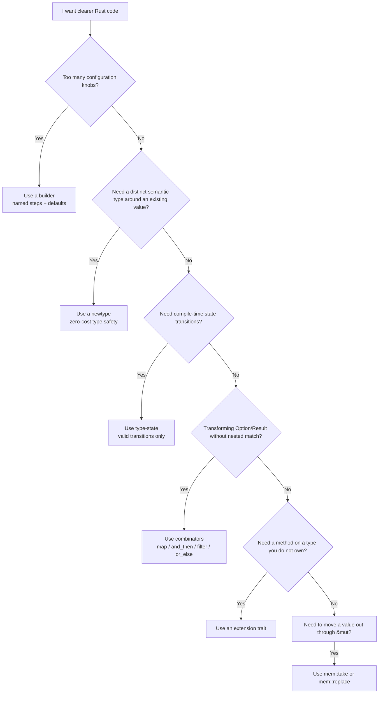
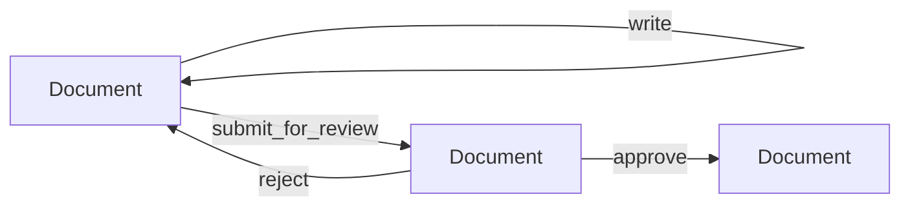

# Patterns the Pros Use

You know how to write Rust that compiles. You understand ownership, borrowing,
traits, generics, error handling, and concurrency. Your code is correct. But
correct code and _idiomatic_ code are not the same thing. Idiomatic code uses
the language's strengths to express intent clearly, catch mistakes at compile
time, and make the next developer's life easier — including future you.

This chapter collects the patterns that experienced Rust programmers reach for
daily. None of them require new language features beyond what you have already
learned. They are combinations of the building blocks from earlier chapters —
structs, enums, traits, generics, and closures — assembled in ways that the Rust
community has found to be reliably effective. Each pattern solves a real design
problem, and each makes your code more expressive without adding runtime cost.

> **How to Read This Chapter**
>
> - Understand now: each pattern solves a recurring design problem by making
>   intent visible to the type system.
> - Memorize: builder, newtype, type-state, combinators, extension traits, and
>   `mem::take`/`mem::replace`.
> - Use as reference: the "when to use" sections and the combinator quick
>   reference table.
> - Skim on first pass: the capstone mixes all six patterns. The important skill
>   is recognizing which smaller problem each pattern solves.

Before the details, keep the pattern-selection problem simple:

Figure 7-1. Choosing the right idiomatic pattern



## The Builder Pattern

Some types need many configuration options. A struct with ten fields leads to a
constructor with ten parameters — most of them optional, many with reasonable
defaults. Callers cannot remember the order, and every call site becomes a wall
of arguments where you cannot tell which value controls what.

The _builder pattern_ solves this by creating a separate struct whose only job is
to accumulate configuration, one method call at a time, and then produce the
final value. Each method has a descriptive name, optional fields have defaults,
and the final `.build()` call produces the configured type.

### A Consuming Builder

The most common form in Rust takes `self` by value in each setter, returning
`Self` so the caller can chain methods:

Example 7-1. Building a value one named step at a time

```rust
struct Server {
    host: String,
    port: u16,
    max_connections: usize,
    tls_enabled: bool,
}

struct ServerBuilder {
    host: String,
    port: u16,
    max_connections: usize,
    tls_enabled: bool,
}

impl ServerBuilder {
    fn new(host: impl Into<String>, port: u16) -> Self {
        Self {
            host: host.into(),
            port,
            max_connections: 100,
            tls_enabled: false,
        }
    }

    fn max_connections(mut self, n: usize) -> Self {
        self.max_connections = n;
        self
    }

    fn tls(mut self, enabled: bool) -> Self {
        self.tls_enabled = enabled;
        self
    }

    fn build(self) -> Server {
        Server {
            host: self.host,
            port: self.port,
            max_connections: self.max_connections,
            tls_enabled: self.tls_enabled,
        }
    }
}

fn main() {
    let server = ServerBuilder::new("localhost", 8080)
        .max_connections(500)
        .tls(true)
        .build();

    println!("{}:{} (max {}, tls: {})",
        server.host, server.port,
        server.max_connections, server.tls_enabled);
}
```

```
localhost:8080 (max 500, tls: true)
```

Each setter takes `mut self` — ownership moves into the method, the field is
modified, and ownership moves back to the caller. There is no extra allocation,
no runtime cost. The compiler optimizes the chain into direct field assignments.

#### Accepting borrowed or owned text

Builders usually store `String` internally because the finished value needs to
own its configuration. But callers often have borrowed text like string
literals, and just as often they already have an owned `String` built at
runtime. `impl Into<String>` accepts both and performs the ownership conversion
exactly once at the API boundary.

The pattern is easier to see in isolation:

```rust
fn store_name(name: impl Into<String>) -> String {
    name.into()
}

fn main() {
    let runtime_host = format!("server-{}", 42);

    let from_literal = store_name("localhost");
    let from_string = store_name(runtime_host);

    println!("{from_literal}");
    println!("{from_string}");
}
```

Output:

```
localhost
server-42
```

The caller pays no syntactic tax: both a string literal and an existing
`String` work. Inside the builder, the `.into()` call turns either input into
the owned `String` the struct needs to keep. If the method only needed a
temporary read-only view, `&str` would be the better parameter. Builders almost
always need ownership because the built value outlives the method call.

A common convention is to provide a `builder()` associated function on the target
type itself:

```rust
struct Server {
    host: String,
    port: u16,
    max_connections: usize,
    tls_enabled: bool,
}

#[must_use = "a builder does nothing until you call .build()"]
struct ServerBuilder {
    host: String,
    port: u16,
    max_connections: usize,
    tls_enabled: bool,
}

impl Server {
    fn builder(host: impl Into<String>, port: u16) -> ServerBuilder {
        ServerBuilder {
            host: host.into(),
            port,
            max_connections: 100,
            tls_enabled: false,
        }
    }
}

impl ServerBuilder {
    fn max_connections(mut self, n: usize) -> Self {
        self.max_connections = n;
        self
    }

    fn tls(mut self, enabled: bool) -> Self {
        self.tls_enabled = enabled;
        self
    }

    fn build(self) -> Server {
        Server {
            host: self.host,
            port: self.port,
            max_connections: self.max_connections,
            tls_enabled: self.tls_enabled,
        }
    }
}

fn main() {
    let server = Server::builder("0.0.0.0", 3000)
        .max_connections(250)
        .tls(true)
        .build();

    println!("{}:{} (max {}, tls: {})",
        server.host, server.port,
        server.max_connections, server.tls_enabled);
}
```

```
0.0.0.0:3000 (max 250, tls: true)
```

This reads naturally: "build a `Server` starting from these required values,
customize what you need, then finalize."

### Validating in Build

When construction can fail — required fields missing, values out of range — the
`build` method returns a `Result`:

```rust
struct DatabaseConfig {
    url: String,
    pool_size: u32,
}

struct DatabaseConfigBuilder {
    url: Option<String>,
    pool_size: u32,
}

impl DatabaseConfigBuilder {
    fn new() -> Self {
        Self {
            url: None,
            pool_size: 5,
        }
    }

    fn url(mut self, url: impl Into<String>) -> Self {
        self.url = Some(url.into());
        self
    }

    fn pool_size(mut self, size: u32) -> Self {
        self.pool_size = size;
        self
    }

    fn build(self) -> Result<DatabaseConfig, String> {
        let url = self.url.ok_or("database URL is required")?;

        if self.pool_size == 0 {
            return Err("pool size must be at least 1".into());
        }

        Ok(DatabaseConfig {
            url,
            pool_size: self.pool_size,
        })
    }
}

fn main() {
    match DatabaseConfigBuilder::new()
        .url("postgres://localhost/mydb")
        .pool_size(10)
        .build()
    {
        Ok(c) => println!("Connected to {} (pool size: {})", c.url, c.pool_size),
        Err(e) => println!("Error: {e}"),
    }

    match DatabaseConfigBuilder::new()
        .pool_size(3)
        .build()
    {
        Ok(c) => println!("Connected to {} (pool size: {})", c.url, c.pool_size),
        Err(e) => println!("Error: {e}"),
    }
}
```

```
Connected to postgres://localhost/mydb (pool size: 10)
Error: database URL is required
```

The rule is simple: validate in `build()`, never in individual setters. Each
setter is a pure configuration step. The final `build()` is where all invariants
are checked at once.

### Catching Forgotten Builds

A consuming builder compiles happily even when the caller forgets the final
`.build()` call. The configuration chain runs, each setter returns `Self`, and
then the builder is silently dropped — doing nothing. This is a real bug, and it
fails silently.

The `#[must_use]` attribute turns this silent failure into a compiler warning.
Annotate the builder struct, and the compiler warns whenever a builder value is
created but never used:

```rust
struct Email {
    to: String,
    subject: String,
    body: String,
}

#[must_use = "a builder does nothing until you call .build()"]
struct EmailBuilder {
    to: String,
    subject: String,
    body: String,
}

impl EmailBuilder {
    fn new(to: impl Into<String>) -> Self {
        Self {
            to: to.into(),
            subject: String::new(),
            body: String::new(),
        }
    }

    fn subject(mut self, subject: impl Into<String>) -> Self {
        self.subject = subject.into();
        self
    }

    fn body(mut self, body: impl Into<String>) -> Self {
        self.body = body.into();
        self
    }

    fn build(self) -> Email {
        Email {
            to: self.to,
            subject: self.subject,
            body: self.body,
        }
    }
}

fn main() {
    // Correct: the builder is consumed by .build()
    let email = EmailBuilder::new("alice@example.com")
        .subject("Hello")
        .body("Welcome to Rust!")
        .build();

    println!("To: {}", email.to);
    println!("Subject: {}", email.subject);
    println!("Body: {}", email.body);
}
```

```
To: alice@example.com
Subject: Hello
Body: Welcome to Rust!
```

If a caller wrote `EmailBuilder::new("alice@example.com").subject("Hello");`
without the final `.build()`, the compiler would produce:

```text
warning: unused `EmailBuilder` that must be used
  --> src/main.rs:44:5
   |
44 |     EmailBuilder::new("alice@example.com").subject("Hello");
   |     ^^^^^^^^^^^^^^^^^^^^^^^^^^^^^^^^^^^^^^^^^^^^^^^^^^^^^^^
   |
   = note: a builder does nothing until you call .build()
   = note: `#[warn(unused_must_use)]` (part of `#[warn(unused)]`) on by default
help: use `let _ = ...` to ignore the resulting value
   |
44 |     let _ = EmailBuilder::new("alice@example.com").subject("Hello");
   |     +++++++
```

The custom message after `#[must_use = "..."]` appears in the warning, telling
the caller exactly what they forgot. This is the same mechanism the standard
library uses for `Result` ("this `Result` may be an `Err` variant, which should
be handled"), `Future` ("futures do nothing unless you `.await` or poll them"),
and iterator adaptors ("iterators are lazy and do nothing unless consumed").

In production code, annotate every builder type with `#[must_use]`. It costs
nothing at runtime, and it catches a class of silent bugs that no amount of
testing would easily find.

### When to Use a Builder

The builder pattern adds a struct and a set of methods. That overhead is worth it
when:

- The type has more than three or four fields.
- Many fields have sensible defaults that callers rarely change.
- Construction can fail and you want to validate all fields together.
- You want a self-documenting API where each configuration option has a name.

For types with just two or three fields that are all required, a plain `new`
function is simpler and clearer. Do not reach for a builder when a constructor
will do.

## The Newtype Pattern

Rust's type system prevents you from adding `5` to `"hello"` — the types do not
match. But it happily lets you pass a user ID where an order ID is expected, as
long as both are `u64`. The _newtype pattern_ fixes this by wrapping a single
value in a tuple struct, creating a distinct type that the compiler treats as
completely separate from the inner value:

```rust
#[derive(Debug, Clone, Copy, PartialEq, Eq, Hash)]
struct UserId(u64);

#[derive(Debug, Clone, Copy, PartialEq, Eq, Hash)]
struct OrderId(u64);

fn process_order(user: UserId, order: OrderId) {
    println!("User {:?} placed order {:?}", user, order);
}

fn main() {
    let user = UserId(42);
    let order = OrderId(1001);

    process_order(user, order);

    // This would not compile — types are different:
    // process_order(order, user);
}
```

```
User UserId(42) placed order OrderId(1001)
```

The newtype is a zero-cost abstraction. At runtime, `UserId(42)` and `42_u64`
have identical representation. The wrapper exists only at compile time, enforcing
that you cannot accidentally mix up user IDs and order IDs. The bug is caught
before your code runs.

### Adding Behavior to Newtypes

A newtype is a full type — you can implement methods and traits on it:

```rust
use std::fmt;

#[derive(Clone, Copy, PartialEq, PartialOrd)]
struct Celsius(f64);

#[derive(Clone, Copy, PartialEq, PartialOrd)]
struct Fahrenheit(f64);

impl Celsius {
    fn to_fahrenheit(self) -> Fahrenheit {
        Fahrenheit(self.0 * 9.0 / 5.0 + 32.0)
    }
}

impl Fahrenheit {
    fn to_celsius(self) -> Celsius {
        Celsius((self.0 - 32.0) * 5.0 / 9.0)
    }
}

impl fmt::Display for Celsius {
    fn fmt(&self, f: &mut fmt::Formatter<'_>) -> fmt::Result {
        write!(f, "{:.1}°C", self.0)
    }
}

impl fmt::Display for Fahrenheit {
    fn fmt(&self, f: &mut fmt::Formatter<'_>) -> fmt::Result {
        write!(f, "{:.1}°F", self.0)
    }
}

fn main() {
    let boiling = Celsius(100.0);
    let converted = boiling.to_fahrenheit();

    println!("{boiling} = {converted}");
    println!("{converted} = {}", converted.to_celsius());
}
```

```
100.0°C = 212.0°F
212.0°F = 100.0°C
```

Without newtypes, `Celsius` and `Fahrenheit` would both be `f64`. You could pass
a temperature in Celsius to a function expecting Fahrenheit, and the compiler
would not complain. The Mars Climate Orbiter was lost because of exactly this
kind of unit confusion — a mismatch between pounds-force and newtons that a type
system could have caught.

### Implementing Traits for Foreign Types

The orphan rule says you can only implement a trait if you own either the trait
or the type. Newtypes provide a workaround: wrap the foreign type, and now you
own the wrapper:

```rust
use std::fmt;

struct PrettyVec(Vec<String>);

impl fmt::Display for PrettyVec {
    fn fmt(&self, f: &mut fmt::Formatter<'_>) -> fmt::Result {
        let joined = self.0.join(", ");
        write!(f, "[{joined}]")
    }
}

fn main() {
    let items = PrettyVec(vec![
        String::from("apple"),
        String::from("banana"),
        String::from("cherry"),
    ]);

    println!("{items}");
}
```

```
[apple, banana, cherry]
```

You cannot implement `Display` for `Vec<String>` directly — neither the trait
nor the type belongs to your crate. But `PrettyVec` does, so you can implement
any trait you like on it.

> **Tip**
>
> The explicit `.0` field access is part of the point. A newtype is supposed to
> stay visibly different from its inner value. Start with an explicit wrapper,
> then add focused methods or trait implementations when repeated operations
> emerge. Do not rush to erase the wrapper with `Deref`.

## The Type-State Pattern

The builder pattern validates at runtime: `build()` checks that all required
fields are set and returns an error if they are not. The _type-state pattern_
goes further — it encodes the object's state _in its type_, so invalid
transitions are caught at compile time. No runtime checks, no error handling. If
the code compiles, the state machine is correct.

The idea is to use generic type parameters as state markers. Each state is a
zero-sized type (it carries no data), and each method is only available when the
object is in the right state. Transitioning to a new state changes the type
parameter, returning a new type that offers different methods.

**Reading tip.** Say `Document<Draft>` out loud as "document in the draft
state." The generic parameter is not extra runtime data. It is compile-time
evidence about which operations are legal right now.

Figure 7-2. Type-state transitions for the document workflow



```rust
use std::marker::PhantomData;

// State markers — zero-sized types, no runtime cost
struct Draft;
struct Reviewed;
struct Published;

struct Document<State> {
    title: String,
    body: String,
    _state: PhantomData<State>,
}

// Methods available only in the Draft state
impl Document<Draft> {
    fn new(title: impl Into<String>) -> Self {
        Self {
            title: title.into(),
            body: String::new(),
            _state: PhantomData,
        }
    }

    fn write(mut self, text: &str) -> Self {
        self.body.push_str(text);
        self
    }

    fn submit_for_review(self) -> Document<Reviewed> {
        Document {
            title: self.title,
            body: self.body,
            _state: PhantomData,
        }
    }
}

// Methods available only in the Reviewed state
impl Document<Reviewed> {
    fn approve(self) -> Document<Published> {
        Document {
            title: self.title,
            body: self.body,
            _state: PhantomData,
        }
    }

    fn reject(self) -> Document<Draft> {
        Document {
            title: self.title,
            body: self.body,
            _state: PhantomData,
        }
    }
}

// Methods available only in the Published state
impl Document<Published> {
    fn print(&self) {
        println!("=== {} ===", self.title);
        println!("{}", self.body);
    }
}

fn main() {
    // First attempt: rejected, revised, then approved
    let doc = Document::<Draft>::new("Release Notes")
        .write("Version 2.0")
        .submit_for_review()
        .reject();   // Back to Draft — needs more detail

    let doc = doc
        .write(" is here with major improvements!")
        .submit_for_review()
        .approve();

    doc.print();

    // These would not compile:
    // doc.write("more text");   // Published documents cannot be written
    // doc.reject();              // Published documents cannot be rejected
}
```

```
=== Release Notes ===
Version 2.0 is here with major improvements!
```

`PhantomData<State>` is the label that ties the generic parameter to the value.
Without it, `State` would exist only in the type signature and not in the
struct's fields. The `_state` field still takes zero bytes. A `Document<Draft>`
and a `Document<Published>` have the same size in memory — the difference exists
only in the type system.

The power of this pattern is what the compiler _prevents_. You cannot call
`.write()` on a `Document<Published>` because that method only exists on
`Document<Draft>`. You cannot call `.approve()` on a `Document<Draft>` because
that method only exists on `Document<Reviewed>`. Every invalid state transition
is a compile error, not a runtime panic.

### When to Use Type-State

Type-state shines when:

- State transitions follow a strict protocol (connection open → authenticated →
  querying → closed).
- Getting the order wrong causes subtle bugs that are hard to test.
- You want zero runtime overhead — no state field, no match, no error handling.

The pattern adds complexity to the API surface — each state gets its own `impl`
block, and the type signature carries the state. Use it when the protocol is
important enough that the compile-time guarantee justifies the additional code.
For simpler cases, an enum with a `match` is more straightforward.

## Preferring Combinators over Match

In earlier chapters you used `match` to handle `Option` and `Result` values.
`match` is explicit and exhaustive, which makes it excellent for complex logic.
But for common transformations — extracting a value, providing a default,
chaining operations — `match` is verbose. The standard library provides
_combinators_: methods that transform `Option` and `Result` values in a single,
readable call.

### Mapping Values

`map` transforms the inner value if it exists, leaving `None` or `Err`
untouched:

```rust
fn main() {
    let name: Option<&str> = Some("  alice  ");
    let trimmed = name.map(|n| n.trim());

    println!("{:?}", trimmed);

    let missing: Option<&str> = None;
    let also_trimmed = missing.map(|n| n.trim());

    println!("{:?}", also_trimmed);
}
```

```
Some("alice")
None
```

Compare this to the equivalent `match`:

```rust,ignore
let trimmed = match name {
    Some(n) => Some(n.trim()),
    None => None,
};
```

The `match` says the same thing in four lines. The combinator says it in one.

### Providing Defaults

`unwrap_or` supplies a fallback value. `unwrap_or_else` computes the fallback
lazily — useful when the default is expensive to create:

```rust
fn main() {
    let port: Option<u16> = None;
    let effective_port = port.unwrap_or(8080);

    println!("Listening on port {effective_port}");

    let config_port: Option<u16> = Some(3000);
    let effective = config_port.unwrap_or(8080);

    println!("Listening on port {effective}");
}
```

```
Listening on port 8080
Listening on port 3000
```

### Chaining Fallible Operations

`and_then` chains operations that each return an `Option` or `Result`. If any
step produces `None` or `Err`, the chain short-circuits:

```rust
fn parse_port(input: &str) -> Option<u16> {
    input
        .strip_prefix("port:")
        .and_then(|s| s.trim().parse().ok())
}

fn main() {
    println!("{:?}", parse_port("port: 8080"));
    println!("{:?}", parse_port("port: abc"));
    println!("{:?}", parse_port("host: localhost"));
}
```

```
Some(8080)
None
None
```

Each step may fail: `strip_prefix` returns `None` if the prefix is absent,
`parse().ok()` returns `None` if the string is not a valid number. `and_then`
composes them into a single pipeline.

### Filtering

You saw `filter` earlier for keeping or discarding an `Option` based on a
predicate. It shines in combinator chains where one step validates the value
before the next step transforms it.

### A Combinator Chain in Practice

Combinators compose. A chain of `map`, `and_then`, `filter`, and `unwrap_or`
reads as a pipeline — each step transforms or short-circuits the value:

```rust
fn format_greeting(config: &[(&str, &str)]) -> String {
    config
        .iter()
        .find(|(key, _)| *key == "username")
        .map(|(_, name)| name.trim())
        .filter(|name| !name.is_empty())
        .map(|name| format!("Hello, {name}!"))
        .unwrap_or_else(|| String::from("Hello, stranger!"))
}

fn main() {
    let config = vec![("username", "  Alice  "), ("theme", "dark")];
    println!("{}", format_greeting(&config));

    let empty_config: Vec<(&str, &str)> = vec![];
    println!("{}", format_greeting(&empty_config));

    let blank_name = vec![("username", "   ")];
    println!("{}", format_greeting(&blank_name));
}
```

```
Hello, Alice!
Hello, stranger!
Hello, stranger!
```

Compare this to a `match`-based version:

```rust,ignore
fn format_greeting(config: &[(&str, &str)]) -> String {
    let entry = config.iter().find(|(key, _)| *key == "username");
    match entry {
        Some((_, name)) => {
            let trimmed = name.trim();
            if trimmed.is_empty() {
                String::from("Hello, stranger!")
            } else {
                format!("Hello, {trimmed}!")
            }
        }
        None => String::from("Hello, stranger!"),
    }
}
```

The `match` version is not wrong, but the combinator chain expresses the same
logic as a linear flow without nesting. Use whichever is clearer for a given
situation — but know the combinators exist.

### The Combinator Quick Reference

Every combinator listed here short-circuits: when the value is absent (`None`)
or in the error state (`Err`), the remaining chain is skipped.

#### Option combinators

These methods transform or unwrap an `Option` without explicit `match`:

| Combinator | On `Option` | Effect |
|---|---|---|
| `map` | `Some(x)` → `Some(f(x))`, `None` → `None` | Transform the value |
| `and_then` | `Some(x)` → `f(x)` (returns `Option`), `None` → `None` | Chain fallible steps |
| `filter` | `Some(x)` → `Some(x)` if predicate, else `None` | Keep only matching values |
| `unwrap_or` | `Some(x)` → `x`, `None` → default | Provide a fallback |
| `unwrap_or_else` | `Some(x)` → `x`, `None` → `f()` | Lazy fallback |
| `flatten` | `Some(Some(x))` → `Some(x)`, otherwise → `None` | Remove one nesting layer |
| `or` | `Some(x)` → `Some(x)`, `None` → alternative | Try another `Option` |
| `or_else` | `Some(x)` → `Some(x)`, `None` → `f()` | Lazy alternative |

#### Result combinators

`Result` has the same core set, plus combinators for the error side that
`Option` does not need.

| Combinator | On `Result` | Effect |
|---|---|---|
| `map` | `Ok(x)` → `Ok(f(x))`, `Err(e)` → `Err(e)` | Transform the success value |
| `map_err` | `Ok(x)` → `Ok(x)`, `Err(e)` → `Err(f(e))` | Transform the error value |
| `and_then` | `Ok(x)` → `f(x)` (returns `Result`), `Err(e)` → `Err(e)` | Chain fallible steps |
| `unwrap_or` | `Ok(x)` → `x`, `Err(_)` → default | Provide a fallback |
| `unwrap_or_else` | `Ok(x)` → `x`, `Err(e)` → `f(e)` | Fallback that sees the error |
| `flatten` | `Ok(Ok(x))` → `Ok(x)`, `Ok(Err(e))` or `Err(e)` → `Err(e)` | Remove one nesting layer |
| `or` | `Ok(x)` → `Ok(x)`, `Err(_)` → alternative | Try another `Result` |
| `or_else` | `Ok(x)` → `Ok(x)`, `Err(e)` → `f(e)` | Lazy alternative |
| `ok` | `Ok(x)` → `Some(x)`, `Err(_)` → `None` | Discard the error |

Notice the symmetry: `map` transforms the success side, `map_err` transforms
the error side, and `and_then` chains operations that can themselves fail. The
`unwrap_or_else` on `Result` receives the error value, unlike `Option`'s
version which takes no arguments — this lets you compute a fallback _based on
what went wrong_.

Here is a `Result` combinator chain in practice:

```rust
use std::num::ParseIntError;

fn parse_port(input: &str) -> Result<u16, String> {
    input
        .trim()
        .parse::<u16>()
        .map_err(|e: ParseIntError| format!("invalid port '{input}': {e}"))
        .and_then(|port| {
            if port > 0 {
                Ok(port)
            } else {
                Err(String::from("port must be greater than zero"))
            }
        })
}

fn main() {
    println!("{:?}", parse_port("  8080  "));
    println!("{:?}", parse_port("abc"));
    println!("{:?}", parse_port("0"));
}
```

```
Ok(8080)
Err("invalid port 'abc': invalid digit found in string")
Err("port must be greater than zero")
```

The chain reads top to bottom: trim, parse, rewrite the error if parsing fails,
then validate the range. Each step either passes the value forward or
short-circuits with an error. Compare this to a `match`-based version and you
will see the same pattern of reduced nesting and linear flow that `Option`
combinators provide.

You have already used many of these in earlier chapters — these tables are a
reminder that `match` is not your only tool.

## Extension Traits

Sometimes you want to add a method to a type you do not own — a standard library
type, a type from a third-party crate. The orphan rule prevents you from
implementing an existing trait on a foreign type. But you can define a _new_
trait and implement it for any type, including foreign ones.

This is the _extension trait_ pattern: define a trait with the methods you want,
implement it for the target type, and import the trait wherever you need those
methods.

```rust
trait StrExt {
    fn word_count(&self) -> usize;
    fn truncate_to(&self, max_len: usize) -> &str;
}

impl StrExt for str {
    fn word_count(&self) -> usize {
        self.split_whitespace().count()
    }

    fn truncate_to(&self, max_len: usize) -> &str {
        if self.len() <= max_len {
            self
        } else {
            let mut end = max_len;
            while end > 0 && !self.is_char_boundary(end) {
                end -= 1;
            }
            &self[..end]
        }
    }
}

fn main() {
    let text = "the quick brown fox jumps over the lazy dog";

    println!("Words: {}", text.word_count());
    println!("Truncated: '{}'", text.truncate_to(15));
}
```

```
Words: 9
Truncated: 'the quick brown'
```

The trait must be in scope at every call site — without `use crate::StrExt`, the
methods do not appear. This is a feature, not a limitation: it makes the code
greppable. When you see `.word_count()` on a `&str` and want to find its
definition, you search for the trait import.

### Blanket Implementations

Extension traits become especially powerful with blanket implementations — a
single `impl` that applies to every type satisfying a trait bound:

```rust
use std::fmt::Display;

trait DisplayExt: Display {
    fn surround(&self, left: char, right: char) -> String {
        format!("{left}{self}{right}")
    }

    fn quoted(&self) -> String {
        self.surround('"', '"')
    }
}

impl<T: Display> DisplayExt for T {}

fn main() {
    println!("{}", "hello".quoted());
    println!("{}", 42.surround('(', ')'));
    println!("{}", 3.14.surround('[', ']'));
}
```

```
"hello"
(42)
[3.14]
```

The line `impl<T: Display> DisplayExt for T {}` says: "every type that
implements `Display` automatically gets these methods." One implementation, and
every `Display` type in the entire program — standard library types, your types,
types from crates you depend on — gains `.surround()` and `.quoted()`.

### Naming Conventions

The Rust ecosystem follows a consistent convention: if you are extending a type
or trait called `Foo`, name your extension trait `FooExt`. Real examples from
popular crates:

- `FutureExt` in the futures crate — adds combinators to `Future`
- `StreamExt` in futures and tokio — adds combinators to `Stream`
- `AsyncReadExt` and `AsyncWriteExt` in tokio — add convenience methods to
  async I/O traits
- `Itertools` in the itertools crate — extends `Iterator` (predates the `Ext`
  convention, but follows the same principle)

The naming signals intent: "this trait extends another type's interface."

## Taking Ownership from Behind a Reference

Sometimes you have a mutable reference to a struct and need to _move_ one of its
fields. The borrow checker prevents this — moving out of a reference would leave
the struct with an uninitialized field, and Rust never permits uninitialized
memory. You already know the escape hatch: `Clone` creates a
copy. But cloning is unnecessary when you can leave a valid replacement behind.

The `std::mem` module provides two functions for this pattern. Where `std::mem::drop`
discards a value, these functions _swap_ values so that nothing
is ever uninitialized.

### Replacing with the Default

`mem::take` replaces a value with its `Default` and returns the original. For
`Vec`, the default is an empty vector. For `String`, it is an empty string. The
swap is instant — no allocation, no cloning:

```rust
use std::mem;

struct Inbox {
    messages: Vec<String>,
}

impl Inbox {
    fn new() -> Self {
        Self { messages: Vec::new() }
    }

    fn receive(&mut self, msg: impl Into<String>) {
        self.messages.push(msg.into());
    }

    fn drain(&mut self) -> Vec<String> {
        mem::take(&mut self.messages)
    }
}

fn main() {
    let mut inbox = Inbox::new();
    inbox.receive("meeting at 3pm");
    inbox.receive("code review requested");
    inbox.receive("build passed");

    let batch = inbox.drain();
    println!("Processing {} messages:", batch.len());
    for msg in &batch {
        println!("  - {msg}");
    }

    println!("Inbox now has {} messages", inbox.messages.len());
}
```

```
Processing 3 messages:
  - meeting at 3pm
  - code review requested
  - build passed
Inbox now has 0 messages
```

Without `mem::take`, you would either need to clone the vector or restructure the
code to avoid the mutable reference. `mem::take` solves the problem directly: you
get ownership of the data, and the struct remains in a valid, empty state.

Any type that implements `Default` works with `mem::take`. Common targets include
`Vec<T>`, `String`, `Option<T>` (defaults to `None`), `HashMap<K, V>`, and
numeric types (default to zero).

### Replacing with a Specific Value

When the `Default` is not the right replacement, `mem::replace` lets you specify
any value. This is common with enum-based state machines, where you need to move
data out of one variant and into another:

```rust
use std::mem;

enum Machine {
    Idle,
    Running(String),
    Paused(String),
}

impl Machine {
    fn pause(&mut self) {
        let previous = mem::replace(self, Machine::Idle);

        *self = match previous {
            Machine::Running(task) => {
                println!("  pausing: {task}");
                Machine::Paused(task)
            }
            other => other,
        };
    }

    fn resume(&mut self) {
        let previous = mem::replace(self, Machine::Idle);

        *self = match previous {
            Machine::Paused(task) => {
                println!("  resuming: {task}");
                Machine::Running(task)
            }
            other => other,
        };
    }

    fn status(&self) -> &str {
        match self {
            Machine::Idle => "idle",
            Machine::Running(_) => "running",
            Machine::Paused(_) => "paused",
        }
    }
}

fn main() {
    let mut m = Machine::Running(String::from("compile project"));
    println!("status: {}", m.status());

    m.pause();
    println!("status: {}", m.status());

    m.resume();
    println!("status: {}", m.status());
}
```

```
status: running
  pausing: compile project
status: paused
  resuming: compile project
status: running
```

The `pause` method cannot simply write `*self = Machine::Paused(task)` because
`task` is trapped inside the current `*self`. To get at it, you need ownership of
the old state. `mem::replace` hands you that ownership by swapping in `Machine::Idle`
as a temporary placeholder, giving you the old value to destructure.

**`mem::swap`** is a third variant that exchanges two mutable references in
place: `mem::swap(&mut a, &mut b)`. It is less common than `take` and `replace`
but useful when you need to reorder elements without temporaries.

### How the Standard Library Uses This Pattern

You have already used methods built on this same idea without knowing it. `Option::take`
is `mem::take` applied to an `Option` — it returns the inner value and leaves `None`
behind. `Vec::drain` removes a range of elements and returns them as an iterator.
Whenever you see a method that _moves data out_ of a container through a mutable
reference, `mem::replace` or `mem::take` is usually the mechanism underneath.

## Putting It All Together

These patterns combine naturally. Here is a small document processing system that
uses all six patterns from this chapter:

Example 7-2. Combining six idiomatic patterns in one document pipeline

```rust
use std::collections::HashMap;
use std::fmt;
use std::marker::PhantomData;

// --- Newtype: distinct ID types ---

#[derive(Debug, Clone, Copy, PartialEq, Eq, Hash)]
struct DocId(u64);

#[derive(Debug, Clone, Copy, PartialEq, Eq, Hash)]
struct RevisionId(u64);

// --- Type-state: document lifecycle ---

struct Editing;
struct Finalized;

struct Document<State> {
    id: DocId,
    revision: RevisionId,
    title: String,
    sections: Vec<String>,
    _state: PhantomData<State>,
}

impl Document<Editing> {
    fn add_section(mut self, text: impl Into<String>) -> Self {
        self.sections.push(text.into());
        self
    }

    fn finalize(self) -> Document<Finalized> {
        Document {
            id: self.id,
            revision: self.revision,
            title: self.title,
            sections: self.sections,
            _state: PhantomData,
        }
    }
}

impl Document<Finalized> {
    fn word_count(&self) -> usize {
        self.sections.iter().map(|s| s.word_count()).sum()
    }
}

impl<S> fmt::Display for Document<S> {
    fn fmt(&self, f: &mut fmt::Formatter<'_>) -> fmt::Result {
        writeln!(f, "Document {:?} (rev {:?}): {}", self.id, self.revision, self.title)?;
        for (i, section) in self.sections.iter().enumerate() {
            writeln!(f, "  Section {}: {}", i + 1, section)?;
        }
        Ok(())
    }
}

// --- Builder: document construction ---

#[must_use = "a builder does nothing until you call .build()"]
struct DocumentBuilder {
    id: Option<DocId>,
    title: String,
}

impl DocumentBuilder {
    fn new(title: impl Into<String>) -> Self {
        Self {
            id: None,
            title: title.into(),
        }
    }

    fn id(mut self, id: u64) -> Self {
        self.id = Some(DocId(id));
        self
    }

    fn build(self) -> Document<Editing> {
        Document {
            id: self.id.unwrap_or(DocId(0)),
            revision: RevisionId(1),
            title: self.title,
            sections: Vec::new(),
            _state: PhantomData,
        }
    }
}

// --- Extension trait: word counting on strings ---

trait StrExt {
    fn word_count(&self) -> usize;
}

impl StrExt for str {
    fn word_count(&self) -> usize {
        self.split_whitespace().count()
    }
}

impl StrExt for String {
    fn word_count(&self) -> usize {
        self.as_str().word_count()
    }
}

// --- Combinators: document lookup ---

fn find_longest_section(doc: &Document<Finalized>) -> Option<String> {
    doc.sections
        .iter()
        .max_by_key(|s| s.word_count())
        .filter(|s| !s.is_empty())
        .map(|s| format!("\"{}\" ({} words)", s, s.word_count()))
}

fn main() {
    // Builder + type-state: construct and finalize
    let doc = DocumentBuilder::new("Rust Patterns Guide")
        .id(42)
        .build()
        .add_section("The builder pattern separates construction from representation.")
        .add_section("Newtypes add type safety at zero cost.")
        .add_section("Type-state encodes valid transitions in the type system.")
        .finalize();

    println!("{doc}");
    println!("Total words: {}", doc.word_count());

    // Combinators: find the longest section or provide a default
    let longest = find_longest_section(&doc)
        .unwrap_or_else(|| String::from("(no sections)"));

    println!("Longest section: {longest}");

    // Newtype safety: these are different types
    let mut index: HashMap<DocId, String> = HashMap::new();
    index.insert(doc.id, doc.title.clone());

    // This would not compile — RevisionId is not DocId:
    // index.insert(doc.revision, doc.title.clone());

    println!("Index: {:?}", index);
}
```

```
Document DocId(42) (rev RevisionId(1)): Rust Patterns Guide
  Section 1: The builder pattern separates construction from representation.
  Section 2: Newtypes add type safety at zero cost.
  Section 3: Type-state encodes valid transitions in the type system.

Total words: 22
Longest section: "Type-state encodes valid transitions in the type system." (8 words)
Index: {DocId(42): "Rust Patterns Guide"}
```

Each pattern plays its role: the builder provides a clean construction API, the
newtypes prevent ID mix-ups, the type-state enforces the editing → finalized
lifecycle, the extension trait adds word counting to strings, and combinators
express the lookup logic without nested `match` blocks.

## Why This Matters

None of these patterns require special language features — they are built from
structs, traits, generics, and the ownership system you already know. What makes
them "pro" patterns is not complexity, but clarity: each one makes a design
intent explicit in the type system so the compiler can enforce it. When the type
system enforces your invariants, you spend less time writing tests for impossible
states and more time building the things that matter.

The key patterns from this chapter:

- **Builder** separates construction from the type itself. Use consuming builders
  with method chaining for clean configuration APIs. Annotate builder types with
  `#[must_use]` so the compiler warns when `.build()` is forgotten.
- **Newtype** wraps a value in a distinct type for zero-cost type safety. It also
  lets you implement traits for foreign types.
- **Type-state** encodes valid state transitions in the type system using generic
  parameters and `PhantomData`. Invalid transitions are compile errors.
- **Combinators** (`map`, `and_then`, `filter`, `unwrap_or`) replace verbose
  `match` expressions with composable pipelines on `Option` and `Result`.
- **Extension traits** add methods to types you do not own. Name them `FooExt`,
  use blanket implementations for maximum reach.
- **`mem::take` and `mem::replace`** move data out of a struct through a mutable
  reference by swapping in a valid replacement. Use `take` when the `Default` is
  the right stand-in, `replace` when you need a specific value.

## Check Yourself

Use these prompts to test whether the patterns feel like design tools rather
than isolated tricks:

- When does a builder improve readability enough to justify an extra type?
- Why is a newtype better than a type alias when semantic mistakes matter?
- What kind of bug becomes impossible once a lifecycle is encoded with
  type-state?
- When does a combinator chain clarify intent, and when would an explicit
  `match` still be better?
- Why are extension traits the idiomatic way to add methods to foreign types?
- What invariant do `mem::take` and `mem::replace` preserve when moving data out
  through `&mut`?

In the next chapter, we will look at the other side of the coin — the patterns
you should _avoid_ and the common mistakes that even experienced developers make
when writing Rust.
